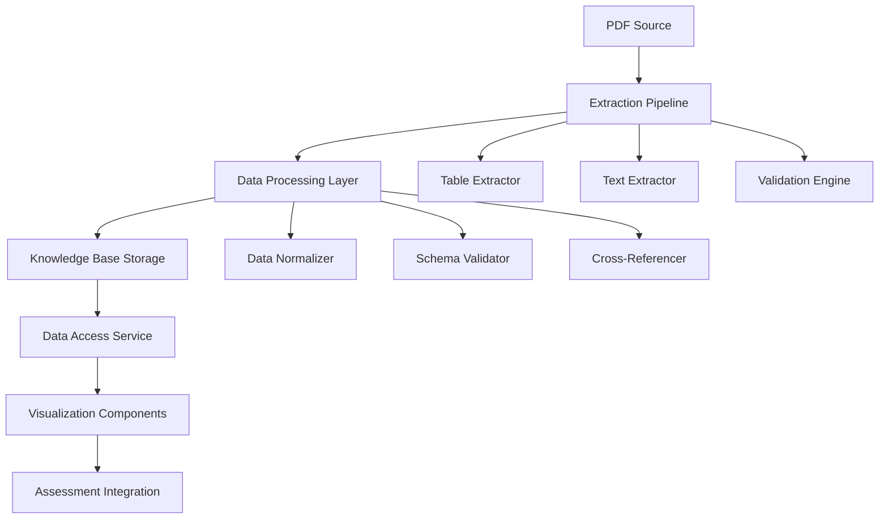

# Design Document

## Overview

The arXiv Data Extraction system is designed as a modular, pipeline-based architecture that transforms unstructured PDF research papers into structured JSON knowledge bases. The system emphasizes data accuracy, automated extraction with manual validation fallbacks, and seamless integration with the existing Next.js assessment platform.

## Architecture

### High-Level Architecture



### Data Flow Pipeline

1. **Extraction Phase**: PDF → Raw structured data (tables + text)
2. **Processing Phase**: Raw data → Normalized, validated JSON
3. **Storage Phase**: Processed data → Versioned knowledge base
4. **Access Phase**: Knowledge base → Service layer → UI components

## Components and Interfaces

### 1. Extraction Pipeline (`src/lib/research/extraction/`)

#### TableExtractor
```typescript
interface TableExtractor {
  extractTables(pdfPath: string): Promise<RawTable[]>
  validateTableData(table: RawTable): ValidationResult
  exportToCSV(table: RawTable, outputPath: string): Promise<void>
}
```

#### TextExtractor
```typescript
interface TextExtractor {
  extractSections(pdfPath: string, sections: string[]): Promise<ExtractedText>
  extractMetadata(pdfPath: string): Promise<PaperMetadata>
  validateTextContent(content: ExtractedText): ValidationResult
}
```

#### ValidationEngine
```typescript
interface ValidationEngine {
  validateExtraction(data: RawExtractionData): ValidationReport
  crossCheckWithSource(data: ProcessedData, sourcePath: string): ValidationReport
  generateQualityReport(): QualityReport
}
```

### 2. Data Processing Layer (`src/lib/research/processing/`)

#### DataNormalizer
```typescript
interface DataNormalizer {
  normalizeOccupations(occupations: RawOccupation[]): NormalizedOccupation[]
  standardizeCodes(data: any[]): any[]
  createCrossReferences(tables: ProcessedTable[]): CrossReference[]
}
```

#### SchemaValidator
```typescript
interface SchemaValidator {
  validateSchema(data: any): SchemaValidationResult
  enforceDataTypes(data: any): ProcessedData
  generateSchemaReport(): SchemaReport
}
```

### 3. Knowledge Base Storage (`src/lib/research/data/`)

#### Storage Structure
- `ai_employment_risks.json` - Main knowledge base
- `extraction_metadata.json` - Extraction history and versioning
- `validation_reports/` - Quality assurance reports

### 4. Data Access Service (`src/lib/research/service/`)

#### ResearchDataService
```typescript
interface ResearchDataService {
  getOccupationRisk(occupationCode: string): Promise<OccupationRisk>
  getTableData(tableId: string): Promise<TableData>
  getVisualizationConfig(chartType: string): Promise<ChartConfig>
  searchOccupations(query: string): Promise<OccupationMatch[]>
}
```

### 5. Visualization Components (`src/components/research/`)

#### RiskComparisonChart
```typescript
interface RiskComparisonChart {
  userRisk: number
  occupationRisk: number
  chartConfig: ChartConfig
  onDataUpdate: (data: ChartData) => void
}
```

## Data Models

### Core Data Schema

```typescript
interface KnowledgeBase {
  metadata: PaperMetadata
  methodology: MethodologyInfo
  occupations: OccupationData[]
  tables: TableData[]
  visualizations: VisualizationConfig[]
  extractionInfo: ExtractionMetadata
}

interface PaperMetadata {
  title: string
  arxivId: string
  url: string
  authors: string[]
  extractionDate: string
  version: string
}

interface OccupationData {
  code: string
  name: string
  riskScore: number
  keyTasks: string[]
  tableReferences: string[]
  confidence: number
}

interface TableData {
  id: string
  title: string
  page: number
  headers: string[]
  rows: any[][]
  footnotes: string[]
  source: string
}
```

### Extraction Pipeline Data Models

```typescript
interface RawTable {
  pageNumber: number
  boundingBox: Rectangle
  cells: Cell[][]
  confidence: number
}

interface ExtractedText {
  sections: Record<string, string>
  metadata: TextMetadata
  confidence: number
}

interface ValidationResult {
  isValid: boolean
  errors: ValidationError[]
  warnings: ValidationWarning[]
  confidence: number
}
```

## Error Handling

### Extraction Error Handling
- **PDF Access Errors**: Retry mechanism with exponential backoff
- **Table Extraction Failures**: Fallback to manual extraction guidance
- **Text Processing Errors**: Partial extraction with error logging
- **Validation Failures**: Detailed reporting with correction suggestions

### Runtime Error Handling
- **Data Loading Errors**: Graceful degradation with cached data
- **Service Unavailable**: Fallback to static data with user notification
- **Visualization Errors**: Default chart with error boundary
- **Integration Failures**: Isolated component failure without system crash

### Error Recovery Strategies
```typescript
interface ErrorRecovery {
  retryExtraction(config: RetryConfig): Promise<ExtractionResult>
  fallbackToCache(dataType: string): Promise<CachedData>
  generateErrorReport(error: ExtractionError): ErrorReport
  notifyManualReview(issue: ValidationIssue): void
}
```

## Testing Strategy

### Unit Testing
- **Extraction Components**: Mock PDF processing, validate output structure
- **Data Processing**: Test normalization, validation, and cross-referencing
- **Service Layer**: Mock data access, test error handling
- **Visualization**: Test chart rendering with various data scenarios

### Integration Testing
- **End-to-End Pipeline**: Full extraction → processing → storage → access
- **Assessment Integration**: Verify seamless connection with existing quiz system
- **Data Accuracy**: Cross-validation with source PDF
- **Performance**: Load testing with large datasets

### Validation Testing
- **Data Integrity**: Automated comparison with source material
- **Schema Compliance**: Validate all JSON outputs against defined schemas
- **Cross-Reference Accuracy**: Verify all table and occupation relationships
- **Manual Review Process**: Structured validation workflow for quality assurance

### Test Data Management
```typescript
interface TestDataManager {
  generateMockPDF(): MockPDF
  createValidationDataset(): ValidationDataset
  setupTestEnvironment(): TestEnvironment
  cleanupTestArtifacts(): void
}
```

## Performance Considerations

### Extraction Optimization
- **Parallel Processing**: Concurrent table and text extraction
- **Caching Strategy**: Cache intermediate results for re-processing
- **Memory Management**: Stream processing for large PDFs
- **Error Recovery**: Fast-fail with detailed logging

### Runtime Performance
- **Data Loading**: Lazy loading with intelligent caching
- **Search Optimization**: Indexed occupation lookup
- **Visualization**: Efficient chart rendering with data pagination
- **Integration**: Minimal impact on existing assessment performance

## Security Considerations

### Data Handling
- **Source Validation**: Verify PDF authenticity and integrity
- **Input Sanitization**: Clean all extracted text and data
- **Output Validation**: Ensure no malicious content in JSON output
- **Access Control**: Secure service endpoints and data access

### Privacy and Compliance
- **Data Minimization**: Extract only necessary research data
- **Audit Trail**: Log all extraction and processing activities
- **Version Control**: Track all changes to knowledge base
- **Backup Strategy**: Secure backup of extraction artifacts