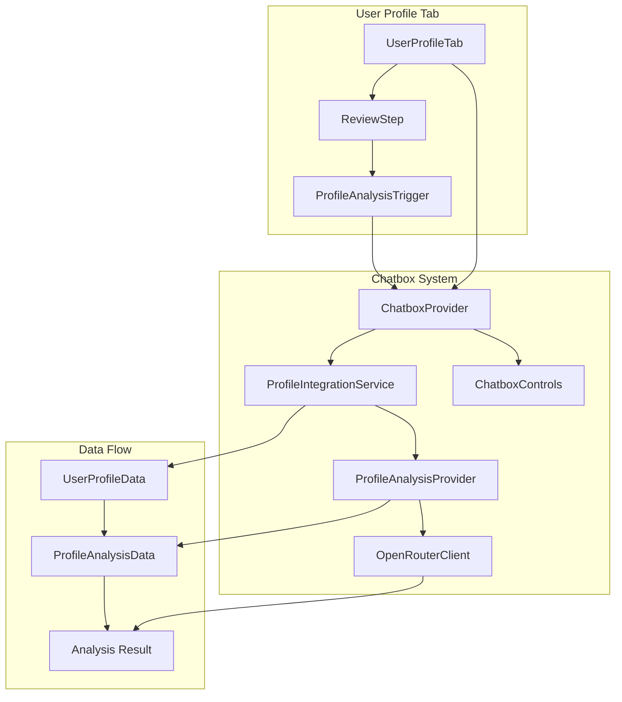

# Design Document

## Overview

The Chatbox Profile Integration design enables seamless connection between the new User Profile tab system and the existing Chatbox analysis pipeline. The design maintains the Chatbox as the central orchestration layer while extending its capabilities to handle profile-specific data and analysis workflows. The solution preserves the existing architecture patterns, error handling mechanisms, and user experience standards.

## Architecture

### High-Level Architecture



### Component Interaction Flow

1. **Profile Completion**: User completes profile in UserProfileTab
2. **State Synchronization**: Profile data synced to ChatboxProvider via setProfileData
3. **Analysis Trigger**: User clicks ProfileAnalysisTrigger in ReviewStep
4. **Data Transformation**: ProfileIntegrationService transforms UserProfileData to ProfileAnalysisData
5. **Analysis Execution**: ChatboxProvider calls startAnalysis with transformed data
6. **Provider Selection**: System selects ProfileAnalysisProvider based on model
7. **API Request**: Provider makes streaming/non-streaming request to OpenRouter
8. **Result Display**: Analysis results displayed in ChatboxPanel with real-time updates

## Components and Interfaces

### ChatboxProvider Enhancements

**Interface Changes:**
```typescript
interface ChatboxContextType {
  // Enhanced method signature
  startAnalysis: (useStreaming?: boolean, data?: any) => Promise<void>;
  
  // Profile data management
  setProfileData: (data: ProfileFormData) => void;
  profileData?: ProfileFormData;
}
```

**Implementation Details:**
- Maintains backward compatibility with existing startAnalysis calls
- Forwards optional data parameter to selected analysis provider
- Validates data format before processing
- Handles both streaming and non-streaming analysis modes
- Preserves existing error handling and retry mechanisms

### ProfileAnalysisProvider Type Safety

**Enhanced Data Handling:**
```typescript
interface SafeProfileAccess {
  // Safe field access with defaults
  getCurrentRole: (profile: any) => string;
  getExperienceData: (profile: any) => ExperienceEntry[];
  getSkillsData: (profile: any) => SkillsData;
  
  // Validation methods
  validateProfileStructure: (profile: any) => ValidationResult;
  transformToAnalysisData: (profile: any) => ProfileAnalysisData;
}
```

**Key Features:**
- Defensive programming for all profile field access
- Graceful handling of undefined/null values
- Consistent data transformation using ProfileIntegrationService
- Proper error handling with meaningful error messages
- Support for both streaming and non-streaming analysis

### ProfileAnalysisTrigger Integration

**Component Props:**
```typescript
interface ProfileAnalysisTriggerProps {
  profileData: UserProfileData;
  variant?: 'button' | 'card' | 'inline';
  size?: 'sm' | 'md' | 'lg';
  onAnalysisStart?: () => void;
  onAnalysisComplete?: () => void;
}
```

**Behavior:**
- Displays analysis readiness status based on profile completion
- Shows missing requirements when profile is incomplete
- Triggers analysis through useProfileIntegration hook
- Provides visual feedback during analysis process
- Handles error states with appropriate user messaging

### Data Transformation Layer

**ProfileIntegrationService Enhancements:**
```typescript
interface DataTransformation {
  // Transform UserProfileData to ProfileAnalysisData
  transformUserProfile: (data: UserProfileData) => ProfileAnalysisData;
  
  // Validate profile readiness
  validateAnalysisReadiness: (data: UserProfileData) => ReadinessStatus;
  
  // Generate analysis status
  getAnalysisStatus: (data: UserProfileData) => AnalysisStatus;
}
```

**Transformation Logic:**
- Maps UserProfileData fields to ProfileAnalysisData structure
- Handles role-specific data (Student, Professional, BusinessOwner, CareerShifter)
- Calculates completion percentage and readiness metrics
- Provides consistent data format for analysis providers
- Maintains data integrity throughout transformation process

## Data Models

### UserProfileData Structure
```typescript
type UserProfileData = {
  role?: Role;
  roleDetails?: RoleDetails;
  industry?: string;
  location?: string;
  workPreference?: WorkPreference;
  skills: string[];
};

type RoleDetails = 
  | { role: Role.Student; student: StudentDetails }
  | { role: Role.Professional; professional: ProfessionalDetails }
  | { role: Role.BusinessOwner; business: BusinessOwnerDetails }
  | { role: Role.CareerShifter; shifter: CareerShifterDetails };
```

### ProfileAnalysisData Structure
```typescript
interface ProfileAnalysisData {
  profileType: string;
  experience: Array<{
    title: string;
    company: string;
    duration: string;
    description?: string;
  }>;
  skills: {
    technical: string[];
    soft: string[];
    languages: string[];
    certifications: string[];
  };
  metadata: {
    completionLevel: number;
    lastModified: string;
  };
}
```

### Analysis Configuration
```typescript
interface AnalysisConfig {
  type: 'profile';
  model: string;
  apiKey: string;
  temperature?: number;
  maxTokens?: number;
  customPrompt?: string;
}
```

## Error Handling

### Error Categories

1. **Validation Errors**
   - Missing API key or model
   - Invalid profile data structure
   - Incomplete profile information
   - Configuration validation failures

2. **Network Errors**
   - API request failures
   - Timeout errors
   - Rate limiting issues
   - Connection problems

3. **Processing Errors**
   - Data transformation failures
   - Provider selection errors
   - Analysis execution errors
   - Streaming interruptions

### Error Handling Strategy

**Graceful Degradation:**
- Fallback from streaming to non-streaming analysis
- Default values for missing profile fields
- Alternative providers when primary fails
- Cached results when network unavailable

**User Communication:**
- Clear, actionable error messages
- Progress indicators during analysis
- Retry options for recoverable errors
- Help text for configuration issues

**Developer Support:**
- Detailed error logging with context
- Debug information in development mode
- Error tracking and monitoring
- Performance metrics collection

## Testing Strategy

### Unit Testing

**ChatboxProvider Tests:**
- startAnalysis method with various parameter combinations
- Profile data synchronization and state management
- Error handling for invalid configurations
- Backward compatibility with existing callers

**ProfileAnalysisProvider Tests:**
- Data transformation accuracy and safety
- Streaming and non-streaming analysis modes
- Error handling for malformed data
- Provider configuration validation

**ProfileIntegrationService Tests:**
- UserProfileData to ProfileAnalysisData transformation
- Readiness calculation and validation
- Missing field handling and defaults
- Edge cases and error conditions

### Integration Testing

**End-to-End Profile Analysis Flow:**
- Complete profile creation and analysis trigger
- Data flow from UserProfileTab to ChatboxPanel
- Error scenarios and recovery mechanisms
- Performance under various data sizes

**Cross-Component Integration:**
- ProfileAnalysisTrigger with ChatboxProvider
- ReviewStep with analysis system
- State synchronization across components
- Event handling and lifecycle management

### Performance Testing

**Analysis Response Times:**
- Streaming vs non-streaming performance
- Large profile data handling
- Concurrent analysis requests
- Memory usage optimization

**User Experience Metrics:**
- UI responsiveness during analysis
- Loading state transitions
- Error recovery time
- Overall workflow completion time

## Security Considerations

### Data Protection
- Secure handling of profile data in memory
- API key protection and validation
- Sanitization of user input data
- Prevention of data leakage in error messages

### API Security
- Proper API key format validation
- Rate limiting compliance
- Secure transmission of analysis requests
- Error message sanitization

### Privacy
- Minimal data retention policies
- User consent for analysis processing
- Data anonymization where possible
- Compliance with privacy regulations

## Performance Optimization

### Caching Strategy
- Analysis result caching based on profile hash
- Provider configuration caching
- Transformation result memoization
- API response caching with TTL

### Resource Management
- Lazy loading of analysis providers
- Memory-efficient data structures
- Cleanup of unused resources
- Optimized re-rendering patterns

### Network Optimization
- Request batching where possible
- Compression of large payloads
- Connection pooling for API requests
- Retry logic with exponential backoff

## Monitoring and Observability

### Metrics Collection
- Analysis success/failure rates
- Response time distributions
- Error frequency by category
- User engagement with analysis features

### Logging Strategy
- Structured logging with context
- Error tracking with stack traces
- Performance monitoring
- User action tracking (anonymized)

### Health Checks
- Provider availability monitoring
- API endpoint health checks
- Data transformation validation
- System resource utilization

## Migration and Deployment

### Rollout Strategy
- Feature flag controlled deployment
- Gradual user base expansion
- A/B testing for UX improvements
- Rollback procedures for issues

### Backward Compatibility
- Existing ChatboxProvider API preservation
- Legacy analysis flow support
- Graceful handling of old data formats
- Migration path for existing users

### Configuration Management
- Environment-specific settings
- Feature toggle management
- Provider configuration updates
- Error handling configuration