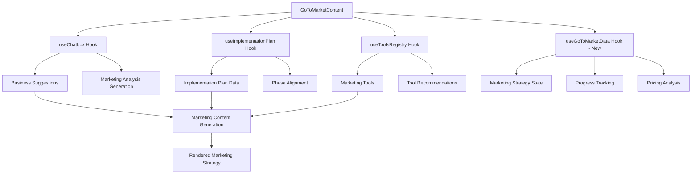

# Go-to-Market Enhancement Design Document

## Overview

The Go-to-Market Enhancement transforms the static GoToMarketContent component into a comprehensive, data-driven marketing strategy platform. The design leverages existing system architecture including ChatboxProvider for AI-powered analysis, implementation plan data from ListTab, and marketing tools from ToolsContent to create an integrated go-to-market planning experience.

## Architecture

### Component Hierarchy

```
GoToMarketContent (Enhanced)
├── GoToMarketHeader
├── BusinessSuggestionSelector
├── MarketingStrategySection
│   ├── DigitalMarketingCard
│   ├── ContentMarketingCard
│   ├── PartnershipMarketingCard
│   └── TraditionalMarketingCard
├── SalesChannelSection
│   ├── ChannelRecommendationCard
│   └── ChannelComparisonMatrix
├── PricingStrategySection
│   ├── PricingModelCard
│   └── CompetitiveAnalysisPanel
├── ImplementationTimelineSection
├── ToolsIntegrationSection
├── ProgressTrackingPanel
└── GoToMarketSettings
```

### Data Flow Architecture



## Components and Interfaces

### Core Hook: useGoToMarketData

```typescript
interface GoToMarketData {
  selectedSuggestion?: BusinessSuggestion;
  marketingStrategies: MarketingStrategy[];
  salesChannels: SalesChannel[];
  pricingStrategies: PricingStrategy[];
  implementationAlignment: ImplementationAlignment;
  recommendedTools: ToolRecommendation[];
  progress: GoToMarketProgress;
  status: 'idle' | 'loading' | 'success' | 'error';
  error?: string;
}

interface MarketingStrategy {
  id: string;
  type: 'digital' | 'content' | 'partnership' | 'traditional';
  title: string;
  description: string;
  tactics: MarketingTactic[];
  estimatedCost: string;
  timeframe: string;
  expectedROI: string;
  difficulty: 'low' | 'medium' | 'high';
  priority: number;
}

interface SalesChannel {
  id: string;
  name: string;
  type: 'direct' | 'retail' | 'online' | 'partner';
  description: string;
  implementation: ImplementationStep[];
  costStructure: CostStructure;
  expectedReach: string;
  timeToImplement: string;
  suitabilityScore: number;
}

interface PricingStrategy {
  id: string;
  model: 'freemium' | 'subscription' | 'one-time' | 'tiered' | 'usage-based';
  title: string;
  description: string;
  pricePoints: PricePoint[];
  pros: string[];
  cons: string[];
  marketFit: number;
  competitivePosition: string;
}
```

### Service Layer: GoToMarketService

```typescript
class GoToMarketService {
  constructor(
    private chatboxProvider: ChatboxProvider,
    private openRouterClient: OpenRouterClient,
    private cacheManager: CacheManager
  ) {}

  async generateMarketingStrategies(
    suggestion: BusinessSuggestion,
    implementationPlan?: ImplementationPlan
  ): Promise<MarketingStrategy[]>

  async generateSalesChannelRecommendations(
    suggestion: BusinessSuggestion
  ): Promise<SalesChannel[]>

  async generatePricingStrategies(
    suggestion: BusinessSuggestion,
    marketAnalysis?: any
  ): Promise<PricingStrategy[]>

  async alignWithImplementationPlan(
    marketingStrategies: MarketingStrategy[],
    implementationPlan: ImplementationPlan
  ): Promise<ImplementationAlignment>

  async getRecommendedTools(
    marketingStrategies: MarketingStrategy[],
    toolsRegistry: ToolsRegistry
  ): Promise<ToolRecommendation[]>
}
```

### UI Components Design

#### BusinessSuggestionSelector
- Dropdown/selector for available business suggestions
- Integration with ChatboxProvider business suggestions
- Empty state when no suggestions available
- Quick action to generate new suggestions

#### MarketingStrategySection
- Grid layout with strategy cards
- Each card shows strategy type, tactics, cost, and ROI
- Expandable details with implementation steps
- Progress tracking for each strategy
- Integration with recommended tools

#### SalesChannelSection
- Channel recommendation cards with suitability scores
- Comparison matrix for multiple channels
- Implementation difficulty indicators
- Cost-benefit analysis visualization

#### PricingStrategySection
- Pricing model cards with pros/cons
- Interactive pricing calculator
- Competitive analysis panel
- Market positioning recommendations

#### ImplementationTimelineSection
- Timeline view aligned with implementation plan phases
- Marketing milestone integration
- Dependency tracking between marketing and development activities
- Progress indicators and completion tracking

## Data Models

### Marketing Strategy Generation

The system uses AI-powered analysis to generate marketing strategies based on:

1. **Business Suggestion Analysis**
   - Category and industry vertical
   - Target market demographics
   - Key features and value propositions
   - Estimated startup costs and resources

2. **Implementation Plan Integration**
   - Development phases and milestones
   - Resource allocation and timeline
   - Technical capabilities and constraints
   - Launch readiness indicators

3. **Market Context**
   - Industry best practices
   - Competitive landscape analysis
   - Channel effectiveness data
   - Pricing benchmarks

### Prompt Engineering for Marketing Analysis

```typescript
const MARKETING_STRATEGY_PROMPT = `
Generate comprehensive marketing strategies for the following business:

Business Details:
- Title: {suggestion.title}
- Category: {suggestion.category}
- Description: {suggestion.description}
- Target Market: {suggestion.targetMarket}
- Key Features: {suggestion.keyFeatures}
- Startup Cost: {suggestion.estimatedStartupCost}

Implementation Context:
- Development Phase: {implementationPlan?.currentPhase}
- Timeline: {implementationPlan?.timeline}
- Resources: {implementationPlan?.resources}

Generate strategies for:
1. Digital Marketing (SEO, SEM, Social Media)
2. Content Marketing (Blog, Video, Podcasts)
3. Partnership Marketing (Affiliates, Collaborations)
4. Traditional Marketing (PR, Events, Print)

For each strategy, provide:
- Specific tactics and channels
- Estimated costs and timeframes
- Expected ROI and metrics
- Implementation difficulty
- Alignment with business phase

Format as JSON with the MarketingStrategy interface structure.
`;
```

## Error Handling

### Error Boundaries and Fallbacks

1. **Component-Level Error Boundaries**
   - Wrap each major section in error boundaries
   - Graceful degradation when individual sections fail
   - Retry mechanisms for failed API calls

2. **Network Error Handling**
   - Offline detection and cached content display
   - Progressive enhancement for slow connections
   - Timeout handling for AI generation requests

3. **Data Validation**
   - Input validation for business suggestion data
   - Fallback content when required data is missing
   - Type safety with TypeScript interfaces

### Loading States and Skeletons

```typescript
const LoadingStates = {
  MarketingStrategies: () => <StrategyCardSkeleton count={4} />,
  SalesChannels: () => <ChannelCardSkeleton count={3} />,
  PricingStrategies: () => <PricingCardSkeleton count={3} />,
  Tools: () => <ToolCardSkeleton count={6} />
};
```

## Testing Strategy

### Unit Testing
- Component rendering with various data states
- Hook behavior and state management
- Service layer API interactions
- Utility function validation

### Integration Testing
- ChatboxProvider integration
- Implementation plan data flow
- Tools registry integration
- Cache management functionality

### End-to-End Testing
- Complete go-to-market workflow
- Cross-tab navigation and data persistence
- Error recovery scenarios
- Performance under load

### Accessibility Testing
- Screen reader compatibility
- Keyboard navigation
- Color contrast compliance
- Focus management

## Performance Considerations

### Optimization Strategies

1. **Component Memoization**
   - React.memo for expensive components
   - useMemo for computed values
   - useCallback for event handlers

2. **Data Caching**
   - Cache marketing strategies by business suggestion ID
   - Implement cache invalidation strategies
   - Use existing cache manager infrastructure

3. **Lazy Loading**
   - Code splitting for heavy components
   - Progressive loading of marketing content
   - On-demand tool recommendations

4. **API Optimization**
   - Batch API requests where possible
   - Implement request deduplication
   - Use streaming for long-running AI generation

### Bundle Size Management

- Dynamic imports for optional features
- Tree shaking for unused utilities
- Optimize icon and image assets
- Minimize third-party dependencies

## Security Considerations

### Data Protection
- Sanitize user inputs for AI prompts
- Validate API responses before processing
- Implement rate limiting for AI requests
- Secure storage of sensitive business data

### API Security
- Use existing OpenRouter client security measures
- Implement request signing where required
- Handle API key management securely
- Monitor for unusual usage patterns

## Migration Strategy

### Phase 1: Foundation (Week 1)
- Create new hook and service infrastructure
- Implement basic component structure
- Add integration with existing providers

### Phase 2: Core Features (Week 2)
- Implement marketing strategy generation
- Add sales channel recommendations
- Create pricing strategy analysis

### Phase 3: Integration (Week 3)
- Integrate with implementation plans
- Add tools recommendations
- Implement progress tracking

### Phase 4: Polish (Week 4)
- Add advanced features and settings
- Implement comprehensive error handling
- Performance optimization and testing

### Backward Compatibility
- Maintain existing GoToMarketContent export
- Gradual feature rollout with feature flags
- Fallback to static content if dynamic features fail
- Preserve existing styling and layout patterns