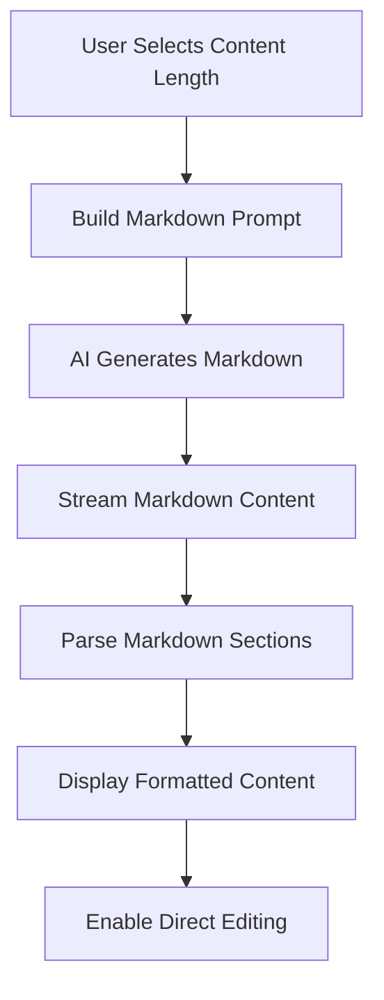

# Go-to-Market Markdown Generation Optimization Design

## Overview

This design transforms the Go-to-Market V2 feature from complex JSON generation to streamlined Markdown-based generation with configurable content length settings. The solution addresses performance issues, reduces complexity, and provides better user control over content verbosity.

## Architecture Changes

### Content Length System

```typescript
type ContentLength = 'brief' | 'standard' | 'detailed';

interface ContentLengthConfig {
  brief: {
    sentenceRange: [3, 5];
    maxSections: 3;
    focusOnEssentials: true;
  };
  standard: {
    sentenceRange: [6, 9];
    maxSections: 5;
    includeDetails: true;
  };
  detailed: {
    sentenceRange: [10, 12];
    maxSections: 8;
    comprehensiveAnalysis: true;
  };
}
```

### Markdown Generation Flow



## Components and Interfaces

### Enhanced Prompt Builder

```typescript
class MarkdownPromptBuilder {
  static buildMarkdownPrompt(
    implementationPlan: ImplementationPlan,
    options: EnhancedGenerationOptions
  ): string {
    const lengthConfig = this.getLengthConfiguration(options.contentLength);
    return this.constructMarkdownPrompt(implementationPlan, options, lengthConfig);
  }

  private static getLengthConfiguration(length: ContentLength): ContentLengthConfig;
  private static constructMarkdownPrompt(plan, options, config): string;
}
```

### Markdown Strategy Processor

```typescript
class MarkdownStrategyProcessor {
  static processMarkdownResponse(rawMarkdown: string): MarkdownGoToMarketStrategies;
  static extractSections(markdown: string): MarkdownSection[];
  static validateMarkdownStructure(content: string): ValidationResult;
  static convertToInteractiveFormat(markdown: string): InteractiveStrategy[];
}
```

### Enhanced Generation Options

```typescript
interface EnhancedGenerationOptions extends GenerationOptions {
  contentLength: ContentLength;
  markdownStyle: 'structured' | 'narrative' | 'bullet-points';
  includeExamples: boolean;
  prioritizeSections: string[];
}
```

## Data Models

### Markdown Strategy Structure

```typescript
interface MarkdownGoToMarketStrategies {
  id: string;
  businessContext: BusinessContext;
  rawMarkdown: string;
  sections: MarkdownSection[];
  metadata: {
    contentLength: ContentLength;
    generatedAt: string;
    wordCount: number;
    estimatedReadTime: number;
  };
}

interface MarkdownSection {
  id: string;
  type: 'marketing' | 'sales' | 'pricing' | 'distribution' | 'timeline' | 'tools';
  title: string;
  content: string;
  subsections: MarkdownSubsection[];
  completed: boolean;
  editable: boolean;
}

interface MarkdownSubsection {
  id: string;
  heading: string;
  content: string;
  actionItems: string[];
  keyMetrics: string[];
}
```

## Prompt Engineering

### Content Length Prompts

#### Brief (3-5 sentences per section)
```
Create a concise go-to-market strategy in Markdown format. Each section should be 3-5 sentences focusing on essential actions and key metrics only. Prioritize actionability over detail.

# Marketing Strategy
- Focus on 1-2 primary channels
- Include budget range and timeline
- Specify target audience

# Sales Strategy  
- Identify main sales approach
- Include conversion expectations
- Specify resource requirements
```

#### Standard (6-9 sentences per section)
```
Create a comprehensive go-to-market strategy in Markdown format. Each section should be 6-9 sentences with balanced detail including context, actions, and expected outcomes.

# Marketing Strategy
## Digital Marketing
- Detailed channel strategy
- Budget breakdown and timeline
- Target audience segmentation
- Success metrics and KPIs

## Content Marketing
- Content types and distribution
- Creation timeline and resources
- Engagement expectations
```

#### Detailed (10-12 sentences per section)
```
Create an in-depth go-to-market strategy in Markdown format. Each section should be 10-12 sentences with comprehensive analysis, multiple options, and detailed implementation guidance.

# Marketing Strategy
## Digital Marketing
- Multi-channel approach with rationale
- Detailed budget allocation and ROI projections
- Audience personas and targeting strategy
- Implementation phases and dependencies
- Risk mitigation and contingency plans
- Success metrics and optimization strategies
```

## Processing Architecture

### Markdown Parser

```typescript
class MarkdownParser {
  static parseStrategy(markdown: string): ParsedStrategy {
    const sections = this.extractSections(markdown);
    const metadata = this.extractMetadata(markdown);
    return { sections, metadata, rawContent: markdown };
  }

  private static extractSections(markdown: string): MarkdownSection[] {
    // Use regex patterns to identify sections
    const sectionPattern = /^#\s+(.+)$/gm;
    const subsectionPattern = /^##\s+(.+)$/gm;
    // Process and return structured sections
  }

  private static extractActionItems(content: string): string[] {
    // Extract bullet points and action-oriented content
    const actionPattern = /^[-*]\s+(.+)$/gm;
    // Return actionable items
  }
}
```

### Content Length Validator

```typescript
class ContentLengthValidator {
  static validateLength(content: string, targetLength: ContentLength): ValidationResult {
    const sentences = this.countSentences(content);
    const config = ContentLengthConfig[targetLength];
    
    return {
      isValid: sentences >= config.sentenceRange[0] && sentences <= config.sentenceRange[1],
      actualLength: sentences,
      targetRange: config.sentenceRange,
      suggestions: this.generateSuggestions(sentences, config)
    };
  }

  private static countSentences(text: string): number;
  private static generateSuggestions(actual: number, config: any): string[];
}
```

## User Interface Changes

### Content Length Selector

```tsx
interface ContentLengthSelectorProps {
  value: ContentLength;
  onChange: (length: ContentLength) => void;
  showPreview?: boolean;
}

const ContentLengthSelector: React.FC<ContentLengthSelectorProps> = ({
  value,
  onChange,
  showPreview = true
}) => {
  const lengthOptions = [
    { 
      value: 'brief', 
      label: 'Brief', 
      description: '3-5 sentences per section',
      estimatedTime: '2-3 min read'
    },
    { 
      value: 'standard', 
      label: 'Standard', 
      description: '6-9 sentences per section',
      estimatedTime: '5-7 min read'
    },
    { 
      value: 'detailed', 
      label: 'Detailed', 
      description: '10-12 sentences per section',
      estimatedTime: '10-15 min read'
    }
  ];

  return (
    <div className="content-length-selector">
      {lengthOptions.map(option => (
        <ContentLengthOption 
          key={option.value}
          option={option}
          selected={value === option.value}
          onClick={() => onChange(option.value)}
        />
      ))}
    </div>
  );
};
```

### Markdown Strategy Display

```tsx
interface MarkdownStrategyDisplayProps {
  strategies: MarkdownGoToMarketStrategies;
  onSectionUpdate: (sectionId: string, content: string) => void;
  editMode?: boolean;
}

const MarkdownStrategyDisplay: React.FC<MarkdownStrategyDisplayProps> = ({
  strategies,
  onSectionUpdate,
  editMode = false
}) => {
  return (
    <div className="markdown-strategy-display">
      <StrategyMetadata metadata={strategies.metadata} />
      {strategies.sections.map(section => (
        <MarkdownSection
          key={section.id}
          section={section}
          editable={editMode && section.editable}
          onUpdate={(content) => onSectionUpdate(section.id, content)}
        />
      ))}
    </div>
  );
};
```

## Performance Optimizations

### Streaming Markdown Processing

```typescript
class StreamingMarkdownProcessor {
  private buffer: string = '';
  private sections: MarkdownSection[] = [];

  processChunk(chunk: string): PartialStrategy {
    this.buffer += chunk;
    const completeSections = this.extractCompleteSections();
    return {
      sections: completeSections,
      isComplete: this.isStrategyComplete(),
      progress: this.calculateProgress()
    };
  }

  private extractCompleteSections(): MarkdownSection[] {
    // Process buffer to find complete sections
    // Return sections that are fully formed
  }

  private isStrategyComplete(): boolean {
    // Check if all expected sections are present
  }
}
```

### Caching Strategy

```typescript
interface MarkdownCache {
  key: string;
  contentLength: ContentLength;
  businessContext: string;
  strategies: MarkdownGoToMarketStrategies;
  createdAt: number;
  accessCount: number;
}

class MarkdownCacheManager {
  private cache: Map<string, MarkdownCache> = new Map();

  getCachedStrategy(
    contextHash: string, 
    contentLength: ContentLength
  ): MarkdownGoToMarketStrategies | null;

  cacheStrategy(
    contextHash: string,
    contentLength: ContentLength,
    strategies: MarkdownGoToMarketStrategies
  ): void;

  private generateCacheKey(contextHash: string, length: ContentLength): string;
}
```

## Migration Strategy

### JSON to Markdown Converter

```typescript
class LegacyStrategyConverter {
  static convertJsonToMarkdown(jsonStrategies: GoToMarketStrategies): MarkdownGoToMarketStrategies {
    const markdown = this.generateMarkdownFromJson(jsonStrategies);
    const sections = this.createSectionsFromJson(jsonStrategies);
    
    return {
      id: jsonStrategies.id,
      businessContext: jsonStrategies.businessContext,
      rawMarkdown: markdown,
      sections,
      metadata: {
        contentLength: 'standard', // Default for converted content
        generatedAt: jsonStrategies.generatedAt,
        wordCount: this.countWords(markdown),
        estimatedReadTime: this.calculateReadTime(markdown)
      }
    };
  }

  private static generateMarkdownFromJson(json: GoToMarketStrategies): string;
  private static createSectionsFromJson(json: GoToMarketStrategies): MarkdownSection[];
}
```

## Testing Strategy

### Content Length Validation Tests

```typescript
describe('Content Length Validation', () => {
  test('brief content should be 3-5 sentences per section', () => {
    const briefStrategy = generateStrategy('brief');
    expect(validateContentLength(briefStrategy, 'brief')).toBe(true);
  });

  test('standard content should be 6-9 sentences per section', () => {
    const standardStrategy = generateStrategy('standard');
    expect(validateContentLength(standardStrategy, 'standard')).toBe(true);
  });

  test('detailed content should be 10-12 sentences per section', () => {
    const detailedStrategy = generateStrategy('detailed');
    expect(validateContentLength(detailedStrategy, 'detailed')).toBe(true);
  });
});
```

### Markdown Processing Tests

```typescript
describe('Markdown Processing', () => {
  test('should parse markdown sections correctly', () => {
    const markdown = generateSampleMarkdown();
    const parsed = MarkdownParser.parseStrategy(markdown);
    expect(parsed.sections).toHaveLength(4);
    expect(parsed.sections[0].type).toBe('marketing');
  });

  test('should handle malformed markdown gracefully', () => {
    const malformedMarkdown = '# Incomplete section\nSome content...';
    const parsed = MarkdownParser.parseStrategy(malformedMarkdown);
    expect(parsed.sections).toBeDefined();
  });
});
```