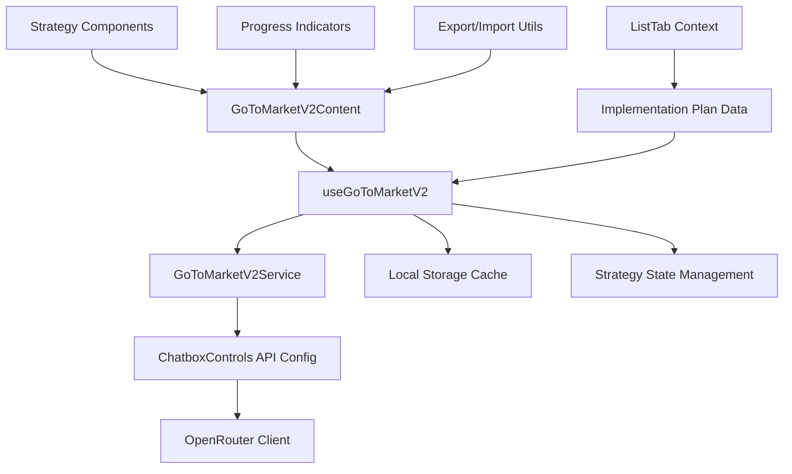

# Go-to-Market V2 Integration Design

## Overview

The Go-to-Market V2 integration transforms the existing placeholder component into a fully functional AI-powered strategy generator. The system leverages the implementation plan context from ListTab, integrates with the existing ChatboxControls and OpenRouter infrastructure, and provides comprehensive go-to-market strategies through a well-organized feature architecture.

## Architecture

### High-Level Architecture



### Component Hierarchy

```
src/features/gotomarket-v2/
├── components/
│   ├── GoToMarketV2Generator.tsx      # Main generator component
│   ├── StrategyDisplay.tsx            # Strategy visualization
│   ├── MarketingStrategyCard.tsx      # Marketing strategy cards
│   ├── SalesChannelCard.tsx           # Sales channel cards
│   ├── PricingStrategyCard.tsx        # Pricing strategy cards
│   ├── ProgressIndicator.tsx          # Generation progress
│   └── ExportControls.tsx             # Export/import controls
├── hooks/
│   ├── useGoToMarketV2.ts             # Main hook
│   ├── useImplementationContext.ts    # ListTab context integration
│   └── useStrategyPersistence.ts      # Local storage management
├── services/
│   ├── GoToMarketV2Service.ts         # AI generation service
│   ├── PromptBuilder.ts               # AI prompt construction
│   └── StrategyProcessor.ts           # Response processing
├── utils/
│   ├── validation.ts                  # Input validation
│   ├── export-utils.ts                # Export functionality
│   └── strategy-helpers.ts            # Strategy manipulation
└── types.ts                           # TypeScript definitions
```

## Components and Interfaces

### Core Components

#### GoToMarketV2Generator
- **Purpose**: Main orchestrator component that handles generation flow
- **Props**: Implementation plan context, generation state
- **State**: Generation status, current strategies, error handling
- **Integration**: Uses ChatboxControls API configuration

#### StrategyDisplay
- **Purpose**: Renders generated strategies in organized sections
- **Features**: Tabbed interface, progress tracking, interactive elements
- **Layout**: Marketing, Sales, Pricing, Distribution sections

#### Strategy Cards (Marketing/Sales/Pricing)
- **Purpose**: Individual strategy item display with actions
- **Features**: Completion tracking, editing capabilities, cost estimates
- **Interactions**: Mark complete, expand details, copy content

### Service Layer

#### GoToMarketV2Service
```typescript
class GoToMarketV2Service {
  constructor(apiKey: string, model: string)
  
  async generateStrategies(
    implementationContext: ImplementationPlan,
    options: GenerationOptions
  ): Promise<GoToMarketStrategies>
  
  async generateStreamingStrategies(
    implementationContext: ImplementationPlan,
    onChunk: (chunk: string) => void,
    options: GenerationOptions
  ): Promise<GoToMarketStrategies>
}
```

#### PromptBuilder
```typescript
class PromptBuilder {
  static buildGoToMarketPrompt(
    implementationPlan: ImplementationPlan,
    focusAreas: string[]
  ): string
  
  static buildMarketingPrompt(context: BusinessContext): string
  static buildSalesPrompt(context: BusinessContext): string
  static buildPricingPrompt(context: BusinessContext): string
}
```

### Hook Architecture

#### useGoToMarketV2
```typescript
interface UseGoToMarketV2Return {
  // State
  strategies: GoToMarketStrategies | null
  status: 'idle' | 'generating' | 'success' | 'error'
  progress: number
  error: string | null
  
  // Actions
  generateStrategies: () => Promise<void>
  regenerateStrategies: () => Promise<void>
  cancelGeneration: () => void
  updateStrategy: (id: string, updates: Partial<Strategy>) => void
  
  // Export/Import
  exportStrategies: (format: 'json' | 'markdown') => void
  importStrategies: (data: string) => void
  
  // Context
  implementationContext: ImplementationPlan | null
  hasValidContext: boolean
}
```

## Data Models

### Core Types

```typescript
interface GoToMarketStrategies {
  id: string
  businessContext: BusinessContext
  marketingStrategies: MarketingStrategy[]
  salesChannels: SalesChannel[]
  pricingStrategies: PricingStrategy[]
  distributionPlans: DistributionPlan[]
  implementationTimeline: TimelinePhase[]
  toolRecommendations: ToolRecommendation[]
  generatedAt: string
  version: string
}

interface BusinessContext {
  businessIdea: string
  targetMarket: string
  valueProposition: string
  implementationPhases: ImplementationPhase[]
  goals: string[]
  constraints: string[]
}

interface MarketingStrategy {
  id: string
  type: 'digital' | 'content' | 'social' | 'traditional'
  title: string
  description: string
  tactics: MarketingTactic[]
  budget: BudgetEstimate
  timeline: string
  expectedROI: string
  difficulty: 'low' | 'medium' | 'high'
  completed: boolean
}

interface SalesChannel {
  id: string
  name: string
  type: 'direct' | 'retail' | 'online' | 'partner'
  description: string
  implementationSteps: ImplementationStep[]
  costStructure: CostStructure
  expectedReach: string
  suitabilityScore: number
  completed: boolean
}

interface PricingStrategy {
  id: string
  model: 'freemium' | 'subscription' | 'one-time' | 'tiered'
  title: string
  description: string
  pricePoints: PricePoint[]
  marketFit: number
  competitiveAnalysis: string
  completed: boolean
}
```

## Error Handling

### Error Categories
1. **Context Errors**: Missing or invalid implementation plan
2. **API Errors**: OpenRouter connection, authentication, rate limits
3. **Generation Errors**: AI response parsing, incomplete generation
4. **Storage Errors**: Local storage failures, data corruption

### Error Recovery
- Automatic retry with exponential backoff
- Graceful degradation with cached data
- Clear user messaging with actionable steps
- Fallback to manual strategy input

## Testing Strategy

### Unit Tests
- Service layer functionality
- Prompt building logic
- Data transformation utilities
- Hook state management

### Integration Tests
- OpenRouter API integration
- Implementation plan context integration
- Storage persistence
- Export/import functionality

### Component Tests
- Strategy card interactions
- Progress indicator updates
- Error state handling
- Responsive design validation

## Performance Considerations

### Optimization Strategies
- Lazy loading of strategy components
- Debounced user interactions
- Efficient re-rendering with React.memo
- Streaming response processing

### Caching Strategy
- Local storage for generated strategies
- Context-based cache invalidation
- Compressed storage for large datasets
- TTL-based cache expiration

## Security Considerations

### Data Protection
- No sensitive data in local storage
- API key validation and secure handling
- Input sanitization for AI prompts
- XSS prevention in rendered content

### API Security
- Rate limiting awareness
- Error message sanitization
- Secure token handling
- Request timeout management

## Future Extensibility

### Planned Enhancements
- Custom strategy templates
- Collaborative strategy editing
- Integration with external tools
- Advanced analytics and reporting
- Multi-language support

### Architecture Flexibility
- Plugin-based strategy types
- Configurable AI models
- Custom prompt templates
- Third-party service integrations