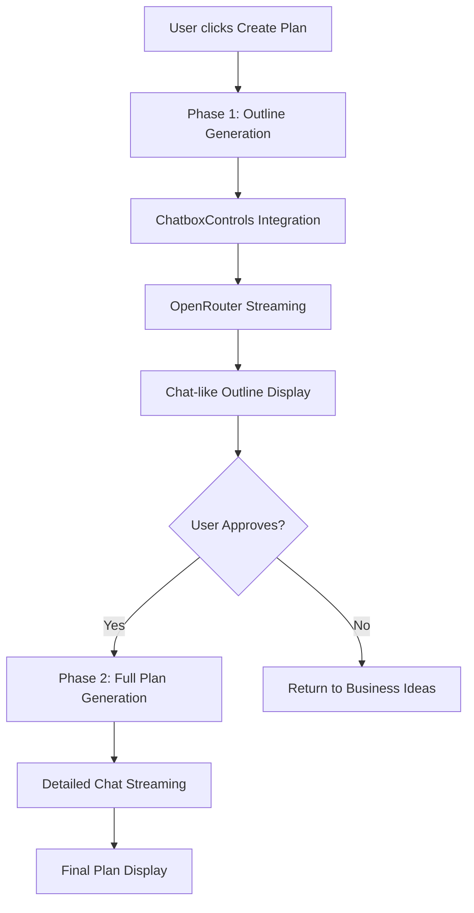

# Implementation Plan Chat Enhancement - Design

## Architecture Overview

The enhancement transforms the implementation plan generation into a two-phase, chat-based experience that fully integrates with the existing ChatboxControls system while maintaining a natural conversational flow.



## Two-Phase Generation Design

### Phase 1: Outline Generation
**Duration**: 5-10 seconds
**Purpose**: Quick overview for user approval
**Output**: High-level structure with key sections

```typescript
interface PlanOutline {
  title: string;
  overview: string;
  keyPhases: string[];
  estimatedTimeline: string;
  majorMilestones: string[];
  resourceRequirements: string[];
  approvalRequired: boolean;
}
```

### Phase 2: Full Plan Generation
**Duration**: 30-60 seconds
**Purpose**: Complete detailed implementation plan
**Output**: Full ImplementationPlan structure
**Trigger**: User approval of outline

## UI/UX Design

### Layout Structure
```
┌─ Vertical Progress (200px) ─┐ ┌─ Chat Content Area ─────────────┐
│                             │ │                                 │
│ Implementation Plan         │ │  💬 AI Assistant                │
│                             │ │  I'll create an implementation  │
│ ● Overview        [✓]       │ │  plan for your business idea.   │
│ ○ Phases          [ ]       │ │                                 │
│ ○ Tasks           [ ]       │ │  📋 Business Plan Outline       │
│ ○ Timeline        [ ]       │ │  • Phase 1: Market Research     │
│ ○ Resources       [ ]       │ │  • Phase 2: Product Development │
│ ○ Budget          [ ]       │ │  • Phase 3: Launch Strategy     │
│ ○ Risks           [ ]       │ │                                 │
│ ○ KPIs            [ ]       │ │  ⏱️ Estimated Timeline: 6 months │
│                             │ │                                 │
│ Progress: 25%               │ │  ┌─ Generate Complete Plan ─┐   │
│ Current: Phases             │ │  │  Continue with detailed   │   │
│                             │ │  │  implementation plan     │   │
│                             │ │  └─────────────────────────┘   │
└─────────────────────────────┘ └─────────────────────────────────┘
```

### Chat Message Design
```typescript
interface ChatMessage {
  id: string;
  type: 'ai' | 'system' | 'user';
  content: string;
  timestamp: Date;
  isStreaming?: boolean;
  metadata?: {
    phase?: GenerationPhase;
    progress?: number;
    sectionComplete?: boolean;
  };
}
```

## ChatboxControls Integration

### Integration Strategy
1. **Extend ChatboxControls**: Add implementation plan generation capability
2. **Unified API Management**: Use existing OpenRouter configuration
3. **Consistent Error Handling**: Leverage existing validation and error systems
4. **Prompt Management**: Integrate with existing system prompt capabilities

### Modified ChatboxControls Interface
```typescript
interface EnhancedChatboxControls {
  // Existing functionality preserved
  startAnalysis(): Promise<void>;
  
  // New implementation plan methods
  generatePlanOutline(suggestion: BusinessSuggestion): Promise<PlanOutline>;
  generateFullPlan(outline: PlanOutline): Promise<ImplementationPlan>;
  
  // Chat integration
  sendChatMessage(message: string): Promise<void>;
  streamChatResponse(onChunk: (chunk: string) => void): Promise<void>;
}
```

## Chat-Based Streaming Design

### Message Flow
```typescript
// Phase 1: Outline Generation
const outlineMessages: ChatMessage[] = [
  {
    type: 'ai',
    content: "I'll analyze your business idea and create an implementation plan outline...",
    isStreaming: false
  },
  {
    type: 'ai', 
    content: "📋 **Business Plan Outline**\n\n• **Phase 1**: Market Research...",
    isStreaming: true,
    metadata: { phase: 'overview', progress: 25 }
  }
];

// Phase 2: Full Plan Generation  
const fullPlanMessages: ChatMessage[] = [
  {
    type: 'ai',
    content: "Great! I'll now create your detailed implementation plan...",
    isStreaming: false
  },
  {
    type: 'ai',
    content: "🎯 **Business Overview**\n\nYour business goals include...",
    isStreaming: true,
    metadata: { phase: 'overview', progress: 15 }
  }
];
```

### Streaming Content Processor
```typescript
class ChatStreamingProcessor {
  processChunk(chunk: string, phase: GenerationPhase): ChatMessage {
    // Convert JSON chunks to natural language
    const naturalContent = this.convertToNaturalLanguage(chunk, phase);
    
    return {
      id: generateId(),
      type: 'ai',
      content: naturalContent,
      timestamp: new Date(),
      isStreaming: true,
      metadata: { phase, progress: this.calculateProgress() }
    };
  }
  
  private convertToNaturalLanguage(chunk: string, phase: GenerationPhase): string {
    // Transform JSON to conversational text
    switch (phase) {
      case 'overview':
        return this.formatOverviewMessage(chunk);
      case 'phases':
        return this.formatPhasesMessage(chunk);
      // ... other phases
    }
  }
}
```

## Vertical Progress Component

### Progress Sidebar Design
```typescript
interface ProgressSidebarProps {
  currentPhase: GenerationPhase;
  completedPhases: GenerationPhase[];
  progress: number;
  isGenerating: boolean;
}

const ProgressSidebar: React.FC<ProgressSidebarProps> = ({
  currentPhase,
  completedPhases,
  progress,
  isGenerating
}) => {
  const phases = [
    { id: 'overview', label: 'Overview', icon: '🎯' },
    { id: 'phases', label: 'Phases', icon: '📋' },
    { id: 'tasks', label: 'Tasks', icon: '✅' },
    { id: 'timeline', label: 'Timeline', icon: '📅' },
    { id: 'resources', label: 'Resources', icon: '👥' },
    { id: 'budget', label: 'Budget', icon: '💰' },
    { id: 'risks', label: 'Risks', icon: '⚠️' },
    { id: 'kpis', label: 'KPIs', icon: '📊' }
  ];

  return (
    <div className="w-48 bg-gray-50 border-r border-gray-200 p-4">
      <h3 className="font-semibold text-gray-900 mb-4">Implementation Plan</h3>
      
      <div className="space-y-2">
        {phases.map((phase) => (
          <div key={phase.id} className={`flex items-center space-x-3 p-2 rounded-lg ${
            currentPhase === phase.id ? 'bg-indigo-100 text-indigo-800' :
            completedPhases.includes(phase.id) ? 'bg-green-100 text-green-800' :
            'text-gray-600'
          }`}>
            <span className="text-lg">{phase.icon}</span>
            <span className="text-sm font-medium">{phase.label}</span>
            <div className="ml-auto">
              {completedPhases.includes(phase.id) ? '✓' :
               currentPhase === phase.id ? '○' : ''}
            </div>
          </div>
        ))}
      </div>
      
      <div className="mt-6">
        <div className="text-sm text-gray-600 mb-2">Progress: {progress}%</div>
        <div className="w-full bg-gray-200 rounded-full h-2">
          <div 
            className="bg-indigo-500 h-2 rounded-full transition-all duration-300"
            style={{ width: `${progress}%` }}
          />
        </div>
      </div>
    </div>
  );
};
```

## Content Transformation Strategy

### JSON to Natural Language
```typescript
class ContentTransformer {
  transformOverview(data: any): string {
    return `🎯 **Business Overview**

Your implementation plan focuses on ${data.overview?.goals?.length || 0} key objectives:

${data.overview?.goals?.map((goal: string, i: number) => 
  `${i + 1}. ${goal}`
).join('\n') || 'Setting up strategic foundation...'}

**Success Criteria:**
${data.overview?.successCriteria?.map((criteria: string) => 
  `• ${criteria}`
).join('\n') || 'Defining measurable outcomes...'}`;
  }

  transformPhases(data: any): string {
    return `📋 **Implementation Phases**

I've structured your plan into ${data.phases?.length || 0} key phases:

${data.phases?.map((phase: any, i: number) => 
  `**Phase ${i + 1}: ${phase.name}**
${phase.duration ? `⏱️ Duration: ${phase.duration}` : ''}
${phase.objectives?.map((obj: string) => `• ${obj}`).join('\n') || ''}`
).join('\n\n') || 'Organizing implementation phases...'}`;
  }
}
```

## Error Handling & Fallbacks

### Graceful Degradation
1. **ChatboxControls Unavailable**: Fall back to direct OpenRouter integration
2. **Streaming Failure**: Display static outline/plan
3. **Parsing Errors**: Show user-friendly error messages
4. **Network Issues**: Provide retry mechanisms

### Error Boundary Integration
```typescript
<ChatErrorBoundary
  fallback={<FallbackPlanDisplay />}
  onError={(error) => logChatError(error)}
>
  <ChatBasedPlanGeneration />
</ChatErrorBoundary>
```

## Performance Considerations

### Optimization Strategies
- **Lazy Loading**: Load chat messages progressively
- **Message Virtualization**: Handle long conversation histories
- **Debounced Updates**: Limit streaming update frequency
- **Memory Management**: Clean up old messages

### Caching Strategy
- **Outline Cache**: Cache generated outlines for quick re-access
- **Message History**: Persist chat history for session recovery
- **Progress State**: Save progress for interruption recovery

## Accessibility Design

### Screen Reader Support
- **ARIA Live Regions**: Announce new chat messages
- **Semantic HTML**: Proper heading hierarchy and landmarks
- **Keyboard Navigation**: Full keyboard accessibility
- **Focus Management**: Logical tab order during streaming

### Visual Accessibility
- **High Contrast**: Meet WCAG 2.1 AA standards
- **Scalable Text**: Support browser zoom up to 200%
- **Motion Preferences**: Respect reduced motion settings
- **Color Independence**: Don't rely solely on color for information