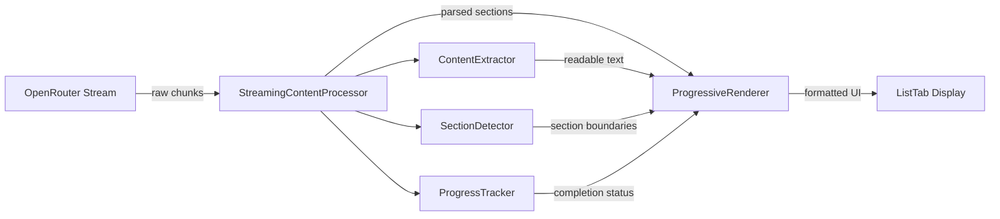

# Implementation Plan Streaming Enhancement - Design

## Architecture Overview

The streaming enhancement introduces a real-time content processing layer that transforms raw JSON chunks into readable, progressive content display without disrupting the existing implementation plan infrastructure.



## Core Components

### 1. StreamingContentProcessor
**Purpose**: Real-time processing of JSON chunks into displayable content
**Location**: `src/features/implementation-plan/streaming/`

```typescript
interface StreamingContentProcessor {
  processChunk(chunk: string): ProcessedContent;
  getCurrentSections(): PlanSection[];
  getProgress(): StreamingProgress;
  reset(): void;
}
```

**Responsibilities:**
- Accumulate and parse JSON chunks incrementally
- Extract readable content from completed sections
- Track generation progress and current phase
- Handle malformed or partial content gracefully

### 2. ProgressiveRenderer
**Purpose**: Render streaming content with smooth transitions and proper formatting
**Location**: `src/features/implementation-plan/components/`

```typescript
interface ProgressiveRendererProps {
  sections: ProcessedSection[];
  currentPhase: GenerationPhase;
  progress: number;
  isComplete: boolean;
}
```

**Features:**
- Card-based layout for each plan section
- Smooth animations for content appearance
- Progress indicators and phase labels
- Responsive design for mobile/desktop

### 3. ContentExtractor
**Purpose**: Extract human-readable content from JSON structures
**Location**: `src/features/implementation-plan/streaming/`

```typescript
interface ContentExtractor {
  extractTitle(data: any): string | null;
  extractBulletPoints(data: any): string[];
  extractDescription(data: any): string | null;
  formatContent(content: any): FormattedContent;
}
```

## Data Flow Design

### Streaming Process
1. **Chunk Reception**: Raw JSON chunks arrive from OpenRouter
2. **Incremental Parsing**: Attempt to parse accumulated content
3. **Content Extraction**: Extract readable text from parsed sections
4. **Progress Calculation**: Determine completion percentage and current phase
5. **UI Update**: Render formatted content with smooth transitions
6. **Fallback Handling**: Display raw content if processing fails

### State Management
```typescript
interface StreamingState {
  rawContent: string;           // Accumulated raw chunks
  processedSections: ProcessedSection[];  // Extracted readable content
  currentPhase: GenerationPhase;          // Current generation phase
  progress: number;             // Completion percentage (0-100)
  error: string | null;         // Processing error if any
}
```

## UI/UX Design

### Visual Hierarchy
```
┌─ Streaming Container ─────────────────────────┐
│ ┌─ Progress Header ─────────────────────────┐ │
│ │ 🔄 Generating Overview... (25%)          │ │
│ └───────────────────────────────────────────┘ │
│                                               │
│ ┌─ Completed Section ───────────────────────┐ │
│ │ ✅ Business Overview                      │ │
│ │ • Goal 1: Market validation               │ │
│ │ • Goal 2: Product development             │ │
│ └───────────────────────────────────────────┘ │
│                                               │
│ ┌─ Current Section ─────────────────────────┐ │
│ │ ⏳ Implementation Phases                  │ │
│ │ • Phase 1: Research and Planning...       │ │
│ │ • Phase 2: [generating...]                │ │
│ └───────────────────────────────────────────┘ │
└───────────────────────────────────────────────┘
```

### Typography & Styling
- **Primary Text**: `text-gray-700` for main content
- **Secondary Text**: `text-gray-500` for metadata
- **Font Family**: System sans-serif for readability
- **Font Sizes**: `text-sm` for content, `text-xs` for labels
- **Spacing**: Consistent padding and margins using Tailwind scale

### Animation Design
- **Fade In**: New sections appear with 200ms fade transition
- **Slide Down**: Content slides down smoothly as it's added
- **Pulse**: Current generation phase has subtle pulse animation
- **Progress Bar**: Smooth width transitions for progress indicators

## Technical Implementation

### Content Processing Algorithm
```typescript
class StreamingContentProcessor {
  private buffer: string = '';
  private sections: Map<string, any> = new Map();
  
  processChunk(chunk: string): ProcessedContent {
    this.buffer += chunk;
    
    // Try to parse accumulated content
    const parsed = this.attemptParse(this.buffer);
    if (parsed) {
      return this.extractReadableContent(parsed);
    }
    
    // Fallback to partial extraction
    return this.extractPartialContent(this.buffer);
  }
  
  private attemptParse(content: string): any | null {
    // Multiple parsing strategies
    return this.tryJsonParse(content) || 
           this.tryPartialJsonParse(content) ||
           this.tryMarkdownParse(content);
  }
}
```

### Section Detection Strategy
```typescript
const SECTION_PATTERNS = {
  overview: /["']overview["']\s*:\s*{/,
  phases: /["']phases["']\s*:\s*\[/,
  tasks: /["']tasks["']\s*:\s*\[/,
  timeline: /["']timeline["']\s*:\s*{/,
  resources: /["']resources["']\s*:\s*{/,
  budget: /["']budget["']\s*:\s*{/,
  risks: /["']risks["']\s*:\s*\[/,
  kpis: /["']kpis["']\s*:\s*\[/
};
```

### Error Handling Strategy
1. **Graceful Degradation**: Fall back to raw display if processing fails
2. **Partial Recovery**: Show successfully processed sections even if others fail
3. **User Feedback**: Clear error messages with recovery options
4. **Logging**: Comprehensive error logging for debugging

## Performance Considerations

### Optimization Strategies
- **Debounced Updates**: Limit UI updates to 60fps maximum
- **Incremental Processing**: Process only new chunks, not entire buffer
- **Memory Management**: Clear processed chunks to prevent memory leaks
- **Lazy Rendering**: Render only visible sections for long plans

### Memory Usage
- **Buffer Size Limit**: Cap raw content buffer at 50KB
- **Section Cleanup**: Remove old sections when memory pressure detected
- **Garbage Collection**: Explicit cleanup on component unmount

## Accessibility Design

### ARIA Implementation
```typescript
<div 
  role="log" 
  aria-live="polite" 
  aria-label="Implementation plan generation progress"
>
  <div aria-label={`Currently generating: ${currentPhase}`}>
    {/* Streaming content */}
  </div>
</div>
```

### Screen Reader Support
- **Live Regions**: Announce progress updates and new sections
- **Semantic HTML**: Proper heading hierarchy and list structures
- **Focus Management**: Maintain logical tab order during updates
- **Alternative Text**: Descriptive labels for progress indicators

## Integration Points

### Existing System Integration
- **ListTab.tsx**: Replace current streaming preview with ProgressiveRenderer
- **useImplementationPlan.ts**: Add streaming processor to hook
- **ImplementationPlanProvider.tsx**: Extend state for streaming progress
- **types.ts**: Add interfaces for streaming-specific types

### Backward Compatibility
- **Fallback Mode**: Automatic fallback to current raw display if needed
- **Feature Flag**: Optional toggle for streaming enhancement
- **Data Preservation**: No changes to final plan data structure
- **Cache Compatibility**: Maintain existing caching behavior

## Testing Strategy

### Unit Testing
- **Content Extraction**: Test parsing of various JSON structures
- **Progress Calculation**: Verify accurate progress reporting
- **Error Handling**: Test graceful degradation scenarios
- **Performance**: Benchmark processing speed and memory usage

### Integration Testing
- **End-to-End Flow**: Test complete streaming experience
- **Error Recovery**: Test handling of network interruptions
- **Accessibility**: Automated accessibility testing
- **Cross-Browser**: Ensure compatibility across browsers

### User Testing
- **Usability**: A/B test streaming vs. raw display
- **Accessibility**: Test with screen readers and keyboard navigation
- **Performance**: Monitor real-world performance metrics
- **Feedback**: Collect user feedback on streaming experience