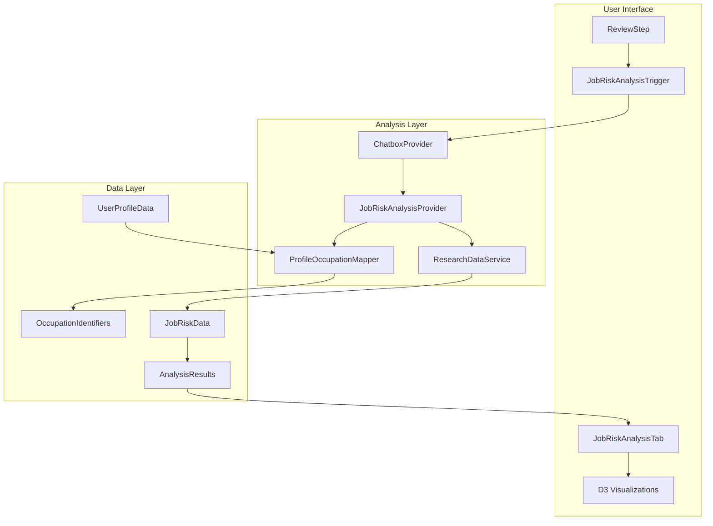
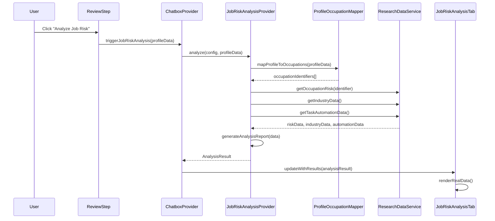

# Design Document

## Overview

The Job Risk Profile Integration feature creates a seamless bridge between user profile data and job risk analysis by extending the existing chatbox analysis system. The design leverages the established ResearchDataService and D3 visualizations while adding intelligent profile-to-occupation mapping and a specialized analysis provider for job risk assessment.

## Architecture

### High-Level Architecture



### Data Flow Sequence



## Components and Interfaces

### 1. JobRiskAnalysisTrigger Component

**Purpose**: Dedicated trigger button for job risk analysis in ReviewStep.

**Interface**:
```typescript
interface JobRiskAnalysisTriggerProps {
  profileData: UserProfileData;
  onAnalysisStart?: () => void;
  onAnalysisComplete?: (result: JobRiskAnalysisResult) => void;
  disabled?: boolean;
}
```

**Key Features**:
- Red-themed styling to match job risk urgency
- Separate from profile analysis trigger
- Shows readiness status and missing requirements
- Integrates with chatbox analysis system

### 2. ProfileOccupationMapper Service

**Purpose**: Intelligent mapping from user profiles to occupation identifiers.

**Interface**:
```typescript
interface ProfileOccupationMapper {
  mapProfileToOccupations(profile: UserProfileData): Promise<OccupationMapping>;
  generateSearchQueries(profile: UserProfileData): string[];
  calculateRelevanceScore(occupation: OccupationData, profile: UserProfileData): number;
}

interface OccupationMapping {
  primary: OccupationIdentifier[];
  secondary: OccupationIdentifier[];
  confidence: number;
  searchQueries: string[];
}
```

**Mapping Logic**:
- **Professional**: `${jobFunction} ${seniority} ${industry}` → SOC codes
- **Student**: `${fieldOfStudy} entry level` → target occupations
- **Business Owner**: `${sector} ${stage} manager/owner` → leadership roles
- **Career Shifter**: Both `${previousField}` and `${desiredField}` → transition analysis

### 3. JobRiskAnalysisProvider

**Purpose**: Specialized analysis provider for job risk assessment.

**Interface**:
```typescript
interface JobRiskAnalysisProvider extends AnalysisProvider {
  id: 'job-risk-analysis';
  analyze(config: AnalysisConfig, profileData: UserProfileData): Promise<JobRiskAnalysisResult>;
  generateRiskReport(data: JobRiskData): Promise<string>;
}

interface JobRiskData {
  occupationRisks: OccupationRisk[];
  industryExposure: IndustryData[];
  skillAutomation: TaskAutomationData[];
  userSkillMatches: SkillMatch[];
}
```

**Analysis Process**:
1. Map profile to occupations using ProfileOccupationMapper
2. Query ResearchDataService for each occupation
3. Aggregate risk data and calculate personalized metrics
4. Generate AI-powered analysis report
5. Store results with profile metadata

### 4. Enhanced useJobRiskData Hook

**Purpose**: Connect JobRiskAnalysisTab to real analysis results.

**Enhanced Interface**:
```typescript
interface UseJobRiskDataResult {
  // Existing placeholder data
  velocity: { data: CutSeries };
  skills: { impacts: SkillImpacts; matrix: RoleSkillMatrix };
  forecast: { history: CutSeries; forecast: ForecastSeries };
  insights: InsightsBundle;
  
  // New real data integration
  analysisResult?: JobRiskAnalysisResult;
  isRealData: boolean;
  profileHash?: string;
  lastAnalyzed?: string;
  
  // State management
  loading: boolean;
  error?: string;
  refreshAnalysis: () => Promise<void>;
}
```

**Data Priority**:
1. Real analysis results (if available and current)
2. Cached analysis results (if profile unchanged)
3. Placeholder data (fallback)

## Data Models

### Core Data Types

```typescript
interface JobRiskAnalysisResult extends AnalysisResult {
  type: 'job-risk-analysis';
  profileHash: string;
  occupationMappings: OccupationMapping;
  riskAssessment: {
    overallRisk: 'low' | 'medium' | 'high' | 'very_high';
    riskScore: number;
    percentile: number;
    timeframe: string;
  };
  skillAnalysis: {
    atRiskSkills: string[];
    safeSkills: string[];
    recommendations: string[];
  };
  industryInsights: {
    sectorRisk: number;
    trends: string[];
    alternatives: string[];
  };
  visualizationData: {
    velocity: CutSeries;
    skills: SkillImpacts;
    forecast: ForecastSeries;
  };
}

interface OccupationIdentifier {
  socCode?: string;
  name: string;
  confidence: number;
  source: 'exact_match' | 'fuzzy_match' | 'inferred';
}
```

### Profile Mapping Strategies

```typescript
interface MappingStrategy {
  role: Role;
  primaryFields: string[];
  secondaryFields: string[];
  queryTemplate: string;
  confidenceWeights: Record<string, number>;
}

const MAPPING_STRATEGIES: Record<Role, MappingStrategy> = {
  [Role.Professional]: {
    primaryFields: ['jobFunction', 'seniority', 'industry'],
    secondaryFields: ['skills', 'yearsExperience'],
    queryTemplate: '{jobFunction} {seniority} {industry}',
    confidenceWeights: { jobFunction: 0.4, industry: 0.3, seniority: 0.3 }
  },
  // ... other roles
};
```

## Integration Points

### 1. ChatboxProvider Enhancement

**New Analysis Type**:
```typescript
type AnalysisType = 'profile' | 'job-risk-analysis' | 'resume' | 'interview' | 'career-planning';

interface ChatboxContextType {
  triggerJobRiskAnalysis: (profileData: UserProfileData) => Promise<void>;
  getJobRiskResults: () => JobRiskAnalysisResult | null;
}
```

### 2. ResearchDataService Integration

**Enhanced Query Methods**:
```typescript
interface ResearchDataServiceExtensions {
  getOccupationsByProfile(profile: UserProfileData): Promise<OccupationMatch[]>;
  getPersonalizedRiskData(occupations: string[], skills: string[]): Promise<PersonalizedRiskData>;
  getSkillRiskMatrix(skills: string[]): Promise<SkillRiskMatrix>;
}
```

### 3. JobRiskAnalysisTab Enhancement

**Real Data Integration**:
```typescript
interface JobRiskAnalysisTabProps {
  userProfile?: UserProfileData;
  forceRefresh?: boolean;
}

// Enhanced component behavior:
// 1. Check for analysis results on mount
// 2. Subscribe to analysis completion events
// 3. Show real data when available
// 4. Provide analysis trigger when no data exists
```

## Error Handling Strategy

### Graceful Degradation Levels

1. **Full Service Available**: Complete analysis with real data
2. **Partial Service**: Limited analysis with cached/fallback data
3. **Service Unavailable**: Placeholder data with analysis prompt
4. **Critical Error**: Error state with retry options

### Error Recovery Mechanisms

```typescript
interface ErrorRecoveryStrategy {
  mappingFailure: 'use_industry_data' | 'use_generic_roles' | 'show_error';
  serviceTimeout: 'use_cache' | 'partial_analysis' | 'placeholder_mode';
  analysisFailure: 'raw_data_display' | 'simplified_report' | 'error_state';
  networkError: 'offline_mode' | 'retry_prompt' | 'cached_results';
}
```

## Performance Optimization

### Caching Strategy

```typescript
interface JobRiskCache {
  profileMappings: Map<string, OccupationMapping>; // Profile hash → mappings
  analysisResults: Map<string, JobRiskAnalysisResult>; // Profile hash → results
  occupationData: Map<string, OccupationRisk>; // SOC code → risk data
  ttl: {
    mappings: 24 * 60 * 60 * 1000; // 24 hours
    results: 7 * 24 * 60 * 60 * 1000; // 7 days
    occupationData: 30 * 24 * 60 * 60 * 1000; // 30 days
  };
}
```

### Optimization Techniques

1. **Profile Hashing**: Detect profile changes to avoid unnecessary re-analysis
2. **Lazy Loading**: Load analysis results only when JobRiskAnalysisTab is viewed
3. **Incremental Updates**: Update only changed visualizations
4. **Background Refresh**: Refresh stale data in background
5. **Request Batching**: Batch multiple ResearchDataService queries

## Security and Privacy

### Data Protection

1. **Profile Data**: Encrypt sensitive profile information in transit
2. **Analysis Results**: Store with user consent and retention policies
3. **API Keys**: Secure handling of OpenRouter API keys
4. **Audit Trail**: Log analysis requests for debugging (anonymized)

### Privacy Compliance

1. **Data Minimization**: Only process necessary profile fields
2. **User Consent**: Clear consent for job risk analysis
3. **Data Retention**: Configurable retention periods for results
4. **Anonymization**: Remove PII from error logs and analytics

## Testing Strategy

### Unit Testing

```typescript
describe('ProfileOccupationMapper', () => {
  test('maps professional profiles correctly');
  test('handles missing profile fields gracefully');
  test('generates appropriate search queries');
  test('calculates relevance scores accurately');
});

describe('JobRiskAnalysisProvider', () => {
  test('integrates with ResearchDataService');
  test('generates comprehensive analysis reports');
  test('handles service failures gracefully');
  test('caches results appropriately');
});
```

### Integration Testing

```typescript
describe('End-to-End Job Risk Analysis', () => {
  test('complete flow from profile to visualization');
  test('real-time data updates in JobRiskAnalysisTab');
  test('error handling with service failures');
  test('performance under concurrent requests');
});
```

## Future Enhancements

### Phase 2 Features

1. **Multi-Profile Analysis**: Compare risk across different career paths
2. **Trend Analysis**: Historical risk changes over time
3. **Skill Recommendations**: AI-powered upskilling suggestions
4. **Industry Alerts**: Notifications about industry risk changes
5. **Export Capabilities**: PDF reports and data export

### Extensibility Points

1. **Additional Data Sources**: Integration with job boards, salary data
2. **Custom Risk Models**: User-configurable risk assessment criteria
3. **Geographic Analysis**: Location-based risk assessment
4. **Real-time Updates**: WebSocket integration for live data
5. **Mobile Optimization**: Touch-friendly interactions and offline support