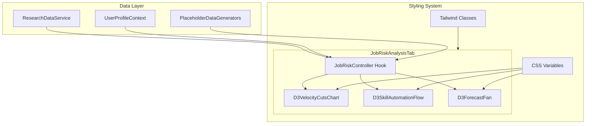
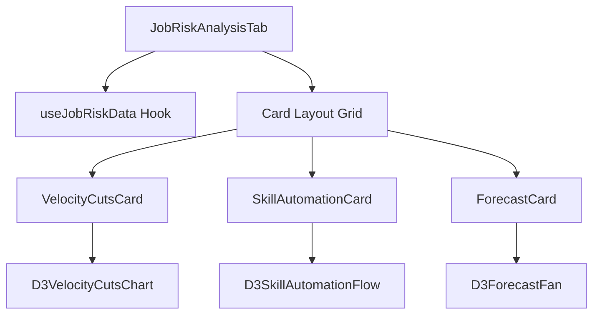
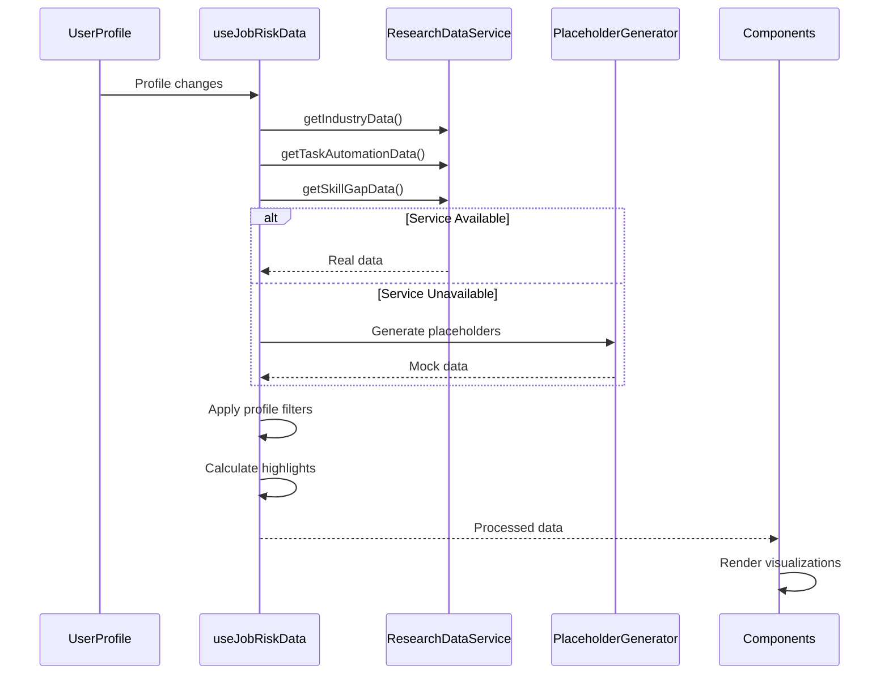

# Design Document

## Overview

The Job Risk Visualization feature implements three D3-based visualizations within a new JobRiskAnalysisTab component. The system follows a minimalist premium design with an urgent tone, using amber/red color schemes to convey the inevitability of AI-driven job displacement. The architecture emphasizes integration-ready components that can connect to existing research services and user profile data.

## Architecture

### High-Level Architecture



### Component Hierarchy



## Components and Interfaces

### 1. JobRiskAnalysisTab Component

**Purpose**: Main container component that orchestrates the three visualizations in a responsive grid layout.

**Props Interface**:
```typescript
interface JobRiskAnalysisTabProps {
  className?: string;
  userProfile?: UserProfileData;
}
```

**Responsibilities**:
- Render responsive 3-card grid layout
- Provide data context to child components
- Handle loading and error states
- Apply premium minimalist styling

### 2. D3VelocityCutsChart Component

**Purpose**: Displays accelerating job cuts over time with animated line drawing.

**Props Interface**:
```typescript
interface D3VelocityCutsChartProps {
  data: CutSeries;
  width?: number;
  height?: number;
  highlightWindowMonths?: number;
  showCaption?: boolean;
  className?: string;
}

type CutSeriesPoint = { t: string | Date; cuts: number };
type CutSeries = CutSeriesPoint[];
```

**Key Features**:
- Smooth monotone line with amber-to-red gradient
- Animated drawing with accelerating easing
- Subtle filled area under curve
- Micro annotations for recent deltas
- Accessibility support with aria-labels

### 3. D3SkillAutomationFlow Component

**Purpose**: Shows skills at risk through radial bloom or chord diagram modes.

**Props Interface**:
```typescript
interface D3SkillAutomationFlowProps {
  impacts: SkillImpacts;
  matrix?: RoleSkillMatrix;
  width?: number;
  height?: number;
  mode?: 'auto' | 'radial' | 'chord';
  highlightSkills?: string[];
  showLegend?: boolean;
  showCaption?: boolean;
  className?: string;
}

type SkillImpact = { skillGroupId: string; impact: number; volume?: number };
type SkillImpacts = SkillImpact[];
type RoleSkillMatrix = number[][];
```

**Key Features**:
- Auto-mode selection based on data availability
- Radial bloom: skill clusters as radial bars
- Chord mode: role-to-skill flow ribbons
- User skill highlighting with halos
- Subtle particle effects for high-impact segments

### 4. D3ForecastFan Component

**Purpose**: Projects future job displacement trends with confidence bands.

**Props Interface**:
```typescript
interface D3ForecastFanProps {
  history: CutSeries;
  forecast: ForecastSeries;
  width?: number;
  height?: number;
  showBand?: boolean;
  showThermalStrip?: boolean;
  showCaption?: boolean;
  className?: string;
}

type ForecastPoint = { t: string | Date; expected: number; p10?: number; p90?: number };
type ForecastSeries = ForecastPoint[];
```

**Key Features**:
- Historical data as solid line, forecast as dashed
- P10-P90 confidence band with diagonal hatching
- Thermal month strip showing intensity
- Clear visual distinction between history and projection

### 5. useJobRiskData Hook

**Purpose**: Central data management and integration point.

**Interface**:
```typescript
interface JobRiskData {
  velocityData: CutSeries;
  skillImpacts: SkillImpacts;
  skillMatrix?: RoleSkillMatrix;
  forecastData: ForecastSeries;
  loading: boolean;
  error: string | null;
}

function useJobRiskData(userProfile?: UserProfileData): JobRiskData;
```

**Responsibilities**:
- Aggregate data from ResearchDataService
- Generate placeholder data when services unavailable
- Apply user profile filters and highlights
- Handle loading and error states
- Cache and optimize data updates

## Data Models

### Core Data Types

```typescript
// Time series data for velocity chart
interface CutSeriesPoint {
  t: string | Date;
  cuts: number;
  metadata?: {
    industry?: string;
    confidence?: number;
    source?: string;
  };
}

// Skill impact data for automation flow
interface SkillImpact {
  skillGroupId: string;
  skillName: string;
  impact: number; // 0-1 normalized
  volume?: number;
  category: 'technical' | 'cognitive' | 'manual' | 'social';
  trend: 'increasing' | 'stable' | 'decreasing';
}

// Forecast data with uncertainty
interface ForecastPoint {
  t: string | Date;
  expected: number;
  p10?: number;
  p90?: number;
  confidence: number;
  scenario: 'conservative' | 'moderate' | 'aggressive';
}

// Integration with existing user profile
interface UserProfileIntegration {
  occupation?: string;
  industry?: string;
  skills: string[];
  experience?: string;
  location?: string;
}
```

### Data Flow Architecture



## Error Handling

### Error Boundaries and Fallbacks

```typescript
interface ErrorHandlingStrategy {
  // Component-level error boundary
  ChartErrorBoundary: {
    fallback: 'placeholder-message' | 'simplified-chart' | 'error-state';
    recovery: 'retry-button' | 'auto-retry' | 'manual-refresh';
  };
  
  // Data-level error handling
  DataErrorHandling: {
    missingData: 'generate-placeholder' | 'show-message' | 'hide-component';
    serviceTimeout: 'use-cache' | 'show-loading' | 'fallback-data';
    invalidData: 'sanitize' | 'skip' | 'show-error';
  };
}
```

### Graceful Degradation

1. **Service Unavailable**: Use deterministic placeholder generators
2. **Partial Data**: Show available visualizations, hide missing ones
3. **Performance Issues**: Reduce animation complexity, prune data points
4. **Accessibility**: Provide text alternatives, keyboard navigation

## Testing Strategy

### Unit Testing

```typescript
// Component testing with React Testing Library
describe('D3VelocityCutsChart', () => {
  test('renders with placeholder data');
  test('handles empty data gracefully');
  test('respects reduced motion preferences');
  test('provides accessible labels');
});

// Hook testing
describe('useJobRiskData', () => {
  test('integrates with ResearchDataService');
  test('generates placeholders when service unavailable');
  test('applies user profile filters correctly');
  test('handles loading and error states');
});
```

### Integration Testing

```typescript
// Full tab integration
describe('JobRiskAnalysisTab Integration', () => {
  test('renders all three visualizations');
  test('responds to user profile changes');
  test('handles responsive layout correctly');
  test('maintains performance under load');
});
```

### Visual Testing

- Screenshot testing for consistent rendering
- Animation testing with reduced motion
- Responsive layout testing across breakpoints
- Color contrast and accessibility validation

## Performance Considerations

### Optimization Strategies

1. **SVG Rendering**: Use efficient D3 update patterns
2. **Data Processing**: Debounce resize events, memoize calculations
3. **Animation**: RequestAnimationFrame for smooth 60fps
4. **Memory Management**: Clean up D3 selections on unmount

### Performance Budgets

```typescript
interface PerformanceBudgets {
  initialRender: '< 100ms';
  dataUpdate: '< 50ms';
  resize: '< 16ms'; // 60fps
  memoryUsage: '< 10MB per chart';
  bundleSize: '< 50KB additional';
}
```

## Accessibility Implementation

### WCAG 2.1 AA Compliance

```typescript
interface AccessibilityFeatures {
  // Screen reader support
  ariaLabels: 'descriptive chart summaries';
  srOnlyText: 'key insights and data points';
  
  // Keyboard navigation
  focusManagement: 'tab order through charts';
  focusIndicators: 'visible focus rings';
  
  // Motion preferences
  reducedMotion: 'disable animations when requested';
  
  // Color accessibility
  colorContrast: 'minimum 4.5:1 ratio';
  colorBlindness: 'patterns and textures for differentiation';
}
```

### Implementation Details

1. **SVG Accessibility**: Use `role="img"` and `aria-labelledby`
2. **Focus Management**: Keyboard-accessible chart containers
3. **Screen Reader**: Provide data tables as alternatives
4. **Motion Sensitivity**: Respect `prefers-reduced-motion`

## Integration Points

### ResearchDataService Integration

```typescript
// Mapping service methods to visualization data
interface ServiceIntegration {
  velocityChart: {
    primary: 'getIndustryData()';
    aggregation: 'monthly job cuts by industry';
    filtering: 'user industry/occupation';
  };
  
  skillAutomation: {
    primary: 'getTaskAutomationData()';
    secondary: 'getSkillGapData()';
    highlighting: 'user skills from profile';
  };
  
  forecast: {
    primary: 'derived from velocity data';
    fallback: 'simple moving average';
    confidence: 'based on data quality';
  };
}
```

### User Profile Integration

```typescript
// Profile data influence on visualizations
interface ProfileIntegration {
  filtering: {
    industry: 'weight industry-specific data';
    occupation: 'highlight relevant occupations';
    experience: 'adjust risk calculations';
  };
  
  highlighting: {
    skills: 'highlight user skills in automation flow';
    location: 'regional data weighting';
    role: 'personalized risk messaging';
  };
}
```

## Styling and Theming

### CSS Variables System

```css
:root {
  /* Base colors */
  --viz-bg: #0b1220;        /* slate-950 */
  --viz-surface: #0f172a;   /* slate-900 */
  --viz-grid: rgba(148,163,184,0.18);
  
  /* Risk palette */
  --viz-amber-1: #f59e0b;
  --viz-amber-2: #fb923c;
  --viz-red-1: #ef4444;
  --viz-glow: rgba(251,146,60,0.35);
  
  /* Typography */
  --viz-font-family: 'Inter', sans-serif;
  --viz-font-size-xs: 10px;
  --viz-font-size-sm: 12px;
  --viz-font-size-base: 14px;
  
  /* Spacing (8px grid) */
  --viz-space-1: 8px;
  --viz-space-2: 16px;
  --viz-space-3: 24px;
  
  /* Effects */
  --viz-border-radius: 12px;
  --viz-shadow: 0 4px 6px -1px rgba(0, 0, 0, 0.1);
}
```

### Component Styling

```typescript
// Tailwind classes for consistent styling
interface StylingClasses {
  card: 'bg-slate-900 rounded-xl border border-slate-700 p-6 shadow-lg';
  title: 'text-slate-100 text-sm font-medium mb-2';
  caption: 'text-slate-400 text-xs mt-2';
  grid: 'grid grid-cols-1 md:grid-cols-2 lg:grid-cols-3 gap-6';
}
```

## Future Enhancements

### Phase 2 Features

1. **Interactive Tooltips**: Hover details with keyboard support
2. **Data Export**: CSV/PNG export functionality
3. **Customization**: User-configurable time ranges and metrics
4. **Real-time Updates**: WebSocket integration for live data
5. **Canvas Fallback**: High-performance rendering for large datasets

### Scalability Considerations

1. **Data Virtualization**: Handle large time series efficiently
2. **Progressive Loading**: Load visualizations incrementally
3. **Caching Strategy**: Intelligent data caching and invalidation
4. **Mobile Optimization**: Touch-friendly interactions and responsive design