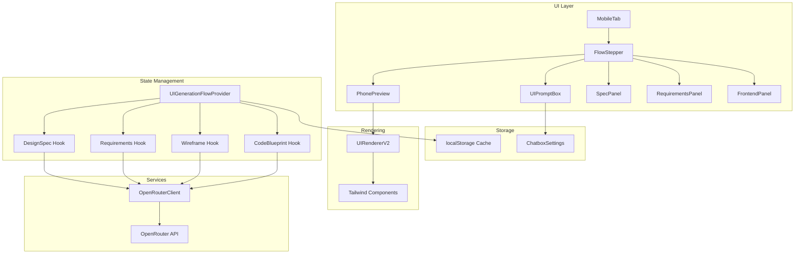
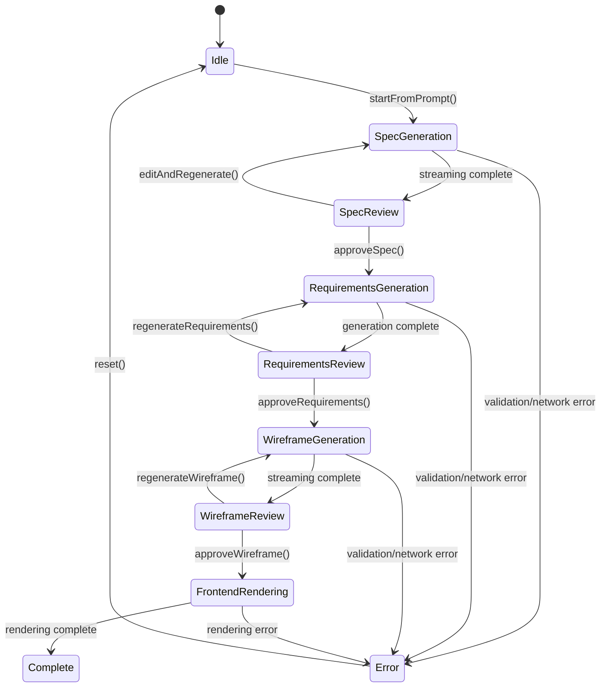

# Design Document

## Overview

The UI Generation Multistage system transforms the existing single-stage UI generation into a comprehensive 4-stage workflow that provides users with granular control over the mobile UI generation process. The system leverages streaming AI responses, robust state management, and a responsive interface to guide users from natural language prompts to production-ready mobile UI previews.

The design builds upon the existing OpenRouter integration, chatbox settings infrastructure, and UI rendering capabilities while introducing new orchestration layers, enhanced data contracts, and improved user experience patterns.

## Architecture

### High-Level Architecture



### State Flow Architecture



## Components and Interfaces

### Core Provider: UIGenerationFlowProvider

**Location:** `src/app/businessidea/tabs/ui-prompt/UIGenerationFlowProvider.tsx`

**Responsibilities:**
- Orchestrate the 4-stage generation workflow
- Manage global state for all stages
- Handle streaming operations with abort control
- Provide caching and persistence
- Coordinate between hooks and UI components

**State Interface:**
```typescript
interface UIGenerationFlowState {
  stage: 'idle' | 'spec' | 'requirements' | 'wireframe' | 'frontend' | 'error';
  specDoc?: DesignSpecDoc;
  tasks?: RequirementTask[];
  wireframe?: WireframeScreen;
  blueprint?: GeneratedCodeBlueprint;
  stream: {
    text: string;
    startedAt?: number;
    lastChunkAt?: number;
    chunks: number;
    bytes: number;
  };
  error?: string;
  controller?: AbortController;
  cache: Map<string, any>;
}
```

**Actions Interface:**
```typescript
interface UIGenerationFlowActions {
  startFromPrompt(prompt: string, options: GenerationOptions): Promise<void>;
  approveSpec(): Promise<void>;
  editSpec(updates: Partial<DesignSpecDoc>): void;
  regenerateRequirements(): Promise<void>;
  approveRequirements(): Promise<void>;
  regenerateWireframe(): Promise<void>;
  approveWireframe(): void;
  generateCodeBlueprint(): Promise<void>;
  cancel(): void;
  reset(): void;
}
```

### Layout Components

#### FlowStepper Component

**Location:** `src/app/businessidea/tabs/ui-prompt/flow/FlowStepper.tsx`

**Responsibilities:**
- Render vertical stepper interface with 4 collapsible panels
- Manage panel expansion/collapse state
- Coordinate between different stage panels
- Provide navigation controls and progress indicators

**Features:**
- Collapsible panels with smooth animations
- Progress indicators showing completion status
- Stage-specific action buttons (Edit, Regenerate, Approve)
- Responsive design for mobile and desktop

#### PhonePreview Component

**Location:** `src/app/businessidea/tabs/ui-prompt/preview/PhonePreview.tsx`

**Responsibilities:**
- Render mobile device frame container
- Display live wireframe rendering
- Provide device-specific viewport simulation
- Handle responsive preview scaling

**Features:**
- iPhone-style device frame with realistic proportions
- Viewport scaling for different screen sizes
- Live updates during wireframe generation
- Export preview functionality

### Stage-Specific Hooks

#### useDesignSpec Hook

**Location:** `src/app/businessidea/tabs/ui-prompt/hooks/useDesignSpec.ts`

**Responsibilities:**
- Generate DesignSpecDoc from user prompt
- Handle streaming JSON parsing with incremental updates
- Validate generated spec against Zod schema
- Provide retry logic for failed generations

**Input/Output:**
```typescript
interface UseDesignSpecInput {
  prompt: string;
  model: string;
  signal: AbortSignal;
  onChunk: (chunk: string) => void;
}

interface UseDesignSpecOutput {
  generate: (input: UseDesignSpecInput) => Promise<DesignSpecDoc>;
  isLoading: boolean;
  error?: string;
  progress: StreamingProgress;
}
```

#### useRequirements Hook

**Location:** `src/app/businessidea/tabs/ui-prompt/hooks/useRequirements.ts`

**Responsibilities:**
- Derive 8-10 RequirementTask items from approved DesignSpecDoc
- Ensure requirements have proper acceptance criteria and priorities
- Validate task dependencies and estimates
- Handle requirement editing and updates

#### useUIGeneration Hook (Enhanced)

**Location:** `src/app/businessidea/tabs/ui-prompt/hooks/useUIGeneration.ts`

**Responsibilities:**
- Generate WireframeScreen from DesignSpecDoc and RequirementTask[]
- Extend existing streaming capabilities for stage-aware operation
- Integrate with new data contracts and validation
- Maintain backward compatibility with existing UIPromptBox

#### useCodeBlueprint Hook

**Location:** `src/app/businessidea/tabs/ui-prompt/hooks/useCodeBlueprint.ts`

**Responsibilities:**
- Generate exportable TSX code from WireframeScreen
- Create GeneratedCodeBlueprint with component structure
- Handle asset generation and bundling
- Provide code formatting and optimization

### Enhanced Renderer: UIRendererV2

**Location:** `src/app/businessidea/tabs/ui-prompt/renderer/UIRendererV2.tsx`

**Responsibilities:**
- Render WireframeScreen with expanded component library
- Map design tokens to Tailwind utility classes
- Provide interactive component behaviors
- Handle responsive rendering and accessibility

**Supported Components:**
- Layout: Screen, Header, Navbar, Card, List, ListItem
- Forms: Form, TextField, Button, SegmentedControl
- Data: Tabs, Chip, Stat, ChartPlaceholder
- Media: Avatar, Icon, ModalSheet
- Interactive: Button press feedback, tab switching, modal toggle

**Token Mapping System:**
```typescript
interface TokenMapper {
  colors: (token: string) => string; // Maps to Tailwind color classes
  typography: (scale: 'sm'|'md'|'lg') => string; // Maps to text size classes
  spacing: (size: 'sm'|'md'|'lg') => string; // Maps to padding/margin classes
  radii: (radius: 'none'|'sm'|'md'|'lg') => string; // Maps to rounded classes
  shadows: (shadow: 'none'|'sm'|'md'|'lg') => string; // Maps to shadow classes
}
```

## Data Models

### Enhanced Type System

**Location:** `src/app/businessidea/tabs/ui-prompt/types.ts`

#### DesignSpecDoc
```typescript
interface DesignSpecDoc {
  id: string;
  title: string;
  summary: string;
  targetAudience?: string;
  primaryGoals: string[];
  secondaryGoals?: string[];
  navigation?: {
    type: 'tabs' | 'bottom-bar' | 'none';
    items?: string[];
  };
  layoutGuidelines?: {
    grid?: number;
    spacing?: 'sm' | 'md' | 'lg';
    sections?: string[];
  };
  componentInventory?: Array<{
    kind: string;
    purpose?: string;
    keyProps?: Record<string, any>;
  }>;
  interactions?: Array<{
    event: string;
    action: string;
    target?: string;
  }>;
  dataBindings?: Array<{
    entity: string;
    fields: string[];
  }>;
  styleTokens?: {
    colors?: Record<string, string>;
    typography?: {
      fontFamily?: string;
      scale?: 'sm' | 'md' | 'lg';
    };
    radii?: 'none' | 'sm' | 'md' | 'lg';
    shadows?: 'none' | 'sm' | 'md' | 'lg';
  };
  accessibility?: string[];
  performance?: string[];
}
```

#### RequirementTask
```typescript
interface RequirementTask {
  id: string;
  title: string;
  description: string;
  acceptanceCriteria: string[];
  priority: 'P0' | 'P1' | 'P2';
  status: 'todo' | 'in-progress' | 'done';
  dependsOn?: string[];
  estimate?: number; // story points
}
```

#### WireframeScreen (Enhanced)
```typescript
interface WireframeScreen {
  name: string;
  viewport?: {
    width: number;
    height: number;
    device: 'phone' | 'tablet';
  };
  tokens?: {
    theme?: 'light' | 'dark';
    colors?: Record<string, string>;
    radii?: string;
    shadows?: string;
  };
  nodes: WireframeNode[];
  viewStates?: Record<string, WireframeNode[]>;
  actions?: Array<{
    id: string;
    event: string;
    intent: string;
    params?: any;
  }>;
  bindings?: Array<{
    nodeId: string;
    entity: string;
    field: string;
  }>;
}
```

#### GeneratedCodeBlueprint
```typescript
interface GeneratedCodeBlueprint {
  componentName: string;
  tsx: string; // stringified TSX for export only
  assets?: Array<{
    name: string;
    content: string;
  }>;
  dependencies?: string[];
  metadata?: {
    generatedAt: string;
    model: string;
    version: string;
  };
}
```

### Validation Schemas

**Location:** `src/app/businessidea/tabs/ui-prompt/schemas.ts`

All data models will have corresponding Zod schemas for runtime validation:
- `DesignSpecDocSchema`
- `RequirementTaskSchema`
- `WireframeScreenSchema`
- `GeneratedCodeBlueprintSchema`

## Error Handling

### Error Classification System

```typescript
enum ErrorType {
  VALIDATION_ERROR = 'validation',
  NETWORK_ERROR = 'network',
  PARSING_ERROR = 'parsing',
  TIMEOUT_ERROR = 'timeout',
  ABORT_ERROR = 'abort',
  QUOTA_ERROR = 'quota'
}

interface UIGenerationError {
  type: ErrorType;
  message: string;
  stage: string;
  details?: any;
  recoverable: boolean;
  retryable: boolean;
}
```

### Recovery Strategies

1. **Validation Errors:** Show specific field errors with correction suggestions
2. **Network Errors:** Automatic retry with exponential backoff
3. **Parsing Errors:** Fallback to non-streaming mode with tighter prompts
4. **Timeout Errors:** Allow manual retry or prompt simplification
5. **Abort Errors:** Clean state reset with progress preservation

### Error UI Components

- Inline error messages with specific field highlighting
- Retry buttons with different strategies (same prompt, simplified prompt, manual edit)
- Error recovery wizards for complex failures
- Progress preservation during error states

## Testing Strategy

### Unit Testing

**Test Coverage Areas:**
- Zod schema validation for all data models
- Token mapping functions for Tailwind classes
- JSON parsing and streaming utilities
- Error handling and recovery logic
- Cache management and persistence

**Test Files:**
- `src/app/businessidea/tabs/ui-prompt/__tests__/schemas.test.ts`
- `src/app/businessidea/tabs/ui-prompt/__tests__/token-mapper.test.ts`
- `src/app/businessidea/tabs/ui-prompt/__tests__/streaming-parser.test.ts`
- `src/app/businessidea/tabs/ui-prompt/__tests__/error-handling.test.ts`

### Integration Testing

**Test Scenarios:**
- Complete 4-stage workflow execution
- Stage cancellation and recovery
- Error handling and retry mechanisms
- Cache persistence and restoration
- Responsive layout behavior

**Test Files:**
- `src/app/businessidea/tabs/ui-prompt/__tests__/workflow-integration.test.tsx`
- `src/app/businessidea/tabs/ui-prompt/__tests__/error-recovery.test.tsx`
- `src/app/businessidea/tabs/ui-prompt/__tests__/cache-persistence.test.tsx`

### Snapshot Testing

**Snapshot Coverage:**
- UIRendererV2 output for various wireframe configurations
- FlowStepper states and transitions
- Error message formatting and display
- Mobile device frame rendering

### Accessibility Testing

**A11y Requirements:**
- Keyboard navigation through stepper panels
- Screen reader compatibility for streaming content
- ARIA live regions for dynamic updates
- Focus management during stage transitions
- Color contrast compliance for all UI elements

## Performance Considerations

### Streaming Optimization

- **Incremental Parsing:** Use brace-balance detection for partial JSON
- **Throttled Updates:** Batch setState calls during high-frequency streaming
- **Memory Management:** Clear large stream buffers after processing
- **Abort Handling:** Immediate cleanup of readers and controllers

### Caching Strategy

- **Input Hashing:** Use stable hashes of prompts/specs/tasks for cache keys
- **Selective Caching:** Cache expensive operations (spec generation, wireframes)
- **Cache Invalidation:** Clear cache on model or settings changes
- **Storage Limits:** Implement LRU eviction for localStorage limits

### Rendering Performance

- **Component Memoization:** Memo-wrap expensive rendering components
- **Virtual Scrolling:** For large wireframe node trees
- **Lazy Loading:** Defer non-critical panel content
- **Animation Optimization:** Use CSS transforms for smooth transitions

## Security Considerations

### Code Safety

- **No Runtime Execution:** Generated TSX is display-only, never executed
- **Content Sanitization:** Escape all user-generated content
- **XSS Prevention:** Validate and sanitize all text inputs
- **Safe Rendering:** Use React's built-in XSS protection

### API Security

- **Key Management:** Leverage existing ChatboxControls infrastructure
- **Request Validation:** Validate all API requests before sending
- **Response Sanitization:** Clean API responses before processing
- **Rate Limiting:** Respect OpenRouter API limits and quotas

### Data Privacy

- **Local Storage:** Keep sensitive data in localStorage only
- **No Server Storage:** Never send user data to external servers
- **Cache Encryption:** Consider encrypting cached sensitive data
- **Session Isolation:** Ensure user sessions don't leak data

## Migration Strategy

### Backward Compatibility

The new multistage system will maintain full backward compatibility with the existing UIPromptBox component:

1. **Existing API Preservation:** Current `useUIGeneration` hook interface remains unchanged
2. **Progressive Enhancement:** New features are additive, not replacing
3. **Fallback Support:** Single-stage mode available as fallback option
4. **Settings Migration:** Automatic migration of existing localStorage settings

### Rollout Plan

1. **Phase 1:** Implement provider and layout infrastructure
2. **Phase 2:** Add Stage 1 (Design Spec) with streaming
3. **Phase 3:** Add Stage 2 (Requirements) with validation
4. **Phase 4:** Enhance Stage 3 (Wireframe) with new renderer
5. **Phase 5:** Add Stage 4 (Code Blueprint) as optional feature
6. **Phase 6:** Polish, caching, and performance optimization

### Feature Flags

```typescript
interface FeatureFlags {
  enableMultistageFlow: boolean;
  enableCodeBlueprints: boolean;
  enableAdvancedCaching: boolean;
  enableA11yEnhancements: boolean;
}
```

This design provides a comprehensive foundation for implementing the multistage UI generation system while maintaining compatibility with existing infrastructure and ensuring a smooth user experience throughout the generation process.