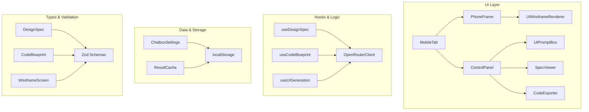
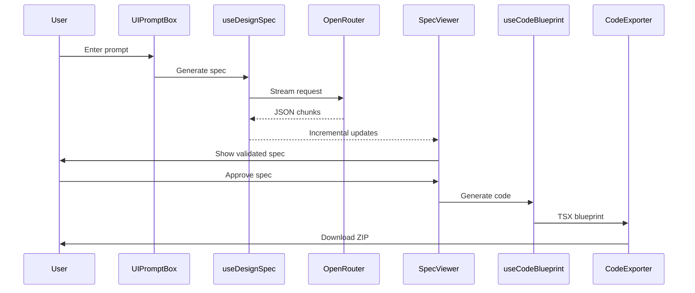

# Design Document

## Overview

The UI Generation Streamlined system enhances the existing MobileTab with a focused 3-step workflow that leverages current infrastructure while adding structured design specification generation and code export capabilities. The design prioritizes simplicity, performance, and integration with existing systems.

## Architecture

### System Architecture



### Data Flow



## Components and Interfaces

### Enhanced MobileTab Layout

**Location:** `src/app/businessidea/tabs/MobileTab.tsx`

**New Structure:**
```tsx
<div className="grid grid-cols-1 lg:grid-cols-2 gap-6">
  <PhoneFrame>
    <UIWireframeRenderer screen={wireframe} />
  </PhoneFrame>
  <ControlPanel>
    <UIPromptBox />
    <SpecViewer spec={designSpec} />
    <CodeExporter blueprint={codeBlueprint} />
  </ControlPanel>
</div>
```

### PhoneFrame Component

**Location:** `src/app/businessidea/tabs/ui-prompt/PhoneFrame.tsx`

**Responsibilities:**
- Render mobile device frame with realistic proportions
- Handle responsive scaling and viewport simulation
- Display loading states during generation

### SpecViewer Component

**Location:** `src/app/businessidea/tabs/ui-prompt/SpecViewer.tsx`

**Responsibilities:**
- Display generated design specifications in readable format
- Allow inline editing of key spec fields
- Show validation status and errors
- Provide approve/regenerate actions

### CodeExporter Component

**Location:** `src/app/businessidea/tabs/ui-prompt/CodeExporter.tsx`

**Responsibilities:**
- Display generated code blueprint preview
- Handle ZIP file creation and download
- Show export progress and status
- Provide code formatting options

## Data Models

### DesignSpec Interface

```typescript
interface DesignSpec {
  id: string;
  title: string;
  theme: 'light' | 'dark' | 'auto';
  primaryColor: string;
  components: ComponentSpec[];
  layout: {
    type: 'single' | 'tabbed' | 'navigation';
    sections: string[];
  };
  constraints: {
    maxWidth: number;
    minHeight: number;
    accessibility: string[];
  };
  targetPlatform: 'mobile' | 'tablet' | 'responsive';
}

interface ComponentSpec {
  type: string;
  props: Record<string, any>;
  children?: ComponentSpec[];
}
```

### CodeBlueprint Interface

```typescript
interface CodeBlueprint {
  componentName: string;
  files: Array<{
    path: string;
    content: string;
  }>;
  dependencies: string[];
  metadata: {
    generatedAt: string;
    model: string;
    designSpecId: string;
  };
}
```

## Enhanced Hooks

### useDesignSpec Hook

**Location:** `src/app/businessidea/tabs/ui-prompt/hooks/useDesignSpec.ts`

```typescript
interface UseDesignSpecResult {
  generate: (prompt: string, options?: GenerationOptions) => Promise<void>;
  spec?: DesignSpec;
  isLoading: boolean;
  error?: string;
  streamText: string;
  metrics: StreamingMetrics;
  cancel: () => void;
}
```

### useCodeBlueprint Hook

**Location:** `src/app/businessidea/tabs/ui-prompt/hooks/useCodeBlueprint.ts`

```typescript
interface UseCodeBlueprintResult {
  generate: (spec: DesignSpec) => Promise<void>;
  blueprint?: CodeBlueprint;
  isLoading: boolean;
  error?: string;
  downloadZip: () => void;
}
```

## Enhanced Renderer

### UIWireframeRenderer V2

**Location:** `src/app/businessidea/tabs/ui-prompt/UIWireframeRenderer.tsx`

**New Components:**
- `Navbar`: Top navigation with logo and menu items
- `Tabs`: Horizontal tab navigation with active states
- `Chip`: Small labeled elements for tags/categories
- `Stat`: Metric display with value and label
- `Avatar`: User profile images with fallbacks
- `Icon`: SVG icon system with common icons
- `FormField`: Enhanced form inputs with validation states

**Token Mapping:**
```typescript
const tokenMapper = {
  colors: (token: string) => `text-${token}-600 bg-${token}-50`,
  spacing: (size: 'sm'|'md'|'lg') => size === 'sm' ? 'p-2' : size === 'md' ? 'p-4' : 'p-6',
  typography: (scale: 'sm'|'md'|'lg') => scale === 'sm' ? 'text-sm' : scale === 'md' ? 'text-base' : 'text-lg'
};
```

## Integration Points

### Settings Integration

The system integrates with existing ChatboxSettings for:
- API key management and secure storage
- Model selection and persistence
- User preferences and defaults

### Cache Management

Results are cached using:
- Stable hash generation from input prompts
- localStorage persistence with size limits
- LRU eviction for storage management
- Cache invalidation on model changes

## Performance Optimizations

### Streaming Enhancements

- Incremental JSON parsing with brace-balance detection
- Throttled UI updates during high-frequency streaming
- Progressive rendering of partial results
- Immediate abort handling with cleanup

### Component Optimizations

- Memoized rendering components to prevent unnecessary re-renders
- Lazy loading of non-critical UI elements
- Optimized Tailwind class generation
- Efficient state management with minimal re-renders

## Security Measures

### Code Safety

- Generated TSX is display-only, never executed
- All user input is sanitized and validated
- XSS prevention through React's built-in protection
- Safe JSON parsing with error boundaries

### Data Privacy

- All processing happens client-side
- No user data sent to external servers
- Secure API key storage using existing infrastructure
- Session isolation and data cleanup

## Error Handling Strategy

### Error Classification

```typescript
enum ErrorType {
  VALIDATION_ERROR = 'validation',
  NETWORK_ERROR = 'network', 
  PARSING_ERROR = 'parsing',
  QUOTA_ERROR = 'quota',
  TIMEOUT_ERROR = 'timeout'
}
```

### Recovery Mechanisms

1. **Validation Errors**: Show specific field errors with correction suggestions
2. **Network Errors**: Automatic retry with exponential backoff
3. **Parsing Errors**: Fallback to non-streaming with simplified prompts
4. **Quota Errors**: Clear messaging with usage information
5. **Timeout Errors**: Allow manual retry or prompt simplification

## Testing Strategy

### Unit Testing
- Zod schema validation for all data models
- Token mapping functions and utilities
- JSON parsing and streaming logic
- Error handling and recovery flows

### Integration Testing
- Complete 3-step workflow execution
- Settings integration and persistence
- Cache management and restoration
- Component rendering and interactions

### Performance Testing
- Streaming performance under various conditions
- Memory usage during large generations
- UI responsiveness during processing
- Cache efficiency and storage limits