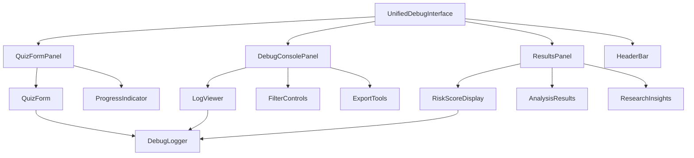

# Design Document

## Overview

The Unified Debug Interface consolidates the quiz form, debug console, and assessment results into a single, comprehensive development and debugging environment. This design eliminates the need for page navigation and loading screens while providing real-time visibility into all processing steps.

## Architecture

### Layout Architecture

```
┌─────────────────────────────────────────────────────────────────┐
│                        Header Bar                               │
├─────────────────────────┬───────────────────────────────────────┤
│                         │                                       │
│     Quiz Form Panel     │        Debug Console Panel           │
│        (40% width)      │           (35% width)                 │
│                         │                                       │
│  ┌─────────────────┐   │  ┌─────────────────────────────────┐  │
│  │ Step 1: Role    │   │  │ [Filter] [Clear] [Copy] [Export]│  │
│  │ Step 2: Details │   │  ├─────────────────────────────────┤  │
│  │ Step 3: Analysis│   │  │ [INFO] QuizForm: Form loaded    │  │
│  │                 │   │  │ [DEBUG] Field changed: job...   │  │
│  │ [Start Analysis]│   │  │ [INFO] Analysis: Starting...    │  │
│  └─────────────────┘   │  │ [SUCCESS] API: Response OK      │  │
│                         │  │ [ERROR] Parser: Failed to...    │  │
│                         │  └─────────────────────────────────┘  │
├─────────────────────────┴───────────────────────────────────────┤
│                    Results Panel (25% height)                   │
│  ┌─────────────────────────────────────────────────────────────┐ │
│  │ Risk Score: 65% | Level: Medium | Summary: Based on...     │ │
│  │ ┌─────────────┐ ┌─────────────┐ ┌─────────────────────────┐ │ │
│  │ │ Risk Factors│ │ Profile Info│ │ Recommendations         │ │ │
│  │ │ - Automation│ │ - Role: Dev │ │ - Develop AI skills     │ │ │
│  │ │ - AI Replace│ │ - Exp: 5yrs │ │ - Focus on creativity   │ │ │
│  │ └─────────────┘ └─────────────┘ └─────────────────────────┘ │ │
│  └─────────────────────────────────────────────────────────────┘ │
└─────────────────────────────────────────────────────────────────┘
```

### Component Architecture



## Components and Interfaces

### 1. UnifiedDebugInterface Component

**Purpose**: Main container component that orchestrates the three-panel layout and manages global state.

**Props**:
```typescript
interface UnifiedDebugInterfaceProps {
  initialMode?: 'development' | 'production';
  enableDebugConsole?: boolean;
  persistState?: boolean;
}
```

**State Management**:
```typescript
interface UnifiedState {
  quizData: QuizData | null;
  assessmentResults: AssessmentResult | null;
  debugLogs: LogEntry[];
  isAnalyzing: boolean;
  analysisProgress: AssessmentProgress | null;
  panelSizes: {
    leftWidth: number;
    rightWidth: number;
    bottomHeight: number;
  };
  debugConsoleState: {
    filters: LogFilters;
    isExpanded: boolean;
    selectedLog: LogEntry | null;
  };
}
```

### 2. QuizFormPanel Component

**Purpose**: Contains the quiz form with enhanced debugging integration.

**Features**:
- Embedded progress indicators
- Real-time validation feedback
- Inline error display
- Debug logging integration

**Props**:
```typescript
interface QuizFormPanelProps {
  onDataChange: (data: QuizData) => void;
  onAnalysisStart: (data: QuizData) => Promise<void>;
  isAnalyzing: boolean;
  analysisProgress: AssessmentProgress | null;
  className?: string;
}
```

### 3. DebugConsolePanel Component

**Purpose**: Enhanced debug console optimized for panel layout.

**Features**:
- Compact header with controls
- Efficient log rendering
- Advanced filtering
- Export functionality
- Real-time updates

**Props**:
```typescript
interface DebugConsolePanelProps {
  logs: LogEntry[];
  onClear: () => void;
  onExport: (format: 'json' | 'txt') => void;
  filters: LogFilters;
  onFiltersChange: (filters: LogFilters) => void;
  className?: string;
}
```

### 4. ResultsPanel Component

**Purpose**: Displays assessment results in a compact, informative layout.

**Features**:
- Condensed result display
- Expandable sections
- Research data integration
- Export capabilities

**Props**:
```typescript
interface ResultsPanelProps {
  results: AssessmentResult | null;
  researchData: any;
  onExport: () => void;
  isLoading: boolean;
  className?: string;
}
```

## Data Models

### Enhanced Log Entry
```typescript
interface LogEntry {
  id: string;
  timestamp: Date;
  level: 'info' | 'warn' | 'error' | 'debug' | 'success';
  category: string;
  message: string;
  data?: any;
  stack?: string;
  duration?: number; // For timing logs
  correlationId?: string; // For tracking related logs
}
```

### Panel Configuration
```typescript
interface PanelConfig {
  id: string;
  title: string;
  isResizable: boolean;
  minSize: number;
  maxSize: number;
  defaultSize: number;
  isCollapsible: boolean;
}
```

### Debug Session
```typescript
interface DebugSession {
  id: string;
  startTime: Date;
  endTime?: Date;
  quizData: QuizData;
  logs: LogEntry[];
  results?: AssessmentResult;
  metadata: {
    userAgent: string;
    screenSize: { width: number; height: number };
    version: string;
  };
}
```

## Error Handling

### Error Boundaries
- Separate error boundaries for each panel
- Graceful degradation when one panel fails
- Error reporting to debug console

### Error Recovery
- Automatic retry mechanisms for API failures
- State recovery from localStorage
- Fallback UI components

### Error Logging
```typescript
interface ErrorLog extends LogEntry {
  level: 'error';
  errorType: 'network' | 'validation' | 'parsing' | 'runtime';
  errorCode?: string;
  userAction?: string;
  recoveryAction?: string;
}
```

## Testing Strategy

### Unit Testing
- Individual panel components
- State management logic
- Debug logging functionality
- Error handling mechanisms

### Integration Testing
- Panel communication
- Real-time updates
- State persistence
- Export functionality

### End-to-End Testing
- Complete assessment workflow
- Debug console functionality
- Results display
- Error scenarios

### Performance Testing
- Large log volume handling
- Memory usage optimization
- Rendering performance
- Export performance

## Implementation Phases

### Phase 1: Core Layout
- Three-panel layout implementation
- Basic panel resizing
- Header bar with controls
- State management setup

### Phase 2: Enhanced Quiz Form
- Quiz form integration
- Real-time debug logging
- Progress indicators
- Inline validation

### Phase 3: Advanced Debug Console
- Enhanced log rendering
- Advanced filtering
- Export functionality
- Performance optimization

### Phase 4: Results Integration
- Inline results display
- Research data integration
- Export capabilities
- Visual enhancements

### Phase 5: Polish and Optimization
- Responsive design refinement
- Performance optimization
- Accessibility improvements
- Documentation

## Technical Specifications

### CSS Grid Layout
```css
.unified-debug-interface {
  display: grid;
  grid-template-areas: 
    "header header"
    "quiz-form debug-console"
    "results results";
  grid-template-columns: 40% 35% 25%;
  grid-template-rows: auto 1fr 25%;
  height: 100vh;
  gap: 1rem;
}
```

### State Management
- React Context for global state
- useReducer for complex state updates
- Custom hooks for panel management
- localStorage for persistence

### Performance Optimizations
- Virtual scrolling for large log lists
- Memoization for expensive computations
- Debounced updates for rapid changes
- Lazy loading for heavy components

### Accessibility
- ARIA labels for all interactive elements
- Keyboard navigation support
- Screen reader compatibility
- High contrast mode support

## Security Considerations

### Data Protection
- Sensitive data filtering in logs
- Secure export functionality
- API key protection
- PII data handling

### Debug Information
- Production vs development logging levels
- Sensitive information masking
- Secure debug session storage
- Export data sanitization

## Deployment Strategy

### Development Mode
- Full debug capabilities enabled
- Detailed logging
- Performance monitoring
- Error tracking

### Production Mode
- Reduced logging levels
- Optimized performance
- Security hardening
- Minimal debug information

## Success Metrics

### Development Efficiency
- Time to identify issues: < 30 seconds
- Debug session setup: < 5 seconds
- Log search and filtering: < 2 seconds
- Export generation: < 10 seconds

### User Experience
- Zero loading screens
- No page navigation delays
- Real-time feedback
- Responsive interactions

### Performance
- Memory usage: < 100MB for typical sessions
- Log rendering: < 100ms for 1000 entries
- Panel resizing: < 16ms response time
- Export generation: < 5 seconds for large datasets