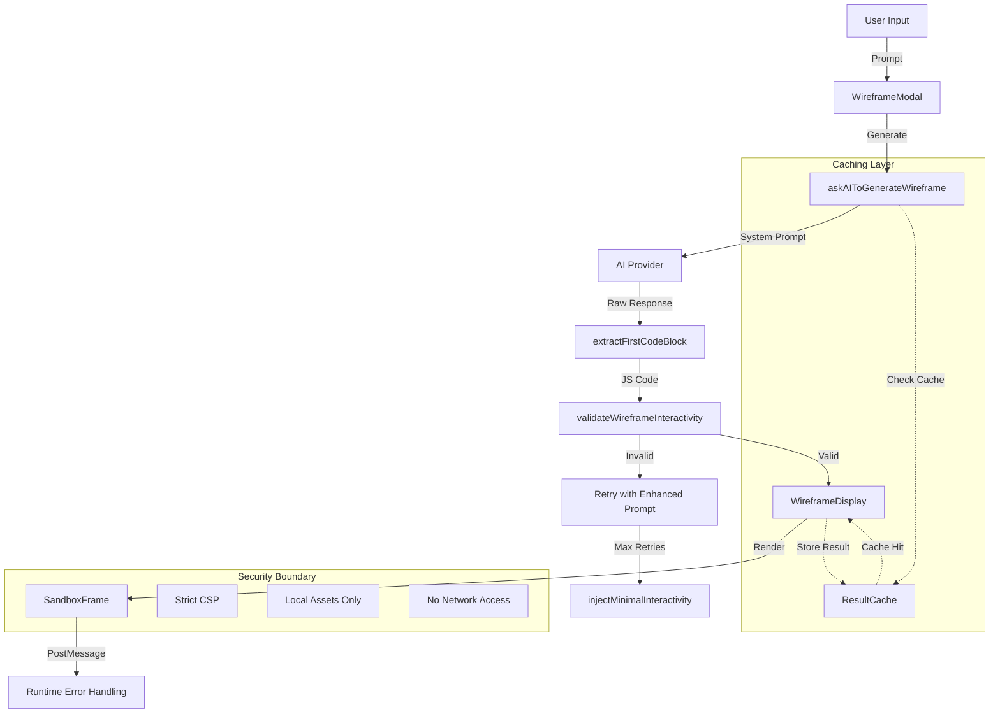

# Wireframe Artifact Studio Design

## Overview

The Wireframe Artifact Studio is a Claude Artifacts-inspired system that transforms natural language prompts into interactive React wireframes. The system consists of a modal-based UI, AI-powered code generation with validation and retry logic, and secure sandboxed execution of generated wireframes.

## Architecture



## Components and Interfaces

### Core Service Layer

#### 1. askAIToGenerateWireframe Service
**Location:** `src/services/wireframe/askAIToGenerateWireframe.ts`

**Responsibilities:**
- Orchestrate AI calls with retry logic
- Cache successful results
- Handle validation failures with follow-up prompts
- Apply auto-repair as last resort

**Key Methods:**
```typescript
interface GenerateWireframeOptions {
  modelId: string;
  onPreGenerate?: () => void;
  onAIResponse?: () => void;
  onVerified?: () => void;
  cache?: Map<string, string>;
  maxRetries?: number;
}

function askAIToGenerateWireframe(
  prompt: string,
  aiClient: AIClient,
  options: GenerateWireframeOptions
): Promise<string>
```

#### 2. Wireframe Prompt Engineering
**Location:** `src/prompts/wireframePrompt.ts`

**Responsibilities:**
- Provide specialized system prompts for wireframe generation
- Extract code blocks from AI responses
- Create follow-up prompts for failed validations

**Key Exports:**
```typescript
const DESIGN_SYSTEM_PROMPT: string;
const INTERACTIVITY_REQUIREMENTS: string[];
function extractFirstCodeBlock(input: string): string;
function createWireframePrompt(system: string, userPrompt: string): ChatMessage[];
```

#### 3. Wireframe Validation
**Location:** `src/utils/wireframe/wireframeValidator.ts`

**Responsibilities:**
- Validate generated code for interactivity requirements
- Detect React hooks, event handlers, and component structure
- Provide auto-repair for minimal interactivity

**Key Methods:**
```typescript
interface ValidationResult {
  isInteractive: boolean;
  hasStateHooks: boolean;
  hasEventHandlers: boolean;
  hasComponents: boolean;
  missingPatterns: string[];
}

function validateWireframeInteractivity(code: string): ValidationResult;
function injectMinimalInteractivity(code: string): string;
```

### UI Components

#### 1. WireframeModal
**Location:** `src/components/wireframe/WireframeModal.tsx`

**Responsibilities:**
- Modal container for wireframe generation
- Prompt input and progress tracking
- Integration with WireframeDisplay

**Props Interface:**
```typescript
interface WireframeModalProps {
  isOpen: boolean;
  onClose: () => void;
  prompt: string;
  onPromptChange: (value: string) => void;
  onVisualize: (prompt: string) => Promise<void>;
  isLoading?: boolean;
  progress?: number;
  statusText?: string;
  errorMessage?: string;
  code?: string | null;
}
```

#### 2. WireframeDisplay
**Location:** `src/components/wireframe/WireframeDisplay.tsx`

**Responsibilities:**
- Display generated wireframes with interactivity badges
- Provide regeneration and fullscreen controls
- Integrate with SandboxFrame for rendering

**Key Features:**
- Status badges: "Interactive", "Partially Interactive", "Static"
- Fullscreen toggle
- Regenerate button for non-interactive wireframes
- Error display and recovery options

#### 3. Enhanced SandboxFrame
**Location:** `src/app/businessidea/tabs/artifact-studio/components/SandboxFrame.tsx`

**Enhancements to existing component:**
- Improved error handling and reporting
- Better integration with wireframe validation
- Enhanced security with stricter CSP
- Performance optimizations for frequent re-renders

### Integration Layer

#### 1. Wireframe Generation Hook
**Location:** `src/hooks/useWireframeGeneration.ts`

**Responsibilities:**
- Replace existing useArtifactGeneration for wireframe-specific logic
- Integrate with new validation and retry system
- Manage generation state and caching

**State Interface:**
```typescript
interface WireframeGenerationState {
  status: 'idle' | 'generating' | 'validating' | 'retrying' | 'complete' | 'error';
  prompt: string;
  code: string | null;
  validation: ValidationResult | null;
  progress: number;
  statusText: string;
  errorMessage: string | null;
}
```

#### 2. AI Client Adapter
**Location:** `src/services/wireframe/aiClient.ts`

**Responsibilities:**
- Adapt existing OpenRouter client for wireframe generation
- Handle streaming responses appropriately
- Implement proper error handling and timeouts

## Data Models

### Wireframe Generation Request
```typescript
interface WireframeRequest {
  prompt: string;
  modelId: string;
  options?: {
    streaming?: boolean;
    temperature?: number;
    maxTokens?: number;
  };
}
```

### Wireframe Generation Result
```typescript
interface WireframeResult {
  code: string;
  validation: ValidationResult;
  metadata: {
    prompt: string;
    modelId: string;
    generatedAt: Date;
    retryCount: number;
    cached: boolean;
  };
}
```

### Cache Entry
```typescript
interface CacheEntry {
  key: string; // prompt + modelId hash
  code: string;
  validation: ValidationResult;
  timestamp: Date;
  accessCount: number;
}
```

## Error Handling

### Error Categories

1. **Generation Errors**
   - AI API failures (network, auth, rate limits)
   - Invalid responses (no code block, malformed content)
   - Timeout errors

2. **Validation Errors**
   - Missing interactivity patterns
   - Banned tokens detected
   - Structural issues (no components, no render call)

3. **Runtime Errors**
   - JavaScript execution errors in sandbox
   - React rendering errors
   - CSP violations

### Error Recovery Strategies

1. **Automatic Retry with Enhanced Prompts**
   - First retry: Add specific interactivity requirements
   - Second retry: Include examples of missing patterns
   - Final attempt: Apply auto-repair injection

2. **Graceful Degradation**
   - Display best-effort wireframe even if not fully interactive
   - Show clear error messages with actionable suggestions
   - Provide manual regeneration options

3. **User Feedback**
   - Progress indicators during retry attempts
   - Clear error messages with suggested fixes
   - Option to modify prompt and retry manually

## Testing Strategy

### Unit Tests
- Wireframe validation logic with various code samples
- Prompt engineering functions
- Cache management and eviction
- Error handling scenarios

### Integration Tests
- End-to-end wireframe generation flow
- AI client integration with mocked responses
- Sandbox security and CSP enforcement
- Modal UI interactions and state management

### Performance Tests
- Cache hit/miss ratios
- Generation time benchmarks
- Memory usage during multiple generations
- Sandbox iframe performance

## Security Considerations

### Content Security Policy
```
default-src 'none';
script-src 'self' 'nonce-{random}';
style-src 'self';
img-src 'self' data:;
font-src 'self';
connect-src 'none';
frame-ancestors 'none';
```

### Sandbox Restrictions
- No access to parent window or DOM
- No network requests (fetch, XHR, WebSocket)
- No persistent storage (localStorage, sessionStorage)
- No dangerous APIs (eval, Function constructor)

### Input Validation
- Sanitize user prompts before AI submission
- Validate generated code against banned token list
- Escape HTML content in error messages
- Limit prompt length and generation tokens

## Performance Optimizations

### Caching Strategy
- LRU cache with configurable size limit (default: 50 entries)
- Cache key: hash of (prompt + modelId + options)
- Automatic cleanup of expired entries
- Persistent cache across browser sessions (optional)

### Lazy Loading
- Load AI client only when needed
- Defer heavy validation until wireframe is displayed
- Progressive enhancement for advanced features

### Resource Management
- Reuse iframe instances when possible
- Cleanup event listeners and timers
- Optimize CSS bundle size for sandbox
- Minimize React UMD bundle size

## Migration Strategy

### Phase 1: Core Infrastructure
- Implement new service layer (askAIToGenerateWireframe, validation, prompts)
- Create wireframe-specific components
- Set up testing framework

### Phase 2: UI Integration
- Replace existing artifact generation with wireframe system
- Implement modal-based interface
- Add interactivity badges and controls

### Phase 3: Enhancement and Polish
- Add caching and performance optimizations
- Implement advanced error handling
- Add accessibility improvements
- Performance testing and optimization

### Backward Compatibility
- Keep existing artifact studio as fallback option
- Feature flag to switch between old and new systems
- Gradual migration of existing functionality
- Preserve user data and preferences