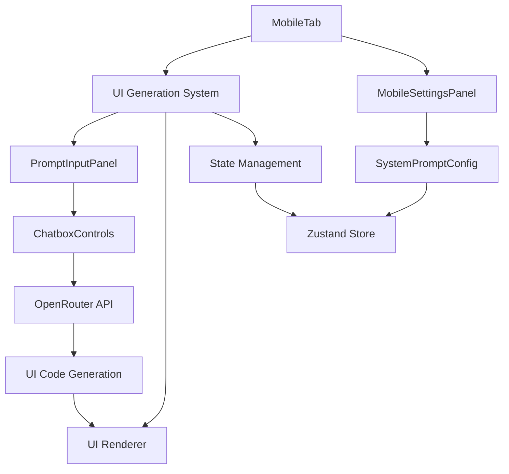
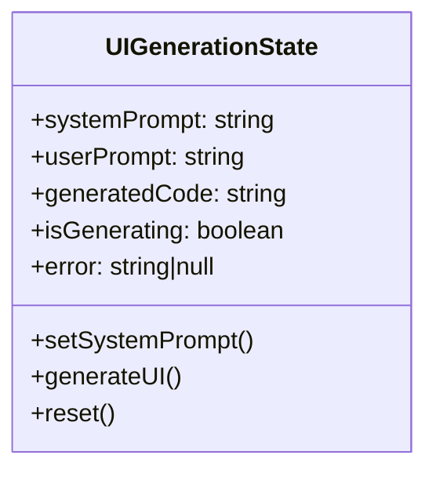

# UI Prompt Task Implementation Plan

## Overview
Implement UI wireframing functionality within MobileTab using:
1. Reusable ChatboxControls component for LLM interactions
2. Enhanced MobileSettingsPanel for system prompt configuration
3. New UI generation components



## File Structure
```
src/
├── app/
│   └── businessidea/
│       └── tabs/
│           ├── mobile-settings-panel/
│           │   ├── MobileSettingsPanel.tsx (modified)
│           │   └── UIPromptSettings.tsx (new)
│           ├── ui-generation/ (new folder)
│           │   ├── UIGenerator.tsx (new)
│           │   ├── UIComponentRenderer.tsx (new)
│           │   └── hooks/
│           │       └── useUIGeneration.ts (new)
│           └── MobileTab.tsx (modified)
└── components/
    └── chatbox/
        └── ChatboxControls.tsx (modified)
```

## Components to Create
1. **UIPromptSettings.tsx**  
   - Settings panel for UI generation prompts
   - Connects to Zustand store
   - Allows customizing system prompts for wireframing

2. **UIGenerator.tsx**  
   - Main UI generation component
   - Integrates ChatboxControls for prompt input
   - Manages generation state (loading/error/results)

3. **UIComponentRenderer.tsx**  
   - Safely renders generated UI code
   - Uses React error boundaries
   - Sandboxes execution

4. **useUIGeneration.ts**  
   - Custom hook for UI generation logic
   - Handles API calls to OpenRouter
   - Manages prompt templating

## Files to Modify
1. **MobileTab.tsx**  
   - Add UIGenerator component
   - Implement tab navigation for UI generation
   - Connect to Zustand store for prompt settings

2. **MobileSettingsPanel.tsx**  
   - Add new "UI Generation" tab
   - Integrate UIPromptSettings component
   - Persist settings to localStorage

3. **ChatboxControls.tsx**  
   - Add prop for custom submit handler
   - Implement UI generation mode
   - Enhance with prompt templating system

## State Management


## Security Considerations
1. Code sanitization for generated UI
2. Sandboxed component rendering
3. Input validation for prompts
4. API key management via existing system

## Implementation Sequence
1. Create Zustand store for UI generation
2. Build UIPromptSettings component
3. Extend MobileSettingsPanel with new tab
4. Modify ChatboxControls to support UI generation mode
5. Implement UIGenerator component
6. Develop UIComponentRenderer with error boundaries
7. Create useUIGeneration hook
8. Integrate UIGenerator into MobileTab
9. Add comprehensive error handling
10. Implement code sanitization utilities

## Dependencies
1. Zustand for state management
2. React Error Boundary
3. OpenRouter API client
4. Existing prompt store system
