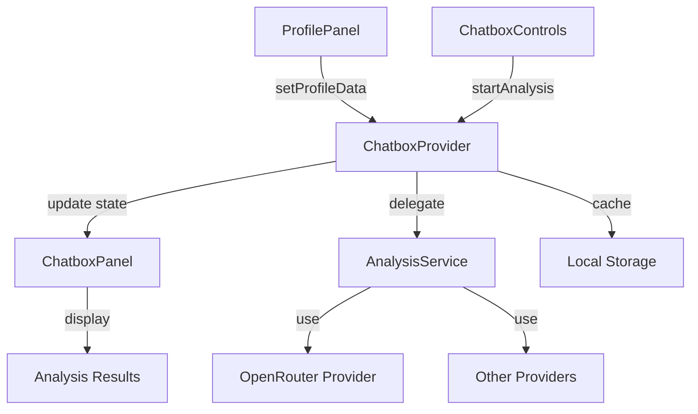

# Chatbox Analysis Implementation Plan

## System Architecture

## Implementation Tasks

### 1. Core Analysis Flow

#### 1.1. Profile Data Integration
- **File**: `src/components/chatbox/ChatboxProvider.tsx`
  - Implement `setProfileData` to store profile data in context
  - Add validation for required profile fields
  - Generate profile hash for caching

#### 1.2. Analysis Trigger
- **File**: `src/components/chatbox/ChatboxControls.tsx`
  - Add Analyze button with loading state
  - Implement API key and model validation
  - Connect to `startAnalysis` from context

#### 1.3. Analysis Execution
- **File**: `src/lib/chatbox/AnalysisService.ts`
  - Implement provider registration system
  - Add model validation and selection
  - Create analysis request/response types

### 2. Provider Implementation

#### 2.1. OpenRouter Provider
- **File**: `src/lib/openrouter/analysis/ProfileAnalyzer.ts`
  - Create OpenRouter client wrapper
  - Implement prompt templates for profile analysis
  - Add streaming response handling

#### 2.2. Analysis Types
- **File**: `src/components/chatbox/types.ts`
  - Define analysis result types
  - Add message types for chat UI
  - Create provider interfaces

### 3. UI Components

#### 3.1. ChatboxPanel Updates
- **File**: `src/components/chatbox/ChatboxPanel.tsx`
  - Add message display area
  - Implement streaming message rendering
  - Add error state handling

#### 3.2. Profile Summary
- **File**: `src/components/chatbox/ProfileSummaryTooltip.tsx`
  - Create compact profile preview
  - Add visual indicators for data completeness
  - Implement tooltip interactions

### 4. Caching System

#### 4.1. Result Caching
- **File**: `src/components/chatbox/hooks/useCacheManager.ts`
  - Implement LRU cache for analysis results
  - Add cache invalidation by profile hash
  - Support TTL for cached items

#### 4.2. Storage Integration
- **File**: `src/components/chatbox/hooks/useStorageManager.ts`
  - Save/load analysis history
  - Manage API key storage
  - Handle storage quotas and errors

### 5. Error Handling

#### 5.1. Error Boundaries
- **File**: `src/components/chatbox/ChatboxErrorBoundary.tsx`
  - Catch rendering errors
  - Display fallback UI
  - Support error recovery

#### 5.2. Error Messages
- **File**: `src/components/chatbox/utils/error-handler.ts`
  - Map error codes to user-friendly messages
  - Implement retry logic
  - Log errors for debugging

## Data Flow

1. User submits profile data via `ProfilePanel`
2. Data is stored in `ChatboxProvider` context
3. User clicks "Analyze" in `ChatboxControls`
4. `startAnalysis` is called with current config
5. `AnalysisService` selects appropriate provider
6. Provider processes request and returns results
7. Results are cached and displayed in `ChatboxPanel`

## Dependencies

- React 18+
- TypeScript 4.9+
- OpenRouter API
- Local storage for caching

## Implementation Notes

- Use React Context for state management
- Implement proper TypeScript types for all components
- Follow atomic design principles
- Ensure accessibility compliance (WCAG 2.1)
- Optimize for performance with memoization
- Support both streaming and non-streaming responses
