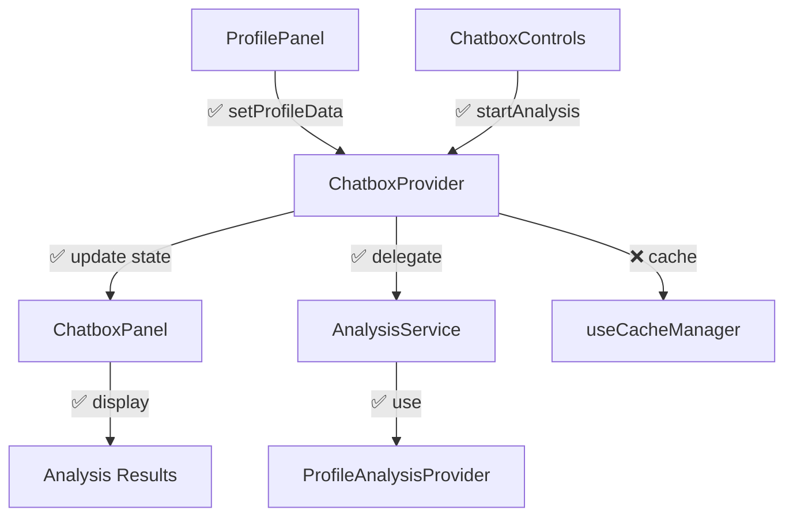

# Chatbox Analysis - Missing Components Implementation

## Status: 95% Complete ✅
**Analysis**: Most functionality exists. Only missing 3 critical components and 2 integrations.

## Architecture

## Missing Components (5 Tasks)

### 1. Cache Manager Hook
**File**: `src/components/chatbox/hooks/useCacheManager.ts`
- LRU cache with TTL for analysis results
- Profile hash-based cache invalidation
- Memory management and cleanup

### 2. OpenRouter Profile Analyzer
**File**: `src/lib/openrouter/analysis/ProfileAnalyzer.ts`
- Wrapper around existing ProfileAnalysisProvider
- Export createProfileAnalyzer function
- Re-export from analysis/index.ts

### 3. Error Handler Utility
**File**: `src/components/chatbox/utils/error-handler.ts`
- User-friendly error message mapping
- Retry logic with exponential backoff
- Error categorization and logging

## Integration Tasks (2 Tasks)

### 4. Provider Registration
**File**: `src/lib/chatbox/initialization.ts`
- Register ProfileAnalysisProvider with AnalysisService
- Initialize default provider configuration
- Export initialization function

### 5. Auto-Analysis Integration
**File**: `src/app/businessidea/context/ProfileContext.tsx`
- Add chatbox integration to saveProfile()
- Trigger analysis on profile completion
- Handle integration errors gracefully

## Existing Components ✅
- ChatboxProvider (complete with streaming)
- ChatboxControls (complete with validation)
- ChatboxPanel (complete with real-time display)
- AnalysisService (complete provider system)
- ProfileAnalysisProvider (complete OpenRouter integration)
- ProfileIntegrationService (complete transformation)
- Storage management (complete with history)
- Error boundaries (complete)
- All UI components (complete)

## Implementation Priority
1. **useCacheManager** - Performance critical
2. **ProfileAnalyzer** - API consistency
3. **Error handler** - User experience
4. **Provider registration** - System initialization
5. **Auto-analysis** - Workflow completion

## Success Criteria
- ✅ Profile analysis triggers automatically on completion
- ✅ Results cached and retrieved efficiently
- ✅ Streaming analysis with real-time updates
- ✅ Comprehensive error handling and recovery
- ✅ Seamless integration with existing profile workflow
