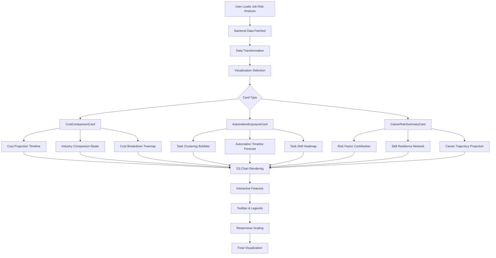

# Enhanced Job Risk Data Visualizations - Technical Specification

## Overview

This technical specification outlines the implementation of enhanced data visualizations for the Job Risk Analysis feature. The goal is to provide deeper insights into AI automation threats and job replaceability using existing backend data sources while maintaining consistent design patterns across all visualization components.

## Core Requirements

### STRICT RULES
- **NO MOCK DATA GENERATION**: All visualizations must use real backend data from existing hooks
- **UTILIZE EXISTING BACKEND**: Leverage data from `src/app/businessidea/tabs/job-risk/JobRiskAnalysisTab.tsx`
- **DESIGN CONSISTENCY**: Follow the same design patterns as existing cards:
  - `src/components/visualizations/cost-comparison-card.tsx`
  - `src/components/visualizations/automation-exposure-card.tsx`
  - `src/components/visualizations/career-risk-summary-card.tsx`

### Objectives
1. Provide contextual insights about AI threat and job replaceability
2. Present numerical data in actionable, meaningful ways
3. Highlight trends and patterns not obvious from raw numbers
4. Support narrative of understanding and mitigating automation risk

## Architecture Overview

### Data Sources Analysis

Based on analysis of `JobRiskAnalysisTab.tsx`, we have access to:

1. **Occupation Risk Data** (`useRealOccupationRisk`):
   - `riskScore`: 0-100 automation risk percentage
   - `threatDrivers`: Array of strings describing automation drivers
   - `skillImpacts`: Array of `{skill: string, impact: 'high'|'medium'|'low', rationale?: string}`
   - `mitigation`: Array of mitigation strategy strings
   - `sources`: Array of `{title: string, url?: string}`

2. **Task Automation Data** (`useRealTaskAutomationData`):
   - `automationExposure`: Array of `{task: string, exposure: number}`
   - `sources`: Array of research sources

3. **Adapted Insights Model** (`adaptJobRiskToInsightsVM`):
   - Combined data from both sources
   - AI-generated narratives for contextual insights
   - Structured data ready for visualization consumption

### Design Pattern Consistency

All new visualizations must follow existing card design patterns:

#### Layout Structure
```tsx
<div className="bg-white p-3 animate-fade-in">
  {/* Header */}
  <div className="mb-2">
    <div className="flex items-center gap-2">
      <Icon className="h-4 w-4 text-gray-700" />
      <h3 className="text-lg font-medium text-gray-800">{title}</h3>
      <BadgeComponent />
    </div>
  </div>

  {/* Content */}
  <div className="space-y-3">
    {/* Visualization components */}
  </div>
</div>
```

#### Color Scheme
- Background: `bg-white`
- Section backgrounds: `bg-gray-50`
- Border radius: `rounded-md`
- Text colors: `text-gray-800`, `text-gray-700`, `text-gray-600`
- Accent colors: Red for risks, Amber for warnings, Green for positives

#### Typography Scale
- H1: `text-2xl font-bold`
- H2: `text-xl font-semibold`
- H3: `text-lg font-medium`
- Body: `text-base`
- Small: `text-xs`
- Micro: `text-xs`

## Proposed Visualizations

### 1. CostComparisonCard Enhancements

#### 1.1 Cost Projection Timeline Chart
**Purpose**: Show projected costs over 5-year horizon to visualize ROI and break-even points

**Data Sources**:
- Current human cost configuration (hourly rate, hours/week, weeks/year)
- Current AI cost configuration
- Historical cost trends (if available)

**Implementation Details**:
- **Chart Type**: D3 Line Chart with area fill
- **Components**: Dual-line chart with cumulative savings area
- **Interactive Features**: Tooltip showing exact values at each point
- **Responsive**: Scales to container width

**Files to Create**:
- `src/components/visualizations/charts/cost-projection-chart.tsx`
- `src/components/visualizations/charts/types/cost-projection.types.ts`
- `src/hooks/use-cost-projection.ts`

**Files to Modify**:
- `src/components/visualizations/cost-comparison-card.tsx`

#### 1.2 Industry Comparison Radar Chart
**Purpose**: Compare cost metrics across similar industries for context

**Data Sources**:
- Industry benchmark data from backend
- Current user's cost configuration
- Industry averages for comparison

**Implementation Details**:
- **Chart Type**: D3 Radar/Spider Chart
- **Metrics**: Cost ratio, displacement percentage, adoption rate, training costs
- **Interactive**: Hover tooltips with detailed breakdowns
- **Responsive**: Adapts to container size

**Files to Create**:
- `src/components/visualizations/charts/industry-comparison-radar.tsx`
- `src/components/visualizations/charts/types/radar-chart.types.ts`
- `src/hooks/use-industry-comparison.ts`

**Files to Modify**:
- `src/components/visualizations/cost-comparison-card.tsx`

#### 1.3 Cost Breakdown Treemap
**Purpose**: Detailed breakdown of cost components with replaceability visualization

**Data Sources**:
- Detailed cost breakdown from backend
- Task-level automation exposure data
- Cost categories with automation potential

**Implementation Details**:
- **Chart Type**: D3 Treemap with hierarchical data
- **Color Coding**: Automation risk levels
- **Size**: Cost magnitude
- **Interactive**: Drill-down on categories

**Files to Create**:
- `src/components/visualizations/charts/cost-breakdown-treemap.tsx`
- `src/components/visualizations/charts/types/treemap.types.ts`
- `src/hooks/use-cost-breakdown.ts`

**Files to Modify**:
- `src/components/visualizations/cost-comparison-card.tsx`

### 2. AutomationExposureCard Enhancements

#### 2.1 Task Clustering Bubble Chart
**Purpose**: Group similar tasks by automation potential and visualize relationships

**Data Sources**:
- `automationExposure` array with task names and exposure percentages
- Task categorization data
- Time allocation data (if available)

**Implementation Details**:
- **Chart Type**: D3 Force-directed bubble chart
- **Bubble Size**: Time spent on task
- **Bubble Color**: Automation exposure level
- **Clustering**: Similar tasks grouped together
- **Interactive**: Drag to reposition, click for details

**Files to Create**:
- `src/components/visualizations/charts/task-clustering-bubble.tsx`
- `src/components/visualizations/charts/types/bubble-chart.types.ts`
- `src/hooks/use-task-clustering.ts`

**Files to Modify**:
- `src/components/visualizations/automation-exposure-card.tsx`

#### 2.2 Automation Timeline Forecast
**Purpose**: Show projected automation adoption over time with uncertainty bands

**Data Sources**:
- Current automation exposure data
- Industry adoption rates
- Technology breakthrough timelines
- Historical automation patterns

**Implementation Details**:
- **Chart Type**: D3 Area chart with stacked bands
- **Bands**: High, medium, low exposure trajectories
- **Milestones**: Technology breakthrough markers
- **Confidence**: Shaded uncertainty intervals
- **Interactive**: Time range selection

**Files to Create**:
- `src/components/visualizations/charts/automation-timeline-forecast.tsx`
- `src/components/visualizations/charts/types/timeline-chart.types.ts`
- `src/hooks/use-automation-timeline.ts`

**Files to Modify**:
- `src/components/visualizations/automation-exposure-card.tsx`

#### 2.3 Task-Skill Heatmap
**Purpose**: Correlate tasks with required skills to identify vulnerable skill combinations

**Data Sources**:
- Task automation exposure data
- Skill requirements per task
- Skill automation vulnerability data

**Implementation Details**:
- **Chart Type**: D3 Heatmap matrix
- **X-Axis**: Tasks
- **Y-Axis**: Skills
- **Color Intensity**: Automation exposure for task-skill combination
- **Interactive**: Hover for details, filtering by skill or task

**Files to Create**:
- `src/components/visualizations/charts/task-skill-heatmap.tsx`
- `src/components/visualizations/charts/types/heatmap.types.ts`
- `src/hooks/use-task-skill-correlation.ts`

**Files to Modify**:
- `src/components/visualizations/automation-exposure-card.tsx`

### 3. CareerRiskSummaryCard Enhancements

#### 3.1 Risk Factor Contribution Chart
**Purpose**: Show how different factors contribute to overall career risk score

**Data Sources**:
- Overall risk score breakdown
- Task automation contribution
- Industry trend factors
- Geographic factors
- Skill obsolescence data

**Implementation Details**:
- **Chart Type**: D3 Stacked bar or waterfall chart
- **Factors**: Task automation, industry trends, geography, skills
- **Interactive**: Hover to see contribution details
- **Responsive**: Adapts to container width

**Files to Create**:
- `src/components/visualizations/charts/risk-factor-contribution.tsx`
- `src/components/visualizations/charts/types/contribution-chart.types.ts`
- `src/hooks/use-risk-factor-analysis.ts`

**Files to Modify**:
- `src/components/visualizations/career-risk-summary-card.tsx`

#### 3.2 Skill Resilience Network Graph
**Purpose**: Visualize relationships between skills and identify resilient skill clusters

**Data Sources**:
- Skill impact data from backend
- Skill relationships and complementarity
- Automation vulnerability per skill

**Implementation Details**:
- **Chart Type**: D3 Network/Force-directed graph
- **Node Size**: Skill importance/relevance
- **Node Color**: Automation risk level
- **Connections**: Skill complementarity relationships
- **Interactive**: Drag nodes, click for skill details

**Files to Create**:
- `src/components/visualizations/charts/skill-resilience-network.tsx`
- `src/components/visualizations/charts/types/network-graph.types.ts`
- `src/hooks/use-skill-network.ts`

**Files to Modify**:
- `src/components/visualizations/career-risk-summary-card.tsx`

#### 3.3 Career Trajectory Projection
**Purpose**: Show potential career paths based on different mitigation strategies

**Data Sources**:
- Current risk assessment
- Mitigation strategy outcomes
- Career progression data
- Income potential projections

**Implementation Details**:
- **Chart Type**: D3 Slope chart or bump chart
- **Trajectories**: Multiple career paths
- **Metrics**: Risk level and income potential
- **Annotations**: Key decision points and skill milestones
- **Interactive**: Path selection and detail views

**Files to Create**:
- `src/components/visualizations/charts/career-trajectory-projection.tsx`
- `src/components/visualizations/charts/types/trajectory-chart.types.ts`
- `src/hooks/use-career-trajectory.ts`

**Files to Modify**:
- `src/components/visualizations/career-risk-summary-card.tsx`

## Implementation Plan

### Phase 1: Foundation (Week 1-2)
**Objective**: Set up base infrastructure for enhanced visualizations

**Tasks**:
1. Create base D3 chart components and utilities
2. Implement data transformation hooks
3. Set up responsive container system
4. Create TypeScript interfaces for all chart types

**Files Created**:
- `src/components/visualizations/charts/base/`
- `src/components/visualizations/charts/utils/`
- `src/components/visualizations/charts/types/`
- `src/hooks/use-chart-data.ts`

### Phase 2: Core Visualizations (Week 3-5)
**Objective**: Implement highest-impact visualizations

**Priority Order**:
1. Cost Projection Timeline (CostComparisonCard)
2. Task Clustering Bubble Chart (AutomationExposureCard)
3. Risk Factor Contribution Chart (CareerRiskSummaryCard)

**Integration**:
- Add new charts to existing cards
- Ensure consistent styling and spacing
- Implement loading states and error handling

### Phase 3: Advanced Visualizations (Week 6-8)
**Objective**: Implement remaining visualizations

**Tasks**:
1. Industry Comparison Radar Chart
2. Cost Breakdown Treemap
3. Automation Timeline Forecast
4. Task-Skill Heatmap
5. Skill Resilience Network Graph
6. Career Trajectory Projection

### Phase 4: Integration & Polish (Week 9-10)
**Objective**: Final integration and optimization

**Tasks**:
1. Ensure consistent styling across all visualizations
2. Implement smooth transitions and animations
3. Add accessibility features
4. Performance optimization
5. Comprehensive testing

## Process Flowchart



## Technical Implementation Details

### D3.js Integration Strategy

1. **Modular Chart Components**:
   - Each chart type as separate, reusable component
   - Consistent API for data input and configuration
   - Built-in responsive behavior

2. **Data Transformation Layer**:
   - Pure functions to transform backend data to chart format
   - Memoized computations for performance
   - Error handling for missing or invalid data

3. **Performance Optimizations**:
   - Virtual DOM integration with React
   - Efficient D3 update patterns
   - Canvas rendering for complex visualizations

### Accessibility Implementation

1. **Keyboard Navigation**:
   - Tab order for interactive elements
   - Arrow key navigation for complex charts
   - Enter/Space activation

2. **Screen Reader Support**:
   - ARIA labels and descriptions
   - Semantic HTML structure
   - Alternative text for visual elements

3. **Color Accessibility**:
   - WCAG AA compliance
   - Color-blind friendly palettes
   - High contrast mode support

### Error Handling & Loading States

1. **Data Validation**:
   - Schema validation for incoming data
   - Graceful degradation for missing data
   - Fallback visualizations for errors

2. **Loading States**:
   - Skeleton loaders matching final layout
   - Progressive loading for complex charts
   - Cancellation support for slow operations

## File Structure

```
src/
├── components/
│   └── visualizations/
│       ├── charts/
│       │   ├── base/
│       │   │   ├── ChartContainer.tsx
│       │   │   ├── ResponsiveChart.tsx
│       │   │   └── ChartTheme.tsx
│       │   ├── cost-projection-chart.tsx
│       │   ├── industry-comparison-radar.tsx
│       │   ├── cost-breakdown-treemap.tsx
│       │   ├── task-clustering-bubble.tsx
│       │   ├── automation-timeline-forecast.tsx
│       │   ├── task-skill-heatmap.tsx
│       │   ├── risk-factor-contribution.tsx
│       │   ├── skill-resilience-network.tsx
│       │   ├── career-trajectory-projection.tsx
│       │   ├── types/
│       │   │   ├── cost-projection.types.ts
│       │   │   ├── radar-chart.types.ts
│       │   │   ├── treemap.types.ts
│       │   │   ├── bubble-chart.types.ts
│       │   │   ├── timeline-chart.types.ts
│       │   │   ├── heatmap.types.ts
│       │   │   ├── contribution-chart.types.ts
│       │   │   ├── network-graph.types.ts
│       │   │   └── trajectory-chart.types.ts
│       │   └── utils/
│       │       ├── d3-utils.ts
│       │       ├── color-scales.ts
│       │       └── data-transformers.ts
│       ├── cost-comparison-card.tsx (MODIFIED)
│       ├── automation-exposure-card.tsx (MODIFIED)
│       └── career-risk-summary-card.tsx (MODIFIED)
├── hooks/
│   ├── use-cost-projection.ts
│   ├── use-industry-comparison.ts
│   ├── use-cost-breakdown.ts
│   ├── use-task-clustering.ts
│   ├── use-automation-timeline.ts
│   ├── use-task-skill-correlation.ts
│   ├── use-risk-factor-analysis.ts
│   ├── use-skill-network.ts
│   ├── use-career-trajectory.ts
│   └── use-chart-data.ts
└── types/
    └── visualization-enhancements.ts
```

## Testing Strategy

### Unit Tests
- Data transformation functions
- Chart component rendering
- Hook functionality
- Error handling scenarios

### Integration Tests
- End-to-end data flow from backend to visualization
- Responsive behavior across screen sizes
- Accessibility compliance
- Performance benchmarks

### Visual Regression Tests
- Chart rendering consistency
- Color scheme adherence
- Layout stability

## Success Metrics

1. **Performance**:
   - Chart render time < 500ms
   - Memory usage < 50MB for complex visualizations
   - Smooth 60fps interactions

2. **Accessibility**:
   - WCAG AA compliance score > 95%
   - Screen reader compatibility
   - Keyboard navigation coverage

3. **User Experience**:
   - Task completion time for insights
   - User engagement with visualizations
   - Feature adoption rate

## Risk Mitigation

1. **Technical Risks**:
   - D3.js version compatibility
   - Browser support for advanced features
   - Performance degradation with large datasets

2. **Data Risks**:
   - Missing or incomplete backend data
   - Data quality issues
   - API rate limiting

3. **Design Risks**:
   - Inconsistent styling across charts
   - Poor responsive behavior
   - Accessibility compliance issues

## Conclusion

This technical specification provides a comprehensive, modular approach to enhancing the Job Risk Analysis visualizations. By leveraging existing backend data sources and maintaining design consistency with current cards, we can deliver meaningful insights about AI automation threats while providing an optimal user experience.

The phased implementation approach ensures manageable development cycles with clear milestones and quality checkpoints. All visualizations will be built with performance, accessibility, and maintainability in mind.
