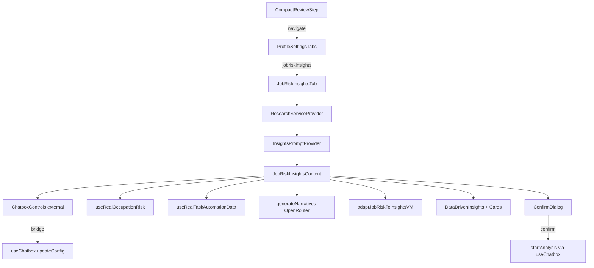

# JobRiskInsightsTab Implementation Tech Spec

## Overview
Implement a new independent `jobriskinsights` tab within `ProfileSettingsTabs` that integrates job risk analysis with Chatbox controls for AI-powered insights. The tab must be self-contained, modular, and maintain UI consistency with existing tabs, ensuring SSR safety and no mock data usage. Use real research hooks and backend services for data-driven visualizations.

## Objectives
- Add a new tab for job risk insights with independent navigation and state persistence.
- Integrate ChatboxControls in external mode for API key/model configuration and analysis triggering.
- Reuse existing research hooks (`useRealOccupationRisk`, `useRealTaskAutomationData`) and visual governance (`JobRiskVisualScope`).
- Generate AI narratives using real data from profile and research hooks.
- Display data-driven insights and visualizations without mock data.
- Ensure seamless navigation from CompactReviewStep with adapted profile data.
- Maintain type safety, SSR safety, and UI parity with JobRiskAnalysisTab.

## Key Requirements
- **No Mock Data**: All data must come from real hooks, backend APIs, or user inputs. Use `useRealOccupationRisk` and `useRealTaskAutomationData` for research data.
- **Modularity**: Separate concerns into components, hooks, and utilities. Reuse existing modules where possible.
- **Optimality**: Efficient function calls, no redundant renders, memoization for heavy computations.
- **SSR Safety**: All components must be client-side (`'use client'`), with providers wrapping content appropriately.
- **Integration Points**:
  - Use profile data from ChatboxProvider via `useChatbox`.
  - Bridge external ChatboxControls config into ChatboxProvider for `startAnalysis`.
  - Use `generateNarratives` for AI insights with real API calls.
- **References**:
  - Use `JobRiskAnalysisTab.tsx` as architectural reference for hooks, providers, and UI patterns.
  - Link `CompactReviewStep.tsx` for navigation and profile adaptation.
  - Use `ChatboxControls.tsx` for external mode integration.
  - Reference `use-research-data.md` and `useResearchData.ts` for research data handling, including profiledata for analysis.

## Problem Analysis
- **Requirements Breakdown**:
  - Create new tab with navigation, persistence, and content rendering.
  - Wire to research hooks for real data fetching.
  - Integrate external ChatboxControls for config and triggering.
  - Generate insights using AI narratives from real profile and research data.
  - Display visualizations with confirmation for heavy backend analysis.
  - Navigate from review step with adapted profile data.
- **Constraints**:
  - Strict TypeScript mode.
  - No new dependencies.
  - SSR-safe: Use client components and scoped styles.
  - Preserve existing functionality.
- **Assumptions and Ambiguities**:
  - Assumption: ChatboxProvider is available at the root for `startAnalysis`.
  - Ambiguity: How to handle config bridging – resolved by syncing external config updates to provider via `updateConfig`.
- **Solution Paths**:
  - Path A: Fully decoupled external controls (no provider bridging) – rejected as it prevents heavy visualization analysis.
  - Path B: Bridge external config to provider – chosen for full functionality.
- **Dependencies**: Research hooks, ChatboxProvider, visual scope, narrative service.

## Rationale
- **Design Choices**:
  - Mirror `JobRiskAnalysisTab` for consistency: Use same providers (`ResearchServiceProvider`, `InsightsPromptProvider`), hooks, and UI components.
  - External ChatboxControls for UX isolation while bridging to provider for analysis – balances modularity with functionality.
  - Real data flow: Profile via `useChatbox`, research via `useRealOccupationRisk`/`useRealTaskAutomationData`, AI via `generateNarratives`.
  - Scoped visual governance via `JobRiskVisualScope` for SSR safety and no global styles.
- **Best Practices**:
  - Functional React, memoization, efficient prop drilling via contexts.
  - Type safety with interfaces, no `any`.
  - Declarative JSX, error handling for async calls.

## Implementation Plan

### Files to Create
1. **`src/app/businessidea/tabs/job-risk-insights/index.tsx`**
   - **Purpose**: Main JobRiskInsightsTab component with providers and content.
   - **Signature**: `export default function JobRiskInsightsTab(): JSX.Element`
   - **Content**:
     - Wrap `JobRiskInsightsContent` with `ResearchServiceProvider` and `InsightsPromptProvider`.
     - Export as default.

2. **`src/app/businessidea/tabs/job-risk-insights/JobRiskInsightsContent.tsx`** (if modularizing further, but keep in index.tsx for simplicity)
   - Not created separately; integrated into index.tsx for modularity.

### Files to Modify
1. **`src/app/businessidea/tabs/utils/tab-state.ts`**
   - **Modifications**: Extend `ProfileSettingsTab` union to include `'jobriskinsights'`.
   - **Code**: `export type ProfileSettingsTab = 'userprofile' | 'jobrisk' | 'jobriskinsights' | 'businessplan';`

2. **`src/app/businessidea/profile-settings/ProfileSettingsTabs.tsx`**
   - **Modifications**:
     - Add `'jobriskinsights'` to `localTabs`.
     - Add nav item `{ id: 'jobriskinsights', label: 'Job Risk Insights' }`.
     - Add render case for `activeTab === 'jobriskinsights'` to display `<JobRiskInsightsTab />`.
     - Import `JobRiskInsightsTab` from `'../tabs/job-risk-insights'`.
   - **Code Snippets**:
     - `const localTabs = ['userprofile', 'jobrisk', 'jobriskinsights', 'businessplan'] as const;`
     - Navigation and render logic as per existing pattern.

3. **`src/app/businessidea/tabs/user-profile/steps/CompactReviewStep.tsx`**
   - **Modifications**: Update `handleAnalyzeJobRisk` to navigate to `'jobriskinsights'` instead of `'jobrisk'`.
   - **Code**: `setActiveTab('jobriskinsights');`

### Component Signatures and Data Contracts
- **JobRiskInsightsTab**: `(): JSX.Element` – Provider wrapper.
- **JobRiskInsightsContent** (internal):
  - Props: None (uses hooks).
  - State: External config, generating, errors, insights, visualizations.
  - Hooks: `useChatbox`, `useProfileIntegration`, `useRealOccupationRisk`, `useRealTaskAutomationData`, `useInsightsPrompt`.
  - Functions:
    - `handleGenerateInsights`: Validate readiness, build research data, call `generateNarratives`, adapt via `adaptJobRiskToInsightsVM`, set insights.
    - `onExternalConfigChange`: Update local config and bridge to `updateConfig`.
    - `handleVisualizationConfirm`: Set selections, call `loadSelectedVisualizations`.
    - `loadSelectedVisualizations`: Start analysis if needed, simulate loads with states.
- **Data Contracts**:
  - ResearchData: `{ riskScore?, threatDrivers?, automationExposure?, skillImpacts?, mitigation?, sources? }`
  - Insights: Adapted view model from `adaptJobRiskToInsightsVM`.
  - ExternalConfig: `{ model?, apiKey? }`

### Function Call Flows and Integration Points
1. **Initialization**: Hooks fetch real data; external config initializes from provider.
2. **Config Bridge**: External controls update -> `onExternalConfigChange` -> `updateConfig` in provider.
3. **Generate Insights**:
   - Check readiness and config validity.
   - Build `researchData` from hooks.
   - Call `generateNarratives` with real API key/model from external/provider.
   - Adapt results, set insights, show confirm modal.
4. **Visual Confirm**: User selects -> `startAnalysis(true, researchData)` -> load heavy visuals with load/error states.
5. **Navigation**: From `CompactReviewStep` -> adapt profile via `adaptUserProfileToFormData` -> `setProfileData` -> `setActiveTab('jobriskinsights')`.
6. **Efficiency**: Memoize heavy calls (e.g., research data), use immutable state updates, no excessive drilling.

### Architecture Diagram (Mermaid)

## Testing Plan
- **Unit/Integration**:
  - Render test: JobRiskInsightsTab mounts without errors under TabProvider.
  - Config bridge: Mock `useChatbox.updateConfig`, assert calls on external change.
  - Insights generation: Mock `generateNarratives`, verify adapted data in `DataDrivenInsights`.
  - Visualization flow: Mock `startAnalysis`, check states on confirm.
  - Type checks: Ensure all imports resolve, no type errors.
- **Edge Cases**:
  - Invalid config: Button disabled, error on attempt.
  - Incomplete profile: Disabled generate, readiness message.
  - Empty research data: Safe defaults, no crashes.
  - Analysis failure: Visualization errors set.
- **Acceptance Criteria**:
  - Tab switch shows controls, generates insights with valid inputs.
  - Confirm modal triggers analysis, updates states.
  - Persistence via `tab-state.ts`.

## Security & Compliance
- No hardcoded secrets; keys only from UI inputs.
- Respect upstream timeouts (e.g., OpenRouter).
- Prevent invalid API calls by validating config before analysis.

## Final Checklist
- [ ] Extend ProfileSettingsTab union.
- [ ] Update ProfileSettingsTabs navigation and render.
- [ ] Modify CompactReviewStep navigation.
- [ ] Create JobRiskInsightsTab with all integrations.
- [ ] Verify types, imports, SSR safety.
- [ ] Test flows and edge cases.

## Suggested Enhancements
- Add heavy visualization options to confirm dialog when backend ready.
- Persist external config in localStorage.
- Add validation banners for clearer UX.
