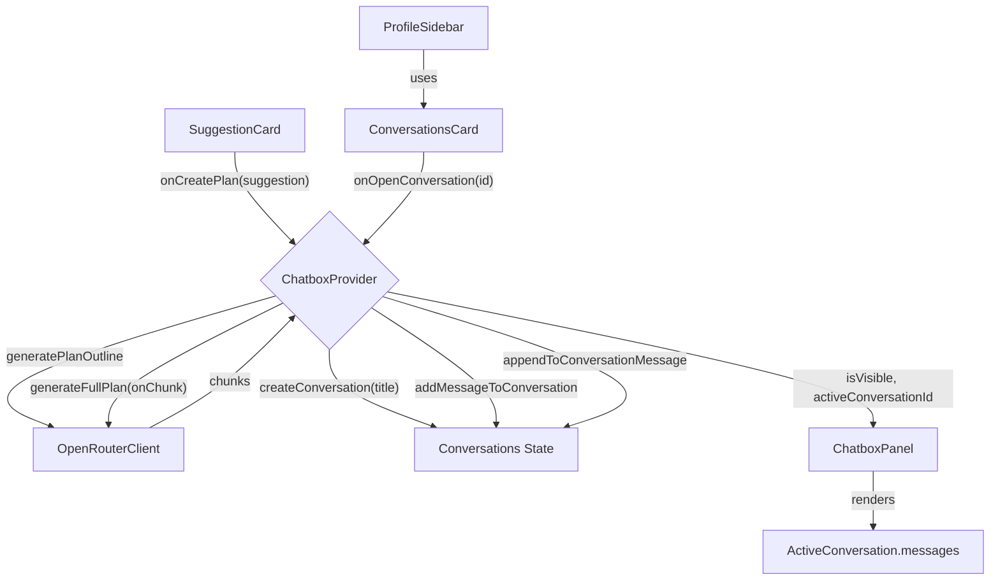

# Business Plan Chat Integration – Technical Specification

Version: 1.0  
Date: 2025-08-20  
Owner: Chatbox/Business Idea Feature Team

---

## 1) Problem Analysis

- __Goal__
  - Integrate business plan generation into the chatbox with multi-conversation support.
  - Clicking "Create Implementation Plan" on a suggestion creates a new chat, streams the full plan into it, and focuses the chat.

- __Scope__
  - Backend client usage remains via existing OpenRouter integration in `ChatboxProvider`.
  - Frontend changes across `ChatboxProvider`, `ChatboxPanel`, `ProfileSidebar`, `ConversationsCard`, `BusinessPlanContent`, and `SuggestionCard`.

- __Constraints__
  - Tech stack: React + TypeScript, Tailwind CSS, Heroicons.
  - No new dependencies; reuse existing client/streaming utilities.
  - Preserve existing non-conversation chat flows as fallback.

- __Assumptions__
  - Provider config (`apiKey`, `model`) must be set prior to plan generation.
  - `SuggestionCard` exposes `onCreatePlan(suggestion)` and receives `BusinessSuggestion`.
  - `generatePlanOutline()` and `generateFullPlan()` exist within `ChatboxProvider` and can be orchestrated.

- __Ambiguities__
  - Conversation persistence across sessions: out of scope for this iteration.
  - Conversation delete/rename: not part of this spec.
  - Read receipts/unread counts: basic field provided, behavior minimal.

- __Solution Paths__
  - Path A: Extend `ChatboxProvider` with conversation state and orchestration method; update consuming UIs. Pros: centralization, minimal duplication. Cons: larger provider.
  - Path B: Separate ConversationProvider. Pros: clean separation. Cons: more plumbing and duplicate config/streaming logic.
  - Decision: Path A for cohesive state and simpler integration.

---

## 2) Rationale

- Central orchestration in `ChatboxProvider` ensures single source of truth for chat state, config, generation, streaming, and UI flags (`status`, `isVisible`).
- UI components consume derived state (active conversation, messages) to avoid tight coupling and preserve legacy behavior as a fallback.
- No new dependencies to reduce risk and complexity.

---

## 3) Implementation Plan

- __Files to Modify__
  - `src/components/chatbox/types.ts`: add Conversation types and extend `ChatboxState`.
  - `src/components/chatbox/ChatboxProvider.tsx`: implement conversation state and actions; implement `createPlanConversation` orchestration; expose in context.
  - `src/components/chatbox/ChatboxPanel.tsx`: render active conversation messages and title; fallback to legacy `messages` when no active conversation.
  - `src/app/businessidea/profile-settings/ProfileSidebar.tsx`: wire `ConversationsCard` to provider state and callbacks.
  - `src/app/businessidea/tabs/BusinessPlanContent.tsx`: invoke `createPlanConversation` from `SuggestionCard`’s `onCreatePlan`.

- __New/Updated Data Contracts__
  - Conversation (conceptual shape)
    - `id: string`
    - `title: string`
    - `messages: ChatboxMessageData[]`
    - `unread?: number`
    - `metadata?: Record<string, any>`
  - `ChatboxState` (added fields)
    - `conversations: Conversation[]`
    - `activeConversationId?: string`

- __Provider Context – New Actions (signatures)__
  - `openConversation(id: string): void`
  - `createConversation(title: string): string` (returns new conversation id)
  - `addMessageToConversation(conversationId: string, message: Omit<ChatboxMessageData, 'id'|'timestamp'>): string` (returns message id)
  - `appendToConversationMessage(conversationId: string, messageId: string, chunk: string): void`
  - `createPlanConversation(suggestion: BusinessSuggestion): Promise<string>`

- __Execution Flow__
  1. User clicks "Create Implementation Plan" on `SuggestionCard` under `BusinessPlanContent`.
  2. `BusinessPlanContent` forwards the event to `ChatboxProvider.createPlanConversation(suggestion)`.
  3. Provider sets `status = 'analyzing'`, clears previous errors.
  4. Provider calls `generatePlanOutline(suggestion)` to derive a conversation `title`.
  5. Provider calls `createConversation(title)`; sets it active and `isVisible = true`.
  6. Provider seeds an assistant message with empty content in that conversation and keeps its `messageId`.
  7. Provider invokes `generateFullPlan(outline, onChunk)`; for each chunk, appends to the message via `appendToConversationMessage`.
  8. On completion, `status = 'completed'`. On failure, `status = 'error'` and set `error` string.

- __UI Integration__
  - `ChatboxPanel`
    - Derives `activeConversation` by `activeConversationId` from `conversations`.
    - Displays `activeConversation.title` in header if present; otherwise default header.
    - Displays `activeConversation.messages` if any; otherwise fallback to legacy `messages`.
    - Auto-scroll based on the displayed message list.
  - `ProfileSidebar`
    - Passes `conversations` mapped to `ConversationsCard`’s item shape and callbacks `onOpenConversation`, `onNewChat` (uses `createConversation`).
  - `BusinessPlanContent`
    - Replaces legacy plan generation hook with `createPlanConversation` for `SuggestionCard.onCreatePlan`.

- __Error Handling & Status__
  - Missing `apiKey`/`model`: early throw in `generatePlanOutline` / `generateFullPlan` propagates to `createPlanConversation`; set `status='error'` and expose `error`.
  - Chunk streaming errors: stop streaming, append an error message if available, set `status='error'`.
  - UI shows error in `ChatboxPanel`’s existing error area.

- __Performance__
  - State updates are scoped to the targeted conversation using `map()` replace patterns.
  - Streaming appends only mutate the relevant message node.
  - Avoid large rerenders by deriving `displayMessages` once.

- __Maintainability__
  - All conversation logic lives in `ChatboxProvider` to simplify extension (persistence, deletion, renaming) later.

---

## 4) Architecture Diagram (Mermaid)

---

## 5) Testing Plan

- __Unit Tests (Provider)__
  - `createConversation` returns id, sets `activeConversationId`, keeps `isVisible=true`.
  - `addMessageToConversation` adds to correct conversation and returns `messageId`.
  - `appendToConversationMessage` appends chunks to the correct message.
  - `createPlanConversation` with mocked outline/full-plan: creates conversation, seeds message, appends chunks, sets final status.

- __Integration Tests__
  - Clicking `SuggestionCard` → new conversation exists, chatbox opens, header shows title, message streams.
  - Switching conversations via `ConversationsCard` updates `ChatboxPanel` messages and header.

- __Edge Cases__
  - Missing API key/model → `status='error'`, error visible.
  - Rapid multiple clicks → multiple conversations created; each streams independently without cross-talk.
  - Empty suggestions list → no action available.

- __Acceptance Criteria__
  - A new conversation is created and opened when user clicks "Create Implementation Plan".
  - Full plan streams into a single assistant message in that conversation.
  - `ChatboxPanel` shows the correct title and messages for the active conversation.
  - No regressions in legacy message rendering when no active conversation is selected.

---

## 6) Security & Compliance

- No new dependencies introduced; no additional third-party data flows.
- API key and model usage remain under existing configuration management.
- Do not log sensitive configuration or plan content beyond existing debug levels.
- Input validation: ensure `suggestion` structure fields exist before using (title/description).

---

## 7) Final Checklist

1. Extend types in `src/components/chatbox/types.ts` for conversations.
2. Implement conversation state + actions in `ChatboxProvider` and export via context.
3. Implement `createPlanConversation` orchestration and use existing generation functions.
4. Update `ChatboxPanel` to display active conversation and title; keep legacy fallback.
5. Wire `ProfileSidebar` → `ConversationsCard` with provider state/callbacks.
6. Update `BusinessPlanContent` to call `createPlanConversation` from `SuggestionCard`.
7. Test streaming flow, error states, and conversation switching.
8. Review accessibility (labels, roles) and responsive layout.

---

## 8) Suggested Enhancements (Optional)

- Persist conversations to storage (`ChatboxStorage.lastSession` or a new key) for reload continuity.
- Add delete/rename conversation actions; show unread counts and streaming status badges.
- Add toast/notification when plan generation starts/completes.
- Introduce lightweight diffing on streaming to reduce reconciliation cost if needed.
