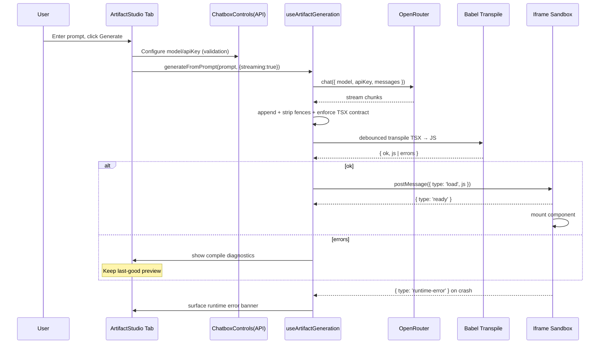

# Artifact Studio (Text-to-UI Generation) — Technical Specification

Status: Draft v1
Owner: BusinessIdea App Team
Scope: New tab under `src/app/businessidea/tabs/` implementing AI-powered text → React UI generation inspired by Claude Artifacts.


## 1) Problem Analysis

- **Goal**
  - Create a new, fully isolated tab (“Artifact Studio”) where the user enters a natural-language prompt and the system generates a self-contained React TSX component and renders it live in a sandboxed preview, while showing the live-generated code.
  - Reuse `src/components/chatbox/ChatboxControls.tsx` for API key/model configuration. No mock data anywhere.

- **Key Requirements**
  - Independent folder and components. Must not reuse or rely on `src/app/businessidea/tabs/ui-prompt/` (explicitly ignore it).
  - Strict isolation: render AI-generated UI only inside this tab.
  - Live code viewer + live preview rendering.
  - Use real LLM calls via existing OpenRouter client through Chatbox config.
  - Secure execution: sandbox iframe, strict CSP, banned tokens.

- **Constraints**
  - Next.js 15.4.x, React 19.1.x.
  - Tabs controlled by `validTabs` in `src/app/businessidea/tabs/TabContext.tsx` and mapping in `TabContainer.tsx`.
  - Existing Chatbox system provides `OpenRouterClient`, config state, storage, caching.

- **Assumptions**
  - Tab ID = `artifact-studio`, label “Artifact”. Icon TBD (Heroicons suggested: `CubeIcon`).
  - Vendored React UMD will be hosted at `public/vendor/react-umd/` for use in iframe runtime.

- **Ambiguities to confirm**
  - Final tab icon selection.

- **Solution Options**
  - A) Inline execution (unsafe) — rejected due to isolation/security risk.
  - B) Iframe sandbox (recommended) — parent transpiles, iframe executes with its own React UMD runtime; communicate via postMessage.


## 2) Rationale

- Sandbox via iframe mirrors Claude Artifacts’ “separate workspace” and provides strong isolation from the host app.
- Reusing `ChatboxControls.tsx` ensures we centralize API key/model handling and stay consistent with the rest of the app.
- `@babel/standalone` enables client-side TSX transpilation without bundlers and keeps the pipeline simple.
- Strict output contract (single default export, no imports/side-effects) simplifies runtime and improves security.


## 3) Implementation Plan

### 3.1 Files to Create

- `src/app/businessidea/tabs/artifact-studio/index.tsx`
  - The tab’s main component. Three-pane layout:
    - Left: `PromptPanel` + `ChatboxControls` (API tab).
    - Center: `CodePanel` (live code with diagnostics).
    - Right: `ArtifactSandbox` (iframe preview).
  - Uses `useArtifactGeneration()` for generation lifecycle.

- `src/app/businessidea/tabs/artifact-studio/hooks/useArtifactGeneration.ts`
  - Reads Chatbox config via `useChatbox()`.
  - API:
    - `setPrompt(prompt: string): void`
    - `generateFromPrompt(prompt: string, options?: { streaming?: boolean }): Promise<void>`
    - `cancelGeneration(): void`
  - State shape:
    - `status: 'idle'|'generating'|'streaming'|'compiled'|'error'`
    - `prompt: string`
    - `rawStream: string`
    - `code: string`
    - `compile: { ok: boolean; errors: string[] }`
    - `runtime: { errors: string[] }`
  - Behavior:
    - Calls OpenRouter via existing `OpenRouterClient` with Chatbox `config.model` and `config.apiKey`.
    - Streaming: buffer chunks, strip fences, normalize to contract.
    - Debounced compile via `transpile.ts`. On success, post to `ArtifactSandbox`.

- `src/app/businessidea/tabs/artifact-studio/components/PromptPanel.tsx`
  - Textarea + Generate/Cancel controls.
  - Displays status and validation messages (e.g., missing API key/model).

- `src/app/businessidea/tabs/artifact-studio/components/CodePanel.tsx`
  - Read-only code view. Shows compile errors with line/column when available. Copy button.

- `src/app/businessidea/tabs/artifact-studio/components/ArtifactSandbox.tsx`
  - Iframe with `sandbox="allow-scripts"` only.
  - Props: `{ code: string; className?: string; width?: number|string; height?: number|string; onRuntimeError?: (e) => void; onReady?: () => void }`.
  - Uses `srcdoc` to load:
    - `/vendor/react-umd/react.production.min.js`
    - `/vendor/react-umd/react-dom.production.min.js`
  - CSP in srcdoc:
    - `default-src 'none'; script-src 'self'; style-src 'self' 'unsafe-inline'; img-src data: blob:; connect-src 'none'`.
  - Listens for parent `postMessage({ type: 'load', js })` to evaluate and mount default export.
  - Captures `window.onerror` and posts `{ type: 'runtime-error' }` back to parent.

- `src/app/businessidea/tabs/artifact-studio/utils/transpile.ts`
  - Wraps `@babel/standalone` to transpile TSX → JS compatible with global React.
  - Babel presets:
    - `typescript`
    - `react` with classic runtime (global `React.createElement`).
  - Banned tokens (reject compilation if present): `import`, `require`, `window`, `document`, `localStorage`, `sessionStorage`, `fetch`, `XMLHttpRequest`, `WebSocket`, `eval`, `Function`, `setTimeout`, `setInterval`, `dangerouslySetInnerHTML`.
  - Returns `{ ok: boolean; js?: string; errors?: string[] }`.

- `src/app/businessidea/tabs/artifact-studio/utils/sandbox-protocol.ts`
  - Message contracts:
    - Parent → Iframe: `{ type: 'load'; js: string }`, `{ type: 'render'; props?: Record<string, unknown> }`.
    - Iframe → Parent: `{ type: 'ready' }`, `{ type: 'runtime-error'; message: string; stack?: string }`, `{ type: 'runtime-log'; data: unknown }`.
  - Validate message origin/shape.

- (Future placeholder dir only in plan) `src/app/businessidea/tabs/artifact-studio/persistence/`
  - Reserved for save/share/export V2. Not implemented in V1.

- Vendored assets (static):
  - `public/vendor/react-umd/react.production.min.js`
  - `public/vendor/react-umd/react-dom.production.min.js`
  - `public/vendor/react-umd/LICENSE` (React MIT License).


### 3.2 Files to Modify

- `src/app/businessidea/tabs/TabContext.tsx`
  - Extend `validTabs` with `'artifact-studio'`.

- `src/app/businessidea/tabs/TabNavigation.tsx`
  - Add new entry to the `TabIcons` map:
    - Key: `'artifact-studio'`
    - Label: `Artifact`
    - Icons: outline/solid (TBD; proposal: `CubeIcon`).

- `src/app/businessidea/tabs/TabContainer.tsx`
  - Extend `tabComponents` mapping: `'artifact-studio': ArtifactStudio` (from `artifact-studio/index.tsx`).

- `src/components/chatbox/ChatboxControls.tsx` (explicitly highlighted)
  - Add backward-compatible optional props:
    - `mode?: 'full' | 'configOnly'` (default `'full'`).
    - `visibleTabs?: { api?: boolean; prompt?: boolean; storage?: boolean }` (default: current behavior).
    - `onValidationChange?: (isValid: boolean) => void` (notify parent when model+key are valid).
  - Behavior in `configOnly` mode:
    - Only show API configuration UI; hide unrelated analyze/profile controls.
    - Keep existing validation and saving of API key/model.
    - Do not change defaults or behavior elsewhere in the app.


### 3.3 Prompt Contract (Strict)

- The model MUST return a single TSX module body with exactly one default export function:
  - `export default function Artifact(props) { return (<div>...</div>); }`
- Disallowed:
  - Any `import`/`export` (besides default export), `require`, side effects, timers, `window`/`document`, network APIs, `dangerouslySetInnerHTML`.
- Styling:
  - Tailwind classes only. No external libs.
- Output format:
  - No markdown. No code fences. No comments. TSX only.


### 3.4 Generation + Streaming + Compile Pipeline

1) User clicks Generate → `useArtifactGeneration.generateFromPrompt(prompt, { streaming: true })`.
2) Uses `OpenRouterClient` with `config.model` and `config.apiKey` from Chatbox.
3) Stream chunks, append to `rawStream`.
4) Normalize: strip fences/backticks, enforce default export function presence.
5) Debounced compile (e.g., 250–400ms) via `transpile.ts`.
6) If compile ok → post `{ type: 'load', js }` to iframe; else show diagnostics.
7) Iframe mounts component; runtime errors are posted back and shown.
8) Keep last-good preview on compile/runtime errors.


### 3.5 Dependencies

- Add: `@babel/standalone` (latest 7.x). Used only client-side for TSX transpile.
- Defer `dompurify` until/if `dangerouslySetInnerHTML` is allowed (not in V1).


### 3.6 Performance Considerations

- Debounce compile on stream to reduce churn.
- Avoid reloading iframe unless JS changes.
- Keep parent bundle small; rely on vendored UMD in iframe.


### 3.7 Error Handling

- API errors: banner in left panel; do not update preview.
- Compile errors: show detailed diagnostics in CodePanel; keep last-good preview.
- Runtime errors: captured in iframe and displayed in parent UI.


## 4) Architecture Diagrams

```mermaid
flowchart TD
  U[User Prompt] -->|Generate| GEN[useArtifactGeneration]
  CC[ChatboxControls (API-only)] -->|model/apiKey| GEN
  GEN -->|stream| OR[(OpenRouter)]
  GEN -->|normalize/debounce| TP[transpile.ts (Babel)]
  TP -->|js| SB[ArtifactSandbox (iframe)]
  SB -->|postMessage: ready/log/error| GEN
  GEN -->|state| UI[index.tsx: CodePanel + PromptPanel]
  SB --> View[Rendered Artifact]
```




## 5) Testing Plan

- Unit
  - `transpile.ts`: valid TSX → JS, banned token rejection, syntax error reporting.
  - `sandbox-protocol.ts`: message shape validation, ignore malformed/unexpected.
- Integration (no network)
  - `ArtifactSandbox.tsx`: mount/teardown; inject known-good/bad component strings; assert ready/error messages.
- Manual E2E (network)
  - With valid OpenRouter key: prompt → stream → compile → live preview.
  - Negative cases: invalid key/model.
- Accessibility
  - Keyboard navigable panes. Live regions for status/errors.
- Acceptance Criteria
  - New tab present and isolated. Live code and preview reflect generated component.
  - No mock data. Errors visible. Other tabs unaffected.


## 6) Security & Compliance

- Iframe sandbox:
  - `sandbox="allow-scripts"`; no same-origin, no popups, no top-navigation, no forms.
  - CSP in `srcdoc`: `default-src 'none'; script-src 'self'; style-src 'self' 'unsafe-inline'; img-src data: blob:; connect-src 'none'`.
- Code validation: reject banned tokens; disallow `dangerouslySetInnerHTML` in V1.
- Data: API keys managed only in Chatbox; no new key storage.
- Licensing: include React MIT license for vendored UMD files.


## 7) Final Checklist

- [ ] Confirm tab icon.
- [ ] Add `@babel/standalone` to dependencies.
- [ ] Vendor React UMD files under `public/vendor/react-umd/` with LICENSE.
- [ ] Create `artifact-studio/` files and components.
- [ ] Modify `TabContext.tsx`, `TabNavigation.tsx`, `TabContainer.tsx`.
- [ ] Update `ChatboxControls.tsx` props (`mode`, `visibleTabs`, `onValidationChange`).
- [ ] Implement prompt contract, streaming, compile, sandbox messaging.
- [ ] Add tests and run manual E2E validation.


## 8) Suggested Enhancements (Roadmap)

- Persistence: save artifact versions, titles, export `.tsx`.
- Props playground: JSON props editor; post to iframe for re-render.
- Preview tooling: viewport presets (mobile/tablet/desktop), theme toggle.
- AST-level static analysis to harden validation.


## 9) Notes & Exclusions

- Explicitly ignore `src/app/businessidea/tabs/ui-prompt/` (not reused, different feature).
- No mock data anywhere; requires valid model + API key.
- No code outside the new tab may render artifacts.
