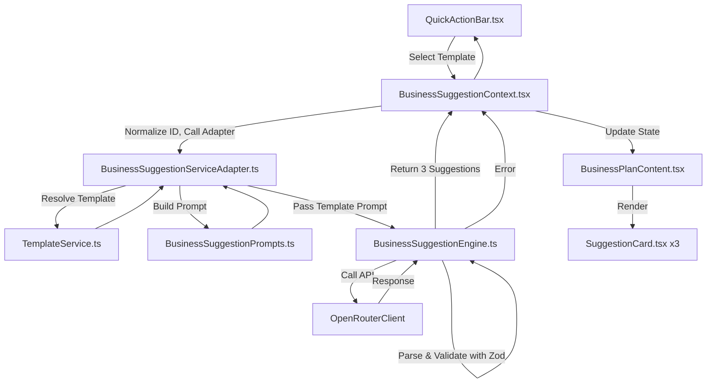
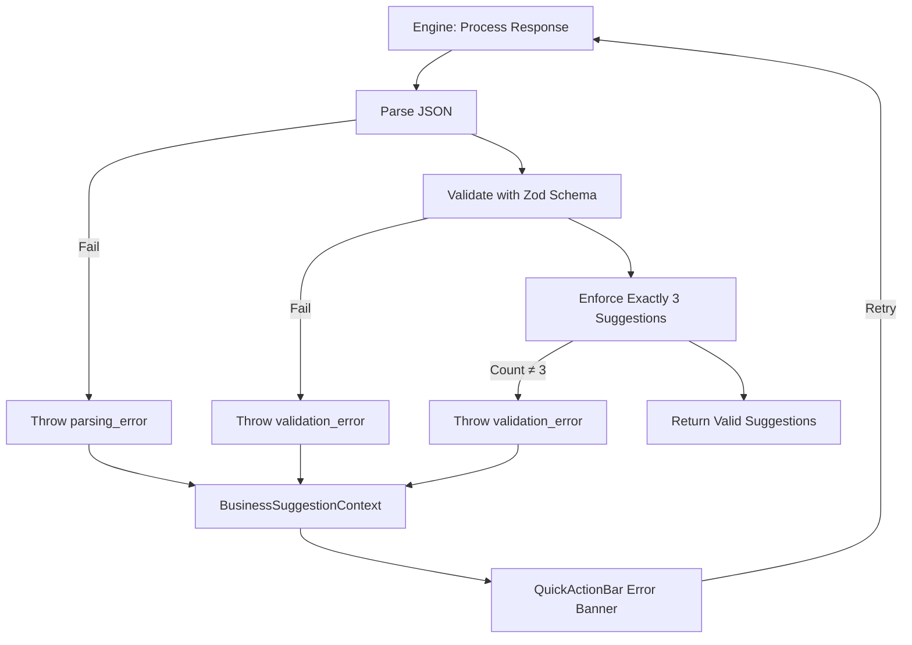

# Business Suggestion Service Replacement Technical Specification

## 1. Problem Analysis
### Requirements and Constraints
- **Core Requirement**: Replace the existing `BusinessSuggestionService.ts` with a modular, template-aware service that generates exactly three personalized business suggestions based on the selected template from `QuickActionBar.tsx`.
- **Template Integration**: Utilize the selected business template (e.g., SaaS, Retail, Course, or custom templates) to dynamically generate suggestions.
- **Normalization**: Ensure template IDs are normalized to lowercase end-to-end to prevent mismatches.
- **Output Guarantee**: Must return exactly three valid `BusinessSuggestion` objects; no fallback suggestions allowed.
- **Error Handling**: Implement robust error handling with structured error taxonomy; propagate errors to UI without silent fallbacks.
- **Integration Points**: Seamlessly integrate with existing UI components (`SuggestionCard.tsx`, `QuickActionBar.tsx`) and context (`BusinessSuggestionContext.tsx`).
- **Dependencies**: Reuse `OpenRouterClient`, `TemplateService`, and existing analysis/config flows.
- **Constraints**: No new external dependencies; maintain performance (single AI API call); ensure backward compatibility where possible.

### Current Issues Identified
- **Casing Inconsistency**: `BusinessSuggestionContext.tsx` initializes `businessType` to `"SaaS"` (capitalized), while `TemplateService.ts` and `QuickActionBar.tsx` use lowercase IDs (`saas`, `retail`, `course`).
- **Fallback Behavior**: `BusinessSuggestionService.parseBusinessSuggestions()` returns hardcoded fallbacks on parsing failures, masking template or AI response issues.
- **Dual Generation Paths**: `ChatboxProvider.generateBusinessSuggestions()` calls the service directly (bypassing adapter), creating confusion and potential inconsistency.
- **Weak Validation**: No strict schema validation for AI responses; only basic shape checks.
- **Count Enforcement**: No guarantee of exactly three suggestions beyond prompt text.
- **Error Propagation**: Errors are thrown as generic `Error` objects without structured metadata.

### Assumptions and Dependencies
- `OpenRouterClient` remains the AI provider; no changes to API usage.
- `BusinessSuggestion` type (from `src/components/chatbox/types`) is the authoritative schema for suggestion objects.
- `TemplateService` is the source of truth for default and custom templates.
- `zod` (already a dependency) will be used for validation.
- Existing profile data and analysis results are valid inputs.

### Ambiguities (Resolved)
- **Dual Path Handling**: Deprecate the direct path in `ChatboxProvider.generateBusinessSuggestions()`; unify to use the adapter for consistency.
- **Error Metadata**: Extend `BusinessSuggestionContext` error state to include structured error codes and details for better UI feedback.

### Solution Paths Evaluated
- **Path A (Rejected)**: Refactor existing `BusinessSuggestionService` + Adapter.
  - Pros: Minimal disruption.
  - Cons: Maintains dual responsibilities in service; harder to test and maintain.
- **Path B (Selected)**: Introduce `BusinessSuggestionEngine` for AI I/O; adapter handles template resolution.
  - Pros: Clear separation of concerns; modular; optimal for testing and extensibility.
  - Cons: Additional file; requires more refactoring.
- Justification: Path B aligns with modular design principles and improves long-term maintainability.

## 2. Rationale
### Design Choices
- **Modular Separation**: Split responsibilities into `BusinessSuggestionServiceAdapter.ts` (template resolution and normalization) and `BusinessSuggestionEngine.ts` (AI interaction, parsing, validation). This isolates concerns: adapter handles business logic (template selection), engine handles technical I/O (AI calls and schema enforcement).
- **Template Awareness**: Centralize template resolution in the adapter to ensure consistent normalization and prompt construction, preventing fallback reliance.
- **Strict Validation**: Use `zod` for schema validation to enforce exactly three suggestions and consistent shape, eliminating silent failures.
- **Error Taxonomy**: Implement structured errors (`api_error`, `parsing_error`, `validation_error`, `template_error`) with metadata for actionable UI feedback and debugging.
- **No Fallbacks**: Remove fallback mechanisms to surface issues immediately, aligning with robust error handling and user expectations.
- **Lowercase Normalization**: Apply normalization at boundaries (context setter, adapter entry) to prevent drift and mismatches.
- **Performance**: Maintain single AI API call; add minimal overhead for validation.
- **Extensibility**: Design for easy addition of new templates or validation rules.

### Best Practices Alignment
- Functional/declarative patterns: Pure functions for validation and prompt building.
- Strict TypeScript: Use interfaces and `zod` for runtime validation.
- Error Handling: Detailed logging with `chatboxDebug`; propagate structured errors.
- Testing: Modular design enables comprehensive unit and integration testing.
- Security: Sanitize template inputs; validate all I/O.

## 3. Implementation Plan
### Files to Create
1. **`src/lib/chatbox/BusinessSuggestionEngine.ts`** (New)
   - Core AI engine for suggestion generation.
   - Responsibilities: Validate config, build prompt, call `OpenRouterClient`, parse/validate response, enforce count, handle errors.
   - Signature: `generateSuggestions(config: AnalysisConfig, analysisResult: AnalysisResult, profileData?: ProfileFormData, templatePrompt?: string): Promise<BusinessSuggestion[]>`
   - Exports: `BusinessSuggestionEngine` class with `getInstance()` singleton.

2. **`src/lib/chatbox/prompts/validationSchemas.ts`** (New)
   - Zod schemas for `BusinessSuggestion` and response validation.
   - Includes coercion for optional fields (e.g., generate IDs if missing).
   - Enforces exactly 3 suggestions (truncate >3, throw on <3).

3. **`docs/specs/business-suggestion-service-replacement-spec.md`** (New)
   - This specification document.

### Files to Modify
1. **`src/contexts/BusinessSuggestionContext.tsx`**
   - Initialize `businessType` to `'saas'` (lowercase).
   - Update `setBusinessType(type: string)` to normalize to lowercase.
   - Extend error state to `{ code?: string; message: string; details?: any }` for structured errors.
   - Ensure `generateSuggestions()` calls adapter with normalized type.

2. **`src/lib/chatbox/BusinessSuggestionServiceAdapter.ts`**
   - Normalize `businessType` to lowercase at entry.
   - Resolve template via `getTemplateById()` with lowercase ID.
   - For defaults, use `BusinessSuggestionPrompts.getIndustrySpecificPrompt()`.
   - Build `TemplateContext` and pass `templatePrompt` to engine.
   - Handle `template_error` if custom template not found.

3. **`src/lib/chatbox/BusinessSuggestionService.ts`** (Replace with Engine)
   - Rename to `BusinessSuggestionEngine.ts` (see new file above).
   - Remove fallback logic; add zod validation.
   - Implement error taxonomy with custom error classes or structured throws.
   - Enforce exactly 3 suggestions via schema.

4. **`src/services/TemplateService.ts`**
   - Add lowercase normalization on template save: `saveTemplate(template: BusinessTemplate)` normalizes `id` to lowercase.
   - Optionally add helper `normalizeTemplateId(id: string): string` for consistency.

5. **`src/components/chatbox/ChatboxProvider.tsx`**
   - Deprecate `generateBusinessSuggestions()`; update to call adapter for consistency (or remove if unused).
   - Ensure no direct calls to old service bypass adapter.

6. **`src/components/chatbox/QuickActionBar.tsx`**
   - No functional changes; confirm error display handles structured errors (update if needed for code-specific messages).

7. **`src/components/business/SuggestionCard.tsx`**
   - No changes; ensure it handles exactly 3 suggestions from context.

8. **`src/app/businessidea/tabs/BusinessPlanContent.tsx`**
   - No changes; renders suggestions from context.

### Function Signatures and Data Contracts
- **Adapter**:
  ```typescript
  class BusinessSuggestionServiceAdapter {
    async generateSuggestions(
      businessType: string,
      analysisResult: AnalysisResult,
      config: AnalysisConfig,
      profileData?: ProfileFormData
    ): Promise<BusinessSuggestion[]>
  }
  ```
- **Engine**:
  ```typescript
  class BusinessSuggestionEngine {
    async generateSuggestions(
      config: AnalysisConfig,
      analysisResult: AnalysisResult,
      profileData?: ProfileFormData,
      templatePrompt?: string
    ): Promise<BusinessSuggestion[]>
  }
  ```
- **Validation Schemas**:
  ```typescript
  const suggestionSchema = z.object({
    id: z.string().optional(),
    title: z.string().min(3),
    description: z.string().min(10),
    category: z.string().min(2),
    viabilityScore: z.number().min(65).max(95),
    keyFeatures: z.array(z.string()).min(3).max(5),
    targetMarket: z.string().min(3),
    estimatedStartupCost: z.string().min(1),
    metadata: z.record(z.any()).optional()
  });

  const responseSchema = z.object({
    suggestions: z.array(suggestionSchema).length(3)
  });
  ```
- **Error Types**:
  ```typescript
  interface SuggestionError extends Error {
    code: 'api_error' | 'parsing_error' | 'validation_error' | 'template_error';
    details?: any;
  }
  ```

### Execution Flow and Integration Points
1. User selects template in `QuickActionBar.tsx` → calls `setBusinessType()` (normalized).
2. `generateSuggestions()` triggered → `BusinessSuggestionContext` calls adapter.
3. Adapter normalizes ID, resolves template, passes prompt to engine.
4. Engine validates config, builds prompt, calls `OpenRouterClient`.
5. Parses response with zod; enforces count; returns 3 suggestions or throws.
6. Context updates state → `BusinessPlanContent.tsx` renders 3 `SuggestionCard`s.
7. Errors propagated to context → UI displays error banner in `QuickActionBar`.

### Performance, Error Handling, and Maintainability
- **Performance**: Single API call; validation adds ~1-5ms overhead.
- **Error Handling**: Structured errors with logs via `chatboxDebug`; UI retry on user action.
- **Maintainability**: Modular files; clear contracts; easy to extend templates or add validations.

## 4. Architecture Diagram (Mermaid)
### Overall Process Flowchart


### Template Resolution Flowchart
```mermaid
flowchart TD
    A[Adapter: Normalize businessType] --> B{Is Default? (saas, retail, course)}
    B -->|Yes| C[Get Industry Prompt from BusinessSuggestionPrompts]
    B -->|No| D[Fetch Custom Template via TemplateService]
    D --> E{Template Found?}
    E -->|Yes| F[Interpolate Template with Profile Data]
    E -->|No| G[Throw template_error]
    C --> H[Pass templatePrompt to Engine]
    F --> H
    G --> Adapter
    H --> Engine
```

### Error Handling Flowchart


## 5. Testing Plan
### Unit Tests
- **Adapter**:
  - Test ID normalization: `'SaaS'` → `'saas'`.
  - Test default template resolution: `'retail'` → industry prompt used.
  - Test custom template: Resolve via `TemplateService`, interpolate variables.
  - Test missing custom template: Throws `template_error`.
- **Engine**:
  - Test valid response with 3 suggestions: Returns array.
  - Test response with >3 suggestions: Returns first 3.
  - Test response with <3 suggestions: Throws `validation_error`.
  - Test invalid JSON: Throws `parsing_error`.
  - Test API failure: Throws `api_error`.
  - Test missing config: Throws before API call.
- **Schemas**:
  - Test zod coercion: Missing `id` generates one.
  - Test validation: Invalid fields throw.

### Integration Tests
- **End-to-End Template Selection**: Select 'Retail' → Generate → 3 `SuggestionCard`s rendered.
- **Custom Template**: Create template → Select → Generate → Cards with template-influenced content.
- **Error Propagation**: Mock malformed API response → Error in `QuickActionBar` → Retry works.
- **Normalization**: Mixed-case selection → Lowercase handled consistently.

### Acceptance Criteria
- Exactly 3 suggestions displayed in `BusinessPlanContent.tsx`.
- Template selection influences suggestion content deterministically.
- No fallback suggestions ever shown.
- Errors displayed with user-friendly messages and retry options.
- Performance: Generation completes in <10 seconds (typical API response).

## 6. Security & Compliance
- **Input Sanitization**: Use `sanitizePrompt()` from `TemplateService` on template prompts before interpolation.
- **API Key Handling**: Keys sourced from config only; no hardcoding.
- **Validation**: Strict zod schemas prevent malformed data; normalize inputs to lowercase.
- **Error Exposure**: Internal errors mapped to safe, non-technical messages; details logged securely.
- **Data Privacy**: No user data leaked in prompts or responses; profile data used for personalization only.

## 7. Final Checklist
- [ ] Update `BusinessSuggestionContext.tsx`: Default to `'saas'`, normalize setter, extend error state.
- [ ] Modify `BusinessSuggestionServiceAdapter.ts`: Normalize ID, resolve templates, pass to engine.
- [ ] Create `BusinessSuggestionEngine.ts`: Remove fallback, add zod, enforce count, error taxonomy.
- [ ] Create `validationSchemas.ts`: Define zod schemas.
- [ ] Update `TemplateService.ts`: Normalize IDs on save.
- [ ] Deprecate direct path in `ChatboxProvider.tsx`.
- [ ] Run unit tests for adapter and engine.
- [ ] Run integration tests for end-to-end flow.
- [ ] Verify: Select template → Generate → 3 cards appear.
- [ ] Deploy and monitor for errors.

## 8. Suggested Enhancements (Optional)
- **Caching**: Cache suggestions per profile hash + template ID to reduce API calls.
- **Analytics**: Track error codes for prompt tuning.
- **UI Feedback**: Add progress indicators during generation.
- **Template Editor**: Enhance with preview of interpolated prompts.
- **Multi-Template Support**: Allow selection of multiple templates for blended suggestions.
