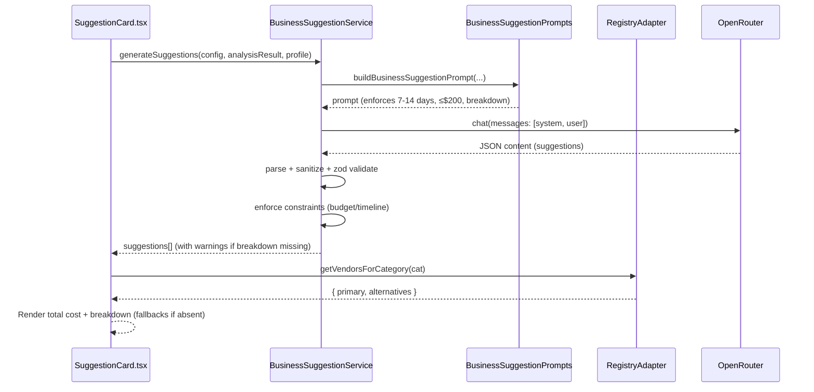
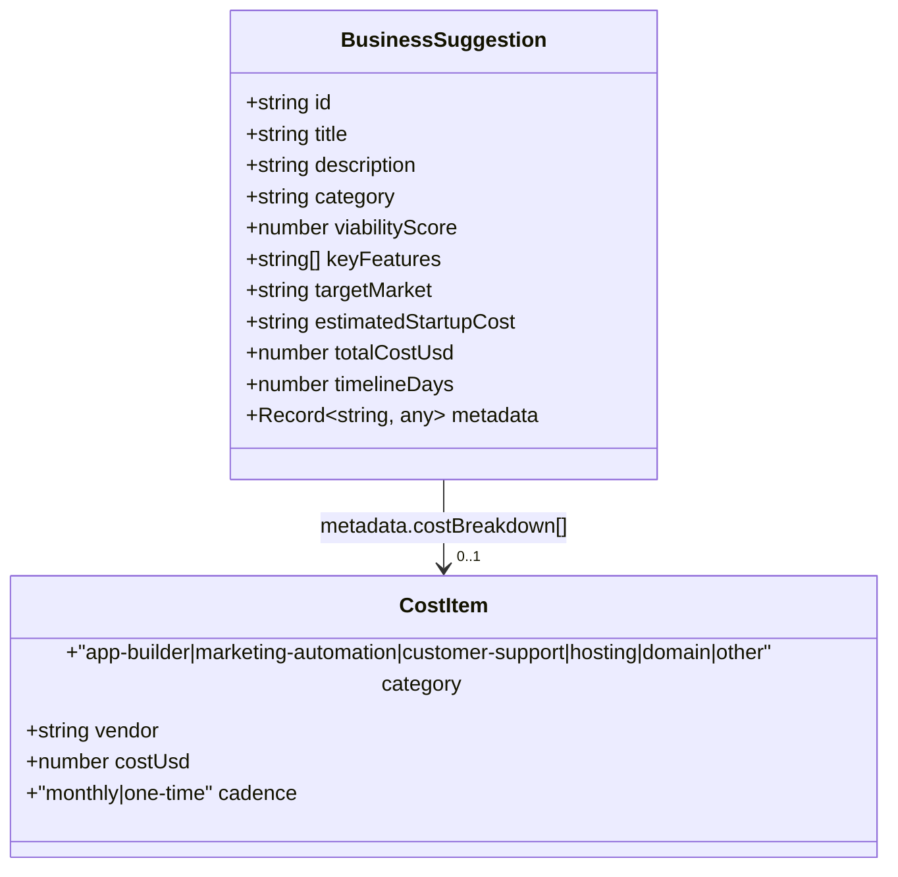

# Low-Cost, 7–14 Day Business Suggestions — Technical Specification

Date: 2025-09-07
Owner: BusinessIdea/Chatbox
Status: Draft for review

## 1) Problem Analysis

- Requirements
  - Enforce constrained suggestions:
    - Build timeline: strictly 7–14 days.
    - Total budget: strictly ≤ $200 (first-month total).
  - Augment UI (`src/components/business/SuggestionCard.tsx`) to show:
    - Total cost.
    - Cost breakdown items (with categories and vendors), rendered within the Key Features block.
  - Prefer practical, no/low-code ideas with minimal backend integration.
  - Use existing Tools Registry (`src/data/tools-registry/`, `src/components/tools-registry/`) for vendor suggestions rather than hardcoded lists.
  - Behavior when breakdown missing: allow with a warning (do not hard-reject).

- Current State
  - Prompting (`src/lib/chatbox/prompts/BusinessSuggestionPrompts.ts`):
    - Encourages 6-month timelines and high ranges (e.g., "$X,XXX - $XX,XXX").
    - No requirement to output a structured cost breakdown.
  - Service (`src/lib/chatbox/BusinessSuggestionService.ts`):
    - Parses JSON and maps to `BusinessSuggestion` with string `estimatedStartupCost` and opaque `metadata`.
    - No schema-level validation for cost/timeline; no constraint enforcement.
  - Types (`src/components/chatbox/types.ts`):
    - `BusinessSuggestion` lacks numeric fields for cost/timeline and typed cost breakdown.
  - UI (`src/components/business/SuggestionCard.tsx`):
    - Renders description, key features, targetMarket, string cost, and string timeline from `metadata.timeToMarket`.
    - No cost breakdown UI.
  - Templates (`src/services/TemplateService.ts`):
    - Default templates (saas, retail, course) do not encode the new constraints.

- Decisions (from product input)
  - Categories fed by Tools Registry, not hardcoded. We will map our breakdown buckets to registry categories.
  - Total is “first-month total”: sum of per-item first/entry plan cost (monthly) plus any one-time amounts. Must be ≤ $200.
  - Prefer default vendors per category but also show other examples (all sourced from registry).
  - Missing costBreakdown is allowed with a warning. Constraint violations (budget/timeline) still fail.

- Constraints & Ambiguities
  - Registry data does not encode precise prices; LLM provides numeric costs, registry gives vendor names and metadata. Total computation uses the model’s numeric values.
  - Mapping buckets to registry categories must be deterministic and simple:
    - app-builder → `no-code-app-builder`
    - marketing-automation → `automation` or `marketing`
    - customer-support → `customer-service`
    - hosting → `deployment-platforms` (optional)
    - domain → (not directly available; treat as `other` or constant one-time cost if provided by the model)
    - other → catch-all

## 2) Rationale

- Enforce constraints at parse/validate time to guarantee deterministic adherence despite LLM variability.
- Extend the data contract with numeric fields (`totalCostUsd`, `timelineDays`) to avoid brittle string parsing for core logic.
- Use registry-sourced vendors for consistency and future-proofing; keep numeric amounts provided by the model to avoid fragile external scraping.
- Allow missing breakdown with a typed warning to reduce friction and avoid unnecessary generation retries.

## 3) Implementation Plan

- Files to Modify
  1. `src/lib/chatbox/prompts/BusinessSuggestionPrompts.ts`
  2. `src/lib/chatbox/BusinessSuggestionService.ts`
  3. `src/components/chatbox/types.ts`
  4. `src/components/business/SuggestionCard.tsx`
  5. `src/services/TemplateService.ts`
  6. (New) `src/lib/tools-registry/RegistryAdapter.ts` — headless adapter to read registry JSON and return suggested vendors per breakdown category.
  7. Tests under `src/__tests__/`:
     - Parser/validator tests (service).
     - UI rendering tests (SuggestionCard).
     - Registry adapter tests.

- Detailed Changes
  - 3.1 Prompting (`BusinessSuggestionPrompts.ts`)
    - Update `getGenerationGuidelines()` to explicitly require:
      - Timeline 7–14 days.
      - Total first-month cost ≤ $200.
      - A structured cost breakdown with at least these buckets when applicable: app-builder, marketing-automation, customer-support. Hosting/domain are optional.
    - Update `getOutputFormat()` to include:
      - `totalCostUsd: number` (first-month total)
      - `timelineDays: number` (7–14)
      - `estimatedStartupCost: string` (backward compatibility display)
      - `metadata.costBreakdown: Array<{ category: string; vendor: string; costUsd: number; cadence: 'monthly'|'one-time' }>`
      - Note: Add guidance to choose vendors from a provided candidate list, but vendor resolution ultimately occurs via registry on the client.

  - 3.2 Types (`types.ts`)
    - Extend `BusinessSuggestion` with:
      - `totalCostUsd: number`
      - `timelineDays: number`
      - `metadata.costBreakdown?: Array<{ category: 'app-builder'|'marketing-automation'|'customer-support'|'hosting'|'domain'|'other'; vendor: string; costUsd: number; cadence: 'monthly'|'one-time' }>`
      - Keep existing fields.

  - 3.3 Service (`BusinessSuggestionService.ts`)
    - System message: reinforce JSON-only responses and that suggestions must comply with timeline and budget constraints.
    - Validation with zod:
      - Schema for a single suggestion covering all required fields and constraints:
        - `viabilityScore` clamped to [60,95].
        - `totalCostUsd` ≤ 200.
        - `timelineDays` ∈ [7,14].
        - `metadata.costBreakdown` optional; if present, 2–5 items. Sum of first-month costs must match `totalCostUsd` within ±$1.
      - If `costBreakdown` missing but `totalCostUsd` exists, accept with `validation_warning` (attach warning metadata to suggestion or global result).
      - If `totalCostUsd` missing but `estimatedStartupCost` contains a parseable number, use that as a provisional `totalCostUsd` and mark `validation_warning`.
    - Constraint enforcement:
      - If `totalCostUsd > 200` or `timelineDays` outside [7,14], throw with code `constraint_violation` and include index and offending values in `meta`.
    - Registry integration (read-only, headless):
      - Defer selection of default vendors to `RegistryAdapter` to avoid bloating the service. The service only validates.

  - 3.4 Registry Adapter (new file)
    - `getVendorsForCategory(category: 'app-builder'|'marketing-automation'|'customer-support'|'hosting'|'domain'|'other'): { primary: string; alternatives: string[] }`
    - Implement mapping to registry categories/directories:
      - `app-builder` → `no-code-app-builder/tools.json`
      - `marketing-automation` → prefer `automation/tools.json`, fallback `marketing/tools.json`
      - `customer-support` → `customer-service/tools.json`
      - `hosting` → `deployment-platforms/tools.json` (optional)
      - `domain` → not covered by registry; return `{ primary: 'Namecheap', alternatives: ['Cloudflare Registrar'] }` as static fallback (no price assertions)
      - `other` → empty/default
    - Selection policy:
      - Prefer top N (e.g., first 3 alphabetically) as alternatives; choose the first as `primary`.
      - Expose pure names only; no pricing inference.

  - 3.5 UI (`SuggestionCard.tsx`)
    - Within the Key Features section (L70–L82), insert a compact cost panel:
      - "Total cost: $<totalCostUsd>" (fallback to `estimatedStartupCost` string when numeric total missing).
      - "Breakdown" list of up to 3 items:
        - Item format: `<CategoryLabel>: $<costUsd> (<vendor>) — <cadence>`
      - If no breakdown present, show a subtle hint: "Breakdown unavailable" (and optionally an info icon with tooltip: "Provided by model; vendors suggested via registry").
      - Styles consistent with existing neutrals in this card; no global tokens altered.

  - 3.6 Templates (`TemplateService.ts`)
    - Add new default template `lean-mvp` (normalized id) that encodes constraints and instructs the model to:
      - Target no/low-code implementation.
      - Include cost breakdown and numeric totals.
      - Maintain 3 suggestions output.
    - Keep existing normalization and schema validation.

  - 3.7 Error Handling & Warnings
    - Extend error taxonomy usage:
      - `parsing_error`, `validation_error`, `constraint_violation`, `template_error`.
    - Introduce non-fatal `validation_warning` for missing or incomplete breakdown/timeline where we can still compute a total.
    - Surface warnings via existing UI state that shows message banners in QuickActionBar or relevant container (no new UI component required).

- Data Contracts
  - Incoming (model output): strict JSON, fields above.
  - Internal (TypeScript types): extended `BusinessSuggestion` with numeric `totalCostUsd` and `timelineDays` and typed `metadata.costBreakdown`.
  - UI expects the extended shape but gracefully handles older shapes via fallbacks.

- Performance & Modularity
  - RegistryAdapter is a small, synchronous reader of static JSON files; cached in-memory per session.
  - Parser/validator work is O(n) for 3 suggestions; negligible overhead.
  - No prop drilling added; UI change local to `SuggestionCard`.

## 4) Architecture Diagram (Mermaid)

## 5) Testing Plan

- Unit Tests
  - Parsing and validation:
    - Accepts valid payloads within constraints.
    - Rejects `totalCostUsd > 200` or `timelineDays` outside [7,14] with `constraint_violation`.
    - Accepts missing `costBreakdown` with `validation_warning`.
    - Tolerates small rounding differences between `sum(costBreakdown)` and `totalCostUsd` (±$1).
  - Currency parsing fallback:
    - Parse `$100`, `100 USD`, `USD 100` from `estimatedStartupCost` when `totalCostUsd` missing.

- UI Tests
  - `SuggestionCard` renders:
    - Total cost from numeric `totalCostUsd` when present, else `estimatedStartupCost` string.
    - Breakdown list with up to 3 items; shows category label, vendor, amount, cadence.
    - Fallback hint when breakdown missing.

- Integration Tests
  - Simulate OpenRouter responses:
    - Happy-path with breakdown and valid totals.
    - Missing breakdown → warning path; ensures UI still renders total.
    - Constraint violation → service throws; verify error surface via existing error UI.

## 6) Security & Compliance

- No secrets added; OpenRouter usage unchanged.
- Continue to sanitize JSON; never render vendor names as HTML.
- Registry reads are static local files; no external network.
- Fail-closed on invalid shapes; warnings are metadata-only and do not mask constraint violations.

## 7) Final Checklist

- Prompt updated to encode constraints and output fields.
- Types extended with `totalCostUsd`, `timelineDays`, and typed `metadata.costBreakdown`.
- Service: zod schema + constraint checks + warnings for missing breakdown.
- UI: cost panel in `SuggestionCard` (L70–L82) with total + breakdown + fallbacks.
- RegistryAdapter: maps breakdown categories to registry directories, returns primary/alternatives vendors.
- TemplateService: add `lean-mvp` default template that encodes constraints.
- Tests: unit, UI, integration.
- QA: verify ≥3 generated ideas comply; verify UI render and warnings.

## 8) Suggested Enhancements (Optional)

- Budget optimizer: If the model returns $210–$230, we could propose lower-cost vendor swaps from registry (e.g., replace paid chat with free-tier alternative) and auto-retry once.
- Telemetry: Track frequency of warnings vs. valid outputs to improve prompts over time (client-side only, no PII).
