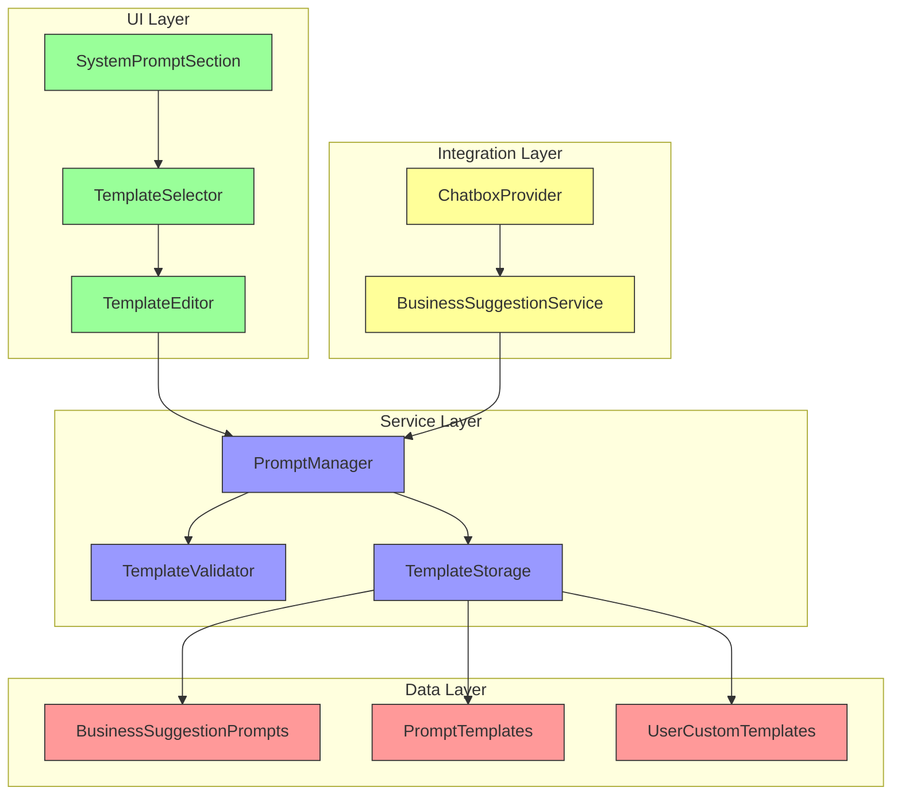
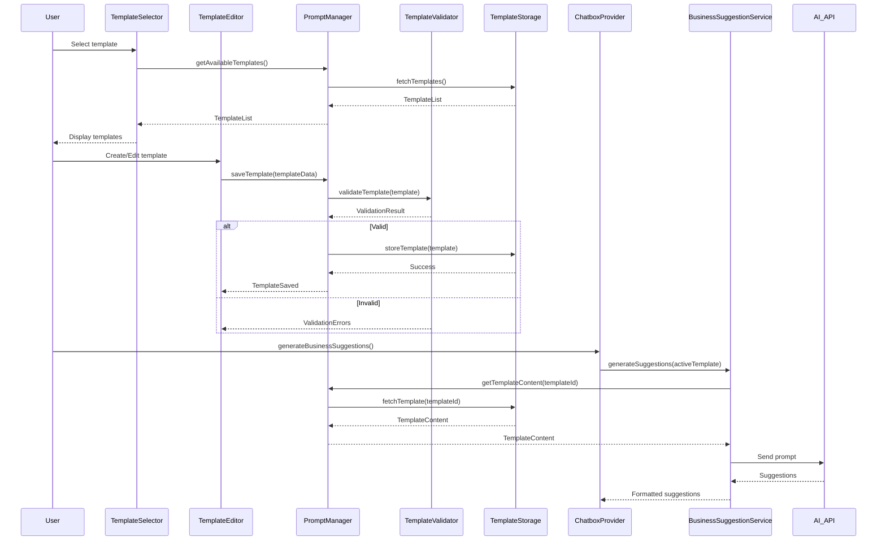

# Customizable Prompt System with Full Prompt Studio - Technical Specification

## Overview

This technical specification outlines the implementation of a comprehensive customizable prompt system that enables users to create, edit, and select specialized prompt templates for business idea generation. The system provides a full prompt studio with advanced features while maintaining modularity and extensibility.

### Goals
- Enable users to create and customize prompt templates through a visual interface
- Support specialized templates (e.g., SaaS, B2B, E-commerce) with pre-built options
- Provide template versioning, validation, and sharing capabilities
- Maintain backward compatibility with existing prompt system
- Ensure optimal performance and security

### Scope
- **In Scope**: Template creation/editing UI, prompt validation, template management, integration with business suggestion generation
- **Out of Scope**: AI model integration changes, non-business prompt types, multi-user collaboration features

### Assumptions
- Users have basic understanding of prompt engineering
- Existing chatbox architecture remains stable
- Template storage can use local storage with potential future backend integration

## Architecture

### High-Level Architecture



### Data Flow



## Implementation Plan

### Phase 1: Core Infrastructure
1. Create type definitions for prompt templates
2. Implement TemplateStorage service
3. Create TemplateValidator service
4. Update ChatboxContext to include template management

### Phase 2: UI Components
1. Create TemplateSelector component
2. Create TemplateEditor component
3. Update SystemPromptSection to include template management
4. Implement template preview functionality

### Phase 3: Integration
1. Update ChatboxProvider to use selected templates
2. Update BusinessSuggestionService to accept template overrides
3. Implement template versioning system
4. Add template sharing capabilities

### Phase 4: Advanced Features
1. Template effectiveness analytics
2. AI-assisted template suggestions
3. Template import/export functionality
4. Community template marketplace integration

## File Changes

### Files to Create

#### 1. `src/lib/chatbox/prompts/types.ts`
**Purpose**: Type definitions for prompt templates and related structures
**Dependencies**: None
**Key Exports**:
```typescript
export interface PromptTemplate {
  id: string;
  name: string;
  description: string;
  content: string;
  category: string;
  tags: string[];
  version: number;
  createdAt: string;
  updatedAt: string;
  author: string;
  isBuiltIn: boolean;
}

export interface TemplateCategory {
  id: string;
  name: string;
  description: string;
  templates: PromptTemplate[];
}

export interface ValidationResult {
  isValid: boolean;
  errors: string[];
  warnings: string[];
}
```

#### 2. `src/lib/chatbox/prompts/TemplateStorage.ts`
**Purpose**: Service for storing and retrieving prompt templates
**Dependencies**: `types.ts`
**Key Features**:
- Local storage persistence
- Template versioning
- CRUD operations
- Import/export functionality

#### 3. `src/lib/chatbox/prompts/TemplateValidator.ts`
**Purpose**: Validates prompt templates for security and format
**Dependencies**: `types.ts`
**Key Features**:
- Content sanitization
- Length validation
- Tag validation
- Security checks

#### 4. `src/lib/chatbox/prompts/PromptManager.ts`
**Purpose**: Central service for template management
**Dependencies**: `TemplateStorage.ts`, `TemplateValidator.ts`, `types.ts`
**Key Features**:
- Template CRUD operations
- Category management
- Search and filtering
- Template cloning

#### 5. `src/components/chatbox/TemplateSelector.tsx`
**Purpose**: Dropdown component for selecting prompt templates
**Dependencies**: `PromptManager.ts`, `ChatboxContext`
**Key Features**:
- Template listing with search
- Category filtering
- Preview functionality
- Quick access to favorites

#### 6. `src/components/chatbox/TemplateEditor.tsx`
**Purpose**: Modal component for creating/editing templates
**Dependencies**: `TemplateManager.ts`, `TemplateValidator.ts`
**Key Features**:
- Rich text editor for content
- Tag management
- Validation feedback
- Template cloning from existing

#### 7. `src/components/chatbox/TemplatePreview.tsx`
**Purpose**: Component for previewing template content
**Dependencies**: `types.ts`
**Key Features**:
- Syntax highlighting
- Variable substitution preview
- Length and complexity metrics

#### 8. `src/components/chatbox/ActivePromptIndicator.tsx`
**Purpose**: Visually displays the currently active prompt template
**Dependencies**: `PromptManager.ts`, `ChatboxContext`
**Key Features**:
- Displays active template name
- Updates dynamically with template selection

### Files to Modify

#### 1. `src/lib/chatbox/prompts/BusinessSuggestionPrompts.ts`
**Current State**: Contains hardcoded prompt templates
**Changes Required**:
- Refactor to use new template structure
- Export template registry
- Add default templates
- Support for custom template loading

**New Structure**:
```typescript
import { PromptTemplate, TemplateCategory } from './types';

export const DEFAULT_TEMPLATES: PromptTemplate[] = [
  {
    id: 'default',
    name: 'General Business Ideas',
    description: 'Standard template for generating diverse business ideas',
    content: `You are a business consultant...`,
    category: 'general',
    tags: ['business', 'ideas'],
    version: 1,
    createdAt: '2024-01-01T00:00:00Z',
    updatedAt: '2024-01-01T00:00:00Z',
    author: 'system',
    isBuiltIn: true
  },
  // ... additional templates
];

export const TEMPLATE_CATEGORIES: TemplateCategory[] = [
  {
    id: 'general',
    name: 'General',
    description: 'General purpose business idea templates',
    templates: DEFAULT_TEMPLATES.filter(t => t.category === 'general')
  },
  // ... additional categories
];
```

#### 2. `src/components/chatbox/types.ts`
**Current State**: Contains ChatboxContext and related types
**Changes Required**:
- Add template-related types to ChatboxContextType
- Add template management methods

**New Additions**:
```typescript
export interface ChatboxContextType extends ChatboxState {
  // ... existing properties
  
  // Template management
  activeTemplateId: string | null;
  setActiveTemplateId: (templateId: string | null) => void;
  availableTemplates: PromptTemplate[];
  createTemplate: (template: Omit<PromptTemplate, 'id' | 'version' | 'createdAt' | 'updatedAt'>) => Promise<string>;
  updateTemplate: (templateId: string, updates: Partial<PromptTemplate>) => Promise<void>;
  deleteTemplate: (templateId: string) => Promise<void>;
}
```

#### 3. `src/components/chatbox/ChatboxProvider.tsx`
**Current State**: Central provider for chatbox functionality
**Changes Required**:
- Add template state management
- Integrate with PromptManager
- Update generateBusinessSuggestions to use selected template

**Key Changes**:
```typescript
// Add to state
const [activeTemplateId, setActiveTemplateId] = useState<string | null>(null);
const [availableTemplates, setAvailableTemplates] = useState<PromptTemplate[]>([]);

// Add to useEffect for initialization
useEffect(() => {
  const loadTemplates = async () => {
    const templates = await promptManager.getAllTemplates();
    setAvailableTemplates(templates);
  };
  loadTemplates();
}, []);

// Modify generateBusinessSuggestions
const generateBusinessSuggestions = useCallback(async () => {
  // ... existing code
  
  const selectedTemplate = activeTemplateId 
    ? await promptManager.getTemplate(activeTemplateId)
    : null;
  
  const customSystemPrompt = selectedTemplate?.content || getCustomSystemPrompt();
  
  // ... rest of the function
}, [state.config, state.currentAnalysis, profileData, profileDataHash, cacheManager, storageManager, activeTemplateId]);
```

#### 4. `src/components/chatbox/SystemPromptSection.tsx`
**Current State**: Component for managing system prompts
**Changes Required**:
- Add TemplateSelector component
- Add section for template management
- Integrate with ChatboxContext

**Key Changes**:
```tsx
import { TemplateSelector } from './TemplateSelector';

export const SystemPromptSection = () => {
  // ... existing code
  
  return (
    <div className="space-y-6">
      {/* Existing system prompt section */}
      <div className="space-y-2">
        <h3 className="text-sm font-medium">System Prompt</h3>
        <Textarea
          value={systemPrompt}
          onChange={setSystemPrompt}
          placeholder="Enter your system prompt..."
          className="min-h-[100px]"
        />
      </div>
      
      {/* New template management section */}
      <div className="space-y-2">
        <h3 className="text-sm font-medium">Business Suggestion Templates</h3>
        <TemplateSelector />
      </div>
    </div>
  );
};
```

## Testing Plan

### Unit Tests
1. **TemplateStorage Tests**:
   - CRUD operations
   - Persistence across sessions
   - Error handling for storage failures

2. **TemplateValidator Tests**:
   - Content validation rules
   - Security sanitization
   - Edge case handling

3. **PromptManager Tests**:
   - Template loading and filtering
   - Category management
   - Search functionality

### Integration Tests
1. **Template Selection Flow**:
   - Select template → Update context → Generate suggestions
   - Template persistence across sessions

2. **Template Creation Flow**:
   - Create template → Validate → Store → Display in selector

3. **Business Suggestion Generation**:
   - Template selection affects generated content
   - Fallback to default when no template selected

### End-to-End Tests
1. **User Journey: SaaS Template Selection**:
   - User opens SystemPromptSection
   - Selects "SaaS Business" template
   - Clicks "Get Business Ideas"
   - Verifies SaaS-focused suggestions generated

2. **Custom Template Creation**:
   - User creates new template
   - Saves and selects it
   - Generates suggestions with custom prompt

## Security Considerations

### Input Validation
- Sanitize all user-provided template content
- Limit template size (max 5000 characters)
- Validate template structure and required fields

### Content Security
- Prevent XSS through template content
- Implement CSP for template rendering
- Rate limit template creation/modification

### Data Protection
- Encrypt sensitive template data if stored remotely
- Implement access controls for shared templates
- Regular security audits of template validation logic

## Performance Considerations

### Optimization Strategies
1. **Template Caching**:
   - Cache frequently used templates in memory
   - Lazy load template previews
   - Implement template compilation for faster execution

2. **UI Performance**:
   - Virtualize long template lists
   - Debounce search input
   - Optimize re-renders with React.memo

3. **Storage Performance**:
   - Use IndexedDB for large template libraries
   - Implement pagination for template lists
   - Compress template content for storage

### Metrics to Monitor
- Template loading time
- UI response time for template selection
- Memory usage during template editing
- Storage operation latency

## Deployment Strategy

### Rollout Plan
1. **Phase 1**: Deploy core infrastructure (storage, validation)
2. **Phase 2**: Deploy UI components with feature flags
3. **Phase 3**: Enable template creation for beta users
4. **Phase 4**: Full release with all features

### Migration Strategy
1. Convert existing hardcoded templates to new structure
2. Migrate user custom prompts to template format
3. Provide backward compatibility during transition

### Monitoring and Rollback
- Implement feature flags for easy rollback
- Monitor error rates and user feedback
- Have rollback procedures documented

## Future Enhancements

### Short Term (3-6 months)
1. Template effectiveness tracking
2. AI-powered template suggestions
3. Template import from popular sources

### Medium Term (6-12 months)
1. Community template marketplace
2. Advanced template collaboration features
3. Template analytics dashboard

### Long Term (1+ years)
1. Multi-language template support
2. Template automation and scheduling
3. Integration with external prompt engineering tools

## Conclusion

This specification provides a comprehensive plan for implementing a modular, extensible prompt management system. The architecture emphasizes separation of concerns, maintainability, and user experience while ensuring security and performance. The phased implementation approach allows for incremental development and testing, minimizing risk and enabling early user feedback.

The system will provide users with powerful tools for customizing their business idea generation experience while maintaining the simplicity and reliability of the existing system.

---

**Document Version**: 1.1
**Updated**: 2024-12-XX
**Changes**: Added active prompt indicator requirements and implementation details
