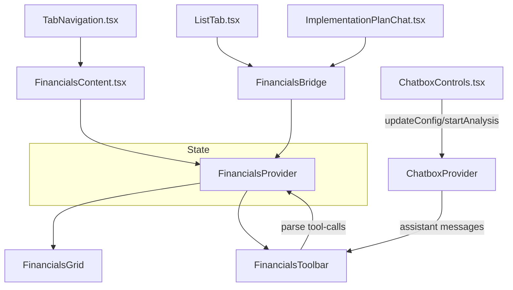

# Excel-Like Financials Integration — Technical Specification

Status: Draft v1
Owner: Financials/Chatbox Integration
Last updated: 2025-08-22 15:34 (+08:00)

---

## 1) Problem Analysis

- **Requirements**
  - Build a modern, Excel-like financials grid inside `src/app/businessidea/tabs/FinancialsContent.tsx`.
  - Context-aware integration with:
    - `src/app/businessidea/tabs/ListTab.tsx` (implementation plan output → import rows).
    - `src/features/implementation-plan/chat/ImplementationPlanChat.tsx` (two-phase generation → import rows).
    - `src/components/chatbox/ChatboxControls.tsx` (AI tool-calling + prompt augmentation).
    - Compatible with `src/app/businessidea/tabs/TabNavigation.tsx` and `ConversationsCard.tsx`.
  - Offline-first persistence via `localStorage`, future-ready optional Supabase sync.
  - UX: spreadsheet-like editing, selection, keyboard navigation, sticky headers, zebra rows, compact density.

- **Assumptions**
  - v1: No new third-party grid/evaluator dependencies.
  - Formula support: numbers, `+ - * /`, parentheses, A1 refs, ranges, functions: `SUM`, `AVERAGE`.
  - Default sheet size: 50 rows × 26 cols (A–Z). Extensible later.
  - `useImplementationPlan()` in `ListTab.tsx` returns a `plan` object (already used in the UI).

- **Ambiguities (confirm)**
  - Additional Excel functions needed in v1? (IF, MIN, MAX, ROUND, PMT)
  - Cross-sheet references and named ranges in v1 or v2?
  - Workbook scoping: per active conversation from `ChatboxProvider` (conversation-bound workbooks) vs single workbook.

- **Solution Paths**
  - Path A (recommended): In-house grid + evaluator + React context. Pros: control, zero deps; Cons: fewer features initially.
  - Path B: Use a grid library (react-data-grid/ag-grid). Pros: features; Cons: dependency/complexity/licensing.
  - Path C: Hybrid A now; reserve upgrade path to B later.

---

## 2) Rationale

- In-house approach maintains style consistency, strict tool-calling control, and optimized data contracts across tabs. Simplifies secure formula evaluation (no `eval`), and enforces a minimal, auditable tool schema for AI operations. Keeps codebase light and performance predictable.

---

## 3) Implementation Plan

### 3.1 Files to Create

- `src/app/businessidea/tabs/financials/types.ts`
  - Data contracts for workbook, sheet, cells, formatting, selection, and evaluators.
  - TypeScript signatures (strict mode, no `any`).

```ts
// File: src/app/businessidea/tabs/financials/types.ts

export interface Workbook {
  id: string;
  name: string;
  activeSheetId: string;
  sheets: Record<string, Sheet>;
  updatedAt: string; // ISO string
  namedRanges?: NamedRange[];
}

export interface Sheet {
  id: string;
  name: string;
  rows: number;
  cols: number;
  cells: Record<A1, Cell>;
  formats?: Record<A1, CellFormat>;
  frozen?: { rows: number; cols: number };
}

export type A1 = string; // e.g., "A1", "AA10"

export interface Cell {
  input: string; // literal or formula e.g., "=SUM(A1:B2)"
  value: number | null;
  error?: string; // evaluation error message
}

export type NumberFormat = 'general' | 'currency' | 'percent' | 'int' | 'decimal';

export interface CellFormat {
  numberFormat?: NumberFormat;
  precision?: number; // decimals for decimal/percent
  bold?: boolean;
  align?: 'left' | 'center' | 'right';
  bg?: 'none' | 'row-zebra' | 'total-row' | 'header';
  color?: string; // CSS color token
}

export interface EvalContext {
  getCellValue(a1: A1): number | null;
}

export interface Selection {
  start: A1;
  end: A1;
}

export interface NamedRange {
  name: string;
  range: string; // e.g., "A1:B10"
}
```

- `src/app/businessidea/tabs/financials/utils/address.ts`
  - Address conversions and range expansion.

```ts
// File: src/app/businessidea/tabs/financials/utils/address.ts

export function colToLetters(col: number): string; // 1 -> A, 26 -> Z, 27 -> AA
export function lettersToCol(letters: string): number; // A -> 1, Z -> 26, AA -> 27
export function toA1(pos: { row: number; col: number }): string; // 1-based indices
export function fromA1(a1: string): { row: number; col: number };
export function expandRange(range: string): string[]; // [A1..B2] -> list of A1s
```

- `src/app/businessidea/tabs/financials/utils/formula.ts`
  - Tokenize → shunting-yard → RPN evaluation.

```ts
// File: src/app/businessidea/tabs/financials/utils/formula.ts

import type { EvalContext } from '../types';

export function evaluateFormula(input: string, ctx: EvalContext): number; // throws on parse/eval error
```

- `src/app/businessidea/tabs/financials/persistence.ts`
  - Local-first persistence. Optional Supabase sync (no hard dependency).

```ts
// File: src/app/businessidea/tabs/financials/persistence.ts

import type { Workbook } from './types';

export const LOCAL_KEY = 'financials:workbook:v1';

export function saveLocal(workbook: Workbook): void;
export function loadLocal(): Workbook | null;

// Supabase adapters (no-op if client unavailable)
export async function saveSupabase(userId: string, workbook: Workbook): Promise<boolean>;
export async function loadSupabase(userId: string, workbookId: string): Promise<Workbook | null>;
```

- `src/app/businessidea/tabs/financials/FinancialsContext.tsx`
  - React context/provider for workbook state and API.

```tsx
// File: src/app/businessidea/tabs/financials/FinancialsContext.tsx

import type { Workbook, Sheet, A1, CellFormat } from './types';

export interface FinancialsContextValue {
  workbook: Workbook;
  sheet: Sheet;
  setCellInput(addr: A1, input: string): void;
  setFormat(addr: A1, fmt: Partial<CellFormat>): void;
  recalc(): void;
  addSheet(name?: string): void;
  setActiveSheet(id: string): void;
  resize(rows: number, cols: number): void;
  setFrozen(rows: number, cols: number): void;
  undo(): void;
  redo(): void;
  importPlanData(plan: unknown): { rowsAdded: number };
  exportCSV(): string;
  getValue(a1: A1): number | null;
  getRangeValues(range: string): number[];
  getNamedRange(name: string): string | undefined;
  onChange(listener: (wb: Workbook) => void): () => void;
}

export function useFinancials(): FinancialsContextValue; // hook
export function FinancialsProvider(props: { children: React.ReactNode }): JSX.Element; // provider
```

- `src/app/businessidea/tabs/financials/FinancialsGrid.tsx`
  - Presentation-only grid with ARIA roles, editing and selection behaviors.

```tsx
// File: src/app/businessidea/tabs/financials/FinancialsGrid.tsx

export interface FinancialsGridProps {
  height?: number; // px
  rowHeight?: number; // px
  density?: 'compact' | 'comfortable';
}

export function FinancialsGrid(props: FinancialsGridProps): JSX.Element;
```

- `src/app/businessidea/tabs/financials/FinancialsToolbar.tsx`
  - Toolbar with actions and AI assist toggle.

```tsx
// File: src/app/businessidea/tabs/financials/FinancialsToolbar.tsx

export function FinancialsToolbar(): JSX.Element;
```

- `src/app/businessidea/tabs/financials/adapters/list-plan-adapter.ts`
  - Maps `ListTab` implementation plan to rows.

```ts
// File: src/app/businessidea/tabs/financials/adapters/list-plan-adapter.ts

export function mapPlanToRows(input: unknown): (string | number)[][]; // includes header row
```

- `src/app/businessidea/tabs/financials/ai/financials-tooling.ts`
  - Tool schema and parser for AI tool-calls.

```ts
// File: src/app/businessidea/tabs/financials/ai/financials-tooling.ts

import type { A1 } from '../types';

export type FinancialsSetOp = { type: 'set'; addr: A1; input: string };
export type FinancialsNoteOp = { type: 'note'; message: string };
export type FinancialsOps = FinancialsSetOp | FinancialsNoteOp;

export interface FinancialsToolCall {
  tool: 'financials.apply';
  ops: FinancialsOps[];
}

export function getFinancialsSystemPrompt(): string;
export function parseToolCalls(messages: Array<{ type: string; content: string }>): FinancialsToolCall[];
export function applyToolCalls(
  calls: FinancialsToolCall[],
  apply: (addr: A1, input: string) => void
): { applied: number; notes: string[] };
```

- `src/app/businessidea/tabs/financials/bridge.ts`
  - Simple singleton bridge for cross-tab imports.

```ts
// File: src/app/businessidea/tabs/financials/bridge.ts

export type Importer = (data: unknown) => { rowsAdded: number };

export const FinancialsBridge: {
  register(importer: Importer): void;
  importFromPlan(data: unknown): { rowsAdded: number };
};
```

- `src/app/businessidea/tabs/financials/selectors.ts`
  - Hook to expose selectors for other tabs (KPIs, viz).

```ts
// File: src/app/businessidea/tabs/financials/selectors.ts

import type { A1 } from './types';

export interface FinancialsSelectors {
  getValue(a1: A1): number | null;
  getRangeValues(range: string): number[];
}

export function useFinancialsSelectors(): FinancialsSelectors;
```

- Tests (structure only; implement in repo test setup)
  - `src/app/businessidea/tabs/financials/__tests__/address.test.ts`
  - `src/app/businessidea/tabs/financials/__tests__/formula.test.ts`
  - `src/app/businessidea/tabs/financials/__tests__/persistence.test.ts`
  - `src/app/businessidea/tabs/financials/__tests__/adapter-list-plan.test.ts`
  - `src/app/businessidea/tabs/financials/__tests__/tooling.test.ts`
  - `src/app/businessidea/tabs/financials/__tests__/grid.interaction.test.tsx`

### 3.2 Files to Modify

- `src/app/businessidea/tabs/FinancialsContent.tsx`
  - Replace static content with provider + toolbar + grid.
  - `// REPLACE` main return: `<FinancialsProvider><FinancialsToolbar /><FinancialsGrid /></FinancialsProvider>`

- `src/app/businessidea/tabs/ListTab.tsx`
  - `// INSERT BELOW` success state: “Send to Financials” button → `FinancialsBridge.importFromPlan(plan)`.

- `src/features/implementation-plan/chat/ImplementationPlanChat.tsx`
  - `// INSERT BELOW` `onPlanGenerated`: call `FinancialsBridge.importFromPlan(fullPlan)`.

- `src/components/chatbox/ChatboxControls.tsx`
  - `// INSERT BELOW` AI Controls: toggle “Enable Financials Tool Schema”. When enabled:
    - `updateConfig({ customPrompt: getFinancialsSystemPrompt() })`.
    - Optionally pass a snapshot when starting analysis.

- Optional (if plugin path chosen):
  - `src/components/chatbox/*` — register `FinancialsPlugin` if a plugin system exists in `ChatboxProvider`.

### 3.3 Execution Flow

- User edits → `setCellInput` → autosave → `recalc` → UI updates.
- Plan generated or displayed → `FinancialsBridge.importFromPlan(plan)` → active sheet gains rows.
- AI Assist → prompt augmented → assistant outputs tool JSON → parse → `applyToolCalls` → `recalc`.

### 3.4 Performance & Error Handling

- v1 full-sheet recompute O(R×C) on edit; acceptable for 50×26.
- Future: dependency graph for incremental recompute.
- Cell errors shown inline; imports are guarded, never throw in UI path; tooling strictly validates ops and A1.

---

## 4) Architecture Diagram (Mermaid)



---

## 5) Testing Plan

- **Unit Tests**
  - Address utils: `A`, `Z`, `AA`, `AZ`, `BA`; range expansion rectangles.
  - Formula eval: precedence, refs, ranges, `SUM`/`AVERAGE`, empty cells, errors.
  - Persistence: save/load roundtrip; schema version key.
  - Adapter: varying plan shapes → consistent rows with headers.
  - Tooling: accept only `financials.apply` ops; reject malformed JSON; idempotent notes.

- **Integration Tests**
  - Grid editing: start/cancel edit, Enter/Shift+Enter, Tab/Shift+Tab, arrows, Home/End, Ctrl+C/V internal.
  - Formatting: number formats, precision, bold, align, freeze panes.
  - Import flows: from `ListTab` and `ImplementationPlanChat` to active sheet.
  - Chatbox: simulate assistant tool JSON; cells updated; recalculated totals.
  - Persistence reload: workbook restored without errors.

- **Acceptance Criteria**
  - Spreadsheet supports editing, selection, keyboard navigation; sticky headers and zebra rows present.
  - Formulas compute deterministically; errors visible.
  - Data import from plan renders useful rows; totals row works.
  - AI Assist applies only allowed ops; prompt augmentation toggle works.
  - Local persistence by default; app runs with no Supabase client.

---

## 6) Security & Compliance

- No `eval`; deterministic tokenizer/parser; whitelist `SUM`, `AVERAGE` only in v1.
- Tool-calls: only `set` and `note`; validate `addr` against `/^[A-Z]{1,3}\d{1,4}$/` and sanitize `input` length.
- Supabase (future): enable RLS on `financial_workbooks`; `auth.uid() = user_id` for all DML.
- No secrets in repo; env via Next runtime env variables.
- Privacy: send financial snapshot to AI only when user enables tool schema or triggers AI Assist.

---

## 7) Final Checklist

1. Create financials modules and hooks (types, utils, context, grid, toolbar, adapters, ai tooling, bridge, selectors).
2. Replace `FinancialsContent.tsx` with provider + toolbar + grid.
3. Wire `FinancialsBridge`:
   - Provider registers `importPlanData`.
   - `ListTab` and `ImplementationPlanChat` call `importFromPlan`.
4. Chatbox integration:
   - Add toggle in `ChatboxControls.tsx` for financials tool schema.
   - Pass snapshot when invoking analysis (optional v1).
5. Persistence: autosave locally; guard optional Supabase sync.
6. Tests: unit + integration + acceptance criteria.
7. Docs: update README for financials usage and Supabase schema.

---

## 8) Suggested Enhancements (Optional)

- Extend functions: `IF`, `MIN`, `MAX`, `ROUND`, `PMT`; named ranges; cross-sheet references.
- Dependency graph and lazy eval for large sheets.
- Drag-fill/auto-fill, multi-line cells, column filters, conditional formatting.
- Pricing-table templates aligned to reference visuals.
- Conversation-scoped workbooks tied to Chatbox conversations for multi-plan handling.

---

## 9) File Index Summary

- Create
  - `src/app/businessidea/tabs/financials/types.ts`
  - `src/app/businessidea/tabs/financials/utils/address.ts`
  - `src/app/businessidea/tabs/financials/utils/formula.ts`
  - `src/app/businessidea/tabs/financials/persistence.ts`
  - `src/app/businessidea/tabs/financials/FinancialsContext.tsx`
  - `src/app/businessidea/tabs/financials/FinancialsGrid.tsx`
  - `src/app/businessidea/tabs/financials/FinancialsToolbar.tsx`
  - `src/app/businessidea/tabs/financials/adapters/list-plan-adapter.ts`
  - `src/app/businessidea/tabs/financials/ai/financials-tooling.ts`
  - `src/app/businessidea/tabs/financials/bridge.ts`
  - `src/app/businessidea/tabs/financials/selectors.ts`
  - Tests under `src/app/businessidea/tabs/financials/__tests__/`

- Modify
  - `src/app/businessidea/tabs/FinancialsContent.tsx`
  - `src/app/businessidea/tabs/ListTab.tsx`
  - `src/features/implementation-plan/chat/ImplementationPlanChat.tsx`
  - `src/components/chatbox/ChatboxControls.tsx`
  - (Optional) `src/components/chatbox/*` if registering a plugin
