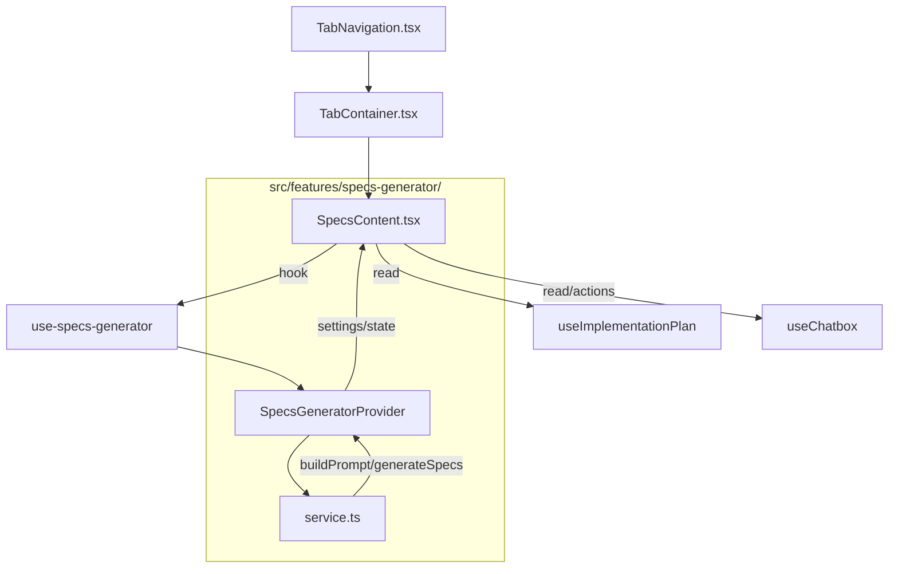

# Specs Generator — Technical Specification

Status: Draft for implementation
Owner: Frontend Platform
Last Updated: 2025-08-25T15:39:21+08:00

---

## 1) Problem Analysis

- Requirements
  - Add a new "Specs" tab to `src/app/businessidea/tabs/` via `TabContext.tsx`, `TabNavigation.tsx`, and `TabContainer.tsx`.
  - Implement a modular, reusable Specs Generator feature under `src/features/specs-generator/` that generates technical specifications in Markdown from the Implementation Plan context.
  - Provide a settings panel with:
    - Spec length presets: 5, 10, 15 lines.
    - A configurable system prompt that shapes structure/format.
    - Extensibility for future options (e.g., templates, tone, target audience).
  - Default generation mode is streaming. Support non-streaming fallback.
  - Integrate with Chatbox configuration (model, API key) from `ChatboxProvider` (no new secrets storage).
  - Add a CTA inside `ListTab` to navigate to the new Specs tab.
  - "Open in Chat" action is user-triggered only (not automatic after generation).

- Constraints
  - Follow existing patterns used by `useImplementationPlan()` and `useChatbox()`.
  - No new external dependencies without strong justification.
  - Keep feature decoupled and unit-testable (service functions pure, provider minimal side effects).

- Assumptions & Dependencies
  - Implementation Plan content is accessible via `useImplementationPlan()` and may be live-streaming or finalized.
  - Chatbox configuration and OpenRouter/LLM invocation are accessible via `useChatbox()`.
  - Placeholder plan mode (from prior work) produces content indistinguishable by consumers; Specs Generator must use whichever plan text is current.

- Ambiguities Resolved (User Confirmations)
  - Folder path: `src/features/specs-generator/` — approved.
  - CTA in `ListTab` to navigate to Specs — approved.
  - Streaming as default — approved.
  - Post to Chatbox only when user clicks an action — approved.

- Solution Options (Trade-offs)
  - A) Dedicated Specs feature (provider + service + hook + components)
    - Pros: separation of concerns; modular; easy to evolve and test.
    - Cons: adds a small provider to mount and maintain.
  - B) Extend Implementation Plan provider to also do specs
    - Pros: centralized state.
    - Cons: violates separation; harder to test and evolve; couples unrelated responsibilities.

Recommended: A.

---

## 2) Rationale

- Separation of concerns ensures maintainability and testability.
- Reusing `useChatbox()` for model and API key avoids duplicating credentials management.
- Reusing `useImplementationPlan()` ensures consistent data flow and respects placeholder/streaming modes already implemented.
- A clear state machine (idle → generating/streaming → success/error) enables robust UX and error handling.
- Settings persisted in localStorage provide a good UX without backend coupling.

---

## 3) Implementation Plan

- Files to Create
  - `src/features/specs-generator/types.ts`
  - `src/features/specs-generator/service.ts`
  - `src/features/specs-generator/SpecsGeneratorProvider.tsx`
  - `src/features/specs-generator/use-specs-generator.ts`
  - `src/features/specs-generator/components/SpecsSettingsPanel.tsx`
  - `src/features/specs-generator/components/SpecsContentView.tsx`
  - `src/app/businessidea/tabs/SpecsContent.tsx`
  - `docs/specs/specs-generator-architecture.md` (supplemental details)

- Files to Modify
  - `src/app/businessidea/tabs/TabContext.tsx`: add `'specs'` to `validTabs` and `TabId`.
  - `src/app/businessidea/tabs/TabNavigation.tsx`: add Specs tab icon + label.
  - `src/app/businessidea/tabs/TabContainer.tsx`: map `'specs'` to `SpecsContent`.
  - `src/app/businessidea/tabs/ListTab.tsx`: add CTA button/link to switch active tab to `'specs'`.

- Component/Hook Signatures & Data Contracts (Documentation Only)
  - Types
    ```ts
    // Docs: Proposed types for specs-generator
    export interface SpecsSettings {
      length: 5 | 10 | 15;
      systemPrompt: string;
      // forward-compatible: allow additional fields without breaking API
      // e.g., templateId?: string; audience?: 'dev' | 'pm';
    }

    export interface SpecsGenerationRequest {
      planText: string;           // normalized plan content used as context
      settings: SpecsSettings;    // current settings in provider
      model: string;              // from ChatboxProvider config
      apiKey: string;             // from ChatboxProvider config (never persisted here)
      streaming?: boolean;        // default true
    }

    export interface SpecsGenerationResult {
      markdown: string;           // fully assembled Markdown spec
      meta: {
        createdAt: string;        // ISO
        length: number;           // selected lines target
        source: 'plan';           // provenance
        conversationId?: string;  // optionally set when user chooses Open in Chat
      };
    }

    export type SpecsStatus = 'idle' | 'generating' | 'streaming' | 'success' | 'error';

    export interface SpecsGeneratorState {
      status: SpecsStatus;
      error?: string;
      preview?: string;           // accumulates streamed partials
      result?: SpecsGenerationResult; // present when success
    }
    ```

  - Service
    ```ts
    // Docs: Proposed service surface (pure functions)
    export function buildPrompt(planText: string, settings: SpecsSettings): string;

    export type ChunkHandler = (chunk: string) => void;

    export function generateSpecs(
      req: SpecsGenerationRequest,
      onChunk?: ChunkHandler
    ): Promise<SpecsGenerationResult>;
    ```

  - Provider Context and Hook
    ```ts
    // Docs: Provider context shape
    export interface SpecsGeneratorContextValue {
      state: SpecsGeneratorState;
      settings: SpecsSettings;
      actions: {
        setLength: (l: 5 | 10 | 15) => void;
        setSystemPrompt: (v: string) => void;
        updateSettings: (p: Partial<SpecsSettings>) => void;
        generate: (options?: { streaming?: boolean; openInChat?: boolean }) => Promise<void>;
        cancel: () => void; // abort streaming
        reset: () => void;
        openInChat: () => Promise<void>; // post current result to a new Chatbox conversation
      };
    }

    // Docs: Hook
    export function useSpecsGenerator(): SpecsGeneratorContextValue;
    ```

- Execution Flow (Generate)
  - User lands on `SpecsContent`.
  - User selects length and edits system prompt.
  - User clicks Generate → Provider:
    - Validates existence of plan text via `useImplementationPlan()`; if streaming, use latest buffer.
    - Validates Chatbox model/apiKey via `useChatbox()`.
    - Builds prompt with `buildPrompt()`.
    - Calls `generateSpecs()` with `streaming=true` by default and `onChunk` that updates `preview`.
    - On completion, sets `result` and `status='success'`.
    - Errors set `status='error'` with actionable message.

- Execution Flow (Open in Chat — on demand only)
  - After success, user clicks "Open in Chat" → Provider uses Chatbox actions:
    - Create conversation (e.g., title: "Generated Specs"), add assistant message with `result.markdown`, and open it.

- Settings Persistence
  - Persist `SpecsSettings` at key: `specs-generator:settings:v1` in `localStorage`.
  - On load, validate schema, apply defaults if missing.

- CTA in ListTab
  - A small button/link in `ListTab` header or settings area: “Generate Specs”.
  - On click: use `useTab()` to set active tab to `'specs'`.

- Prompt Strategy (Streaming-first)
  - Template
    - System prompt: from settings (user-editable), sanitized and bounded.
    - User prompt composition:
      - Context header (title, constraints, line target).
      - Normalized plan text (trimmed, deduped whitespace, and optionally truncated if over token limits with a warning in UI).
      - Explicit output contract: Markdown only, no preamble, adhere to target line count (±2 tolerance in streaming).
  - Length enforcement: request approximate constraint and post-process (if > target + tolerance, suggest Regenerate with stricter constraint).

- Error Handling
  - Missing plan → disable Generate with tooltip.
  - Missing API key/model → link to Chatbox Controls “API” tab.
  - Provider/network errors → user-friendly, non-sensitive messages; include retry/regenerate.
  - Streaming abort → `cancel()` transitions to `idle` with preserved preview for user reference.

- Performance & Token Limits
  - Normalize and optionally trim context to respect provider’s token cap; display count info.
  - Debounce settings updates; memoize derived prompt.
  - AbortController for cancellation.

- Accessibility & UX
  - Keyboard navigable, ARIA roles for controls.
  - Loading states on buttons; progress indicator for streaming.
  - Dark mode compatible; responsive layout.

---

## 4) Architecture Diagram (Mermaid)



Sequence (Streaming)

```mermaid
sequenceDiagram
  participant UI as SpecsContent
  participant PR as SpecsGeneratorProvider
  participant SV as service.ts
  participant CB as ChatboxProvider (OpenRouter)

  UI->>PR: actions.generate({ streaming: true })
  PR->>SV: generateSpecs(req, onChunk)
  SV->>CB: start streaming completion
  loop chunks
    CB-->>SV: token chunk
    SV-->>PR: onChunk(text)
    PR-->>UI: state.preview += text
  end
  CB-->>SV: done(final)
  SV-->>PR: resolve(result)
  PR-->>UI: state.status=success; state.result=result
```

---

## 5) Testing Plan

- Unit Tests
  - `buildPrompt()` enforces structure and embeds length/systemPrompt.
  - `generateSpecs()` calls Chatbox client with correct parameters; handles streaming vs non-streaming; chunk aggregation.
  - Provider state transitions: idle → streaming → success/error; cancel behavior.
  - Settings persistence: load defaults, migrate schema, save updates.

- Integration Tests (React Testing Library + Jest)
  - `SpecsContent` in tab container with providers; mock `useImplementationPlan()` to return plan text.
  - Mock `useChatbox()` to provide model/apiKey; verify disabled state without them.
  - Click Generate → verify streaming preview and final markdown; Copy/Download actions.
  - Click "Open in Chat" → verify conversation created and message appended.

- Edge Cases
  - No plan or empty plan text.
  - Huge plan text (token cap): truncation warning and successful generation.
  - Network/timeout errors: error state with retry.
  - Cancel during streaming: returns to idle; preview retained.

- Acceptance Criteria
  - Specs generated from plan context with chosen length and system prompt.
  - Default streaming preview visible; final Markdown rendered.
  - Settings persisted; Open in Chat only on user click.
  - CTA from `ListTab` navigates to Specs tab.

---

## 6) Security & Compliance

- Credentials: never store API keys in localStorage; always read from `ChatboxProvider`.
- Data: store only non-sensitive settings locally, namespaced with version key.
- Validation: sanitize user-provided system prompt; normalize plan text; limit prompt size.
- Error messages: avoid leaking provider details; keep generic but informative.
- Compliance: respect rate limits; exponential backoff for transient errors.

---

## 7) Final Checklist

- Tabs
  - Add `'specs'` to `validTabs` in `TabContext.tsx`.
  - Add Specs tab icon/label in `TabNavigation.tsx`.
  - Map `'specs'` to `SpecsContent` in `TabContainer.tsx`.
- Feature
  - Create `src/features/specs-generator/` with types, service, provider, hook, components.
  - Implement streaming-first generation flow; non-streaming fallback.
  - Persist settings to localStorage v1.
- UI
  - Implement `SpecsContent` layout with Settings, Generate/Cancel/Regenerate, preview, Copy/Download, Open in Chat.
  - Add CTA in `ListTab` to navigate to Specs.
- Integration
  - Read plan via `useImplementationPlan()`; support placeholder mode.
  - Use `useChatbox()` for model/apiKey; implement Open in Chat action.
- Quality
  - Unit/integration tests; lint; build; manual verification.
  - Documentation in `docs/specs/specs-generator-architecture.md`.

---

## 8) Suggested Enhancements (Optional)

- Templates: curated system prompts (API Spec, Component Spec, Data Contract) selectable via dropdown.
- History: save generated specs to local storage or project storage for recall.
- Export: one-click export to `docs/` as `.md` with date-stamped filenames.
- Context extensibility: allow users to inject additional context blocks (requirements, constraints) merged into prompt.
- Quality controls: post-generation linting (e.g., heading presence, section completeness) with actionable fixes.
- Chat linking: allow appending to an existing conversation chosen by user.

---

## References

- `src/app/businessidea/tabs/TabNavigation.tsx`, `TabContext.tsx`, `TabContainer.tsx`
- `src/app/businessidea/tabs/ListTab.tsx`
- `src/components/chatbox/ChatboxProvider.tsx`, `ChatboxControls.tsx`
- Prior spec: `docs/specs/implementation-plan-chatbox-sync-spec.md` (for streaming + prompt strategies)
