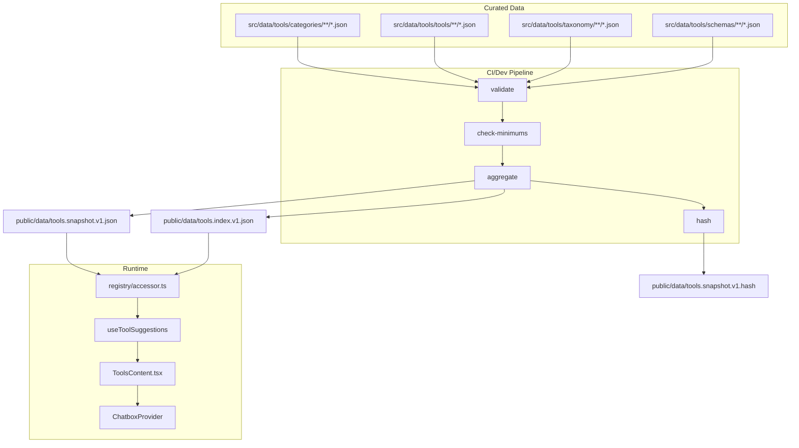

# Tools Database Technical Spec (Architecture-First)

Last updated: 2025-08-23T07:47:36+08:00
Status: Proposed (planning-only; no code implemented)
Owners: Business Tools Feature Team

This document defines the modular, offline-first Tools Database used by the Tool Suggestions feature in `src/app/businessidea/tabs/ToolsContent.tsx`. No runtime network calls are allowed for derivation; the registry is curated, validated, versioned, and aggregated at build/CI time. Optional Supabase mirroring is strictly gated behind dynamic import and is not required by the UI.

---

## 1) Problem Analysis

- __Requirements__
  - Offline-first, deterministic registry of third-party tools curated in-repo under `src/data/tools/`.
  - No runtime fetches for suggestion derivation. Data must be available locally at runtime (via import or static snapshot in `public/`).
  - Modular non-monolithic structure: separate data, taxonomy, schemas, validators, aggregation, and optional mirror adapters.
  - Strict validation and governance (schema conformance, uniqueness, taxonomy integrity, HTTPS URL constraints, category minimums).
  - Versioned, reproducible snapshots with integrity hash.
  - Integrates with:
    - `useImplementationPlanContext()` for deriving relevance from plan/settings.
    - `useTab()` for tab-aware rule weighting.
    - `useChatbox()` for Discuss/Select actions (conversations show in `ConversationsCard`).
  - Optional Supabase mirror for analytics/ops; UI must not depend on it.

- __Constraints__
  - No mock data. Curated entries only.
  - No secrets or external API keys in the data.
  - Keep bundle size reasonable; use aggregation and indexes to avoid expensive runtime scans.
  - Align dynamic import gating with patterns in `src/app/businessidea/tabs/financials/persistence.ts`.

- __Assumptions__
  - CI can run Node scripts to validate and aggregate JSON data.
  - Jest is available to test scripts (repo already has Jest config files).
  - `ToolsContent.tsx` is the UI integration point for suggestions.

- __Dependencies__
  - Internal contexts/hooks: `useImplementationPlanContext`, `useTab`, `useChatbox`.
  - Build/CI runner capable of executing Node scripts.

- __Ambiguities (needs decision)__
  - Validation approach: dev-only JSON Schema + AJV vs. custom TS validator (zero deps). See Solution Paths.
  - Initial live categories and capability taxonomy list (minimum three tools per live category).
  - Snapshot load strategy: compile-time import vs. fetch from `public/`. Both supported; choose default.
  - Supabase mirror: create tables/migrations now vs. defer.

- __Solution Paths__
  - Path A: JSON registry + JSON Schema + AJV (dev-only)
    - Pros: rigorous validation, better DX, schema-as-contract.
    - Cons: introduces a dev dependency (AJV).
  - Path B: JSON registry + custom TS validator
    - Pros: zero new deps.
    - Cons: weaker ergonomics, more custom maintenance.

---

## 2) Rationale

- __JSON data + JSON Schema__ ensures language-agnostic, auditable curated data and strong validation signals in CI. The registry is not code, avoiding runtime logic in data files.
- __Aggregated snapshot__ in `public/data/tools.snapshot.v1.json` decouples runtime from build, allows caching and integrity checks, and makes local derivation fast.
- __Indexes__ (`byCategory`, `byCapability`) are precomputed to keep UI hooks simple and performant.
- __Dynamic import + try/catch__ for Supabase aligns with established patterns and prevents runtime crashes when the client/env is unavailable.
- __Deterministic ordering__ in the snapshot produces reproducible builds and stable UX before later rule-based ranking.

If you prefer zero new dependencies, adopt Path B and keep schema files as documentation; otherwise Path A is recommended for data quality.

---

## 3) Implementation Plan

### 3.1 Directory Structure (modular)

- `src/data/tools/`
  - `categories/` — one JSON per category (metadata; ownership; status live/draft).
  - `tools/` — per-tool JSON files organized by category slug subfolders.
  - `taxonomy/` — capability, compliance, pricing-model enumerations.
  - `schemas/` — JSON Schemas for tool, category, taxonomy, and aggregate registry.
- `scripts/tools-registry/`
  - `validate.(ts|mjs)` — schema validation and governance rules.
  - `aggregate.(ts|mjs)` — build aggregate registry and indexes.
  - `hash.(ts|mjs)` — compute integrity hash for aggregate.
  - `check-minimums.(ts|mjs)` — enforce category population thresholds.
- `public/data/`
  - `tools.snapshot.v1.json` — canonical aggregated registry snapshot.
  - `tools.index.v1.json` — optional precomputed inverted indexes.
  - `tools.snapshot.v1.hash` — integrity hash of snapshot.
- `src/features/tool-suggestions/registry/`
  - `accessor.ts` — read-only accessor that loads the snapshot or imports JSON during development (no aggregation at runtime).

### 3.2 Data Contracts (field-level; no code)

- __Tool__
  - `id`: string (kebab-case, globally unique, e.g., `vendor-tool`)
  - `name`: string
  - `vendor`: string
  - `category`: string (slug; must exist in categories)
  - `website`: string (absolute HTTPS URL)
  - `description`: string (concise, curated, plain text)
  - `pricing`: object
    - `model`: one of `free | freemium | subscription | enterprise | usage`
    - `minMonthlyUSD?`: number
    - `maxMonthlyUSD?`: number
  - `capabilities`: string[] (slugs; must exist in taxonomy)
  - `compliance`: object
    - `gdpr?`: boolean
    - `soc2?`: boolean
    - `hipaa?`: boolean
  - `metadata?`: object
    - `lastVerifiedAt?`: ISO string
    - `sourceRefs?`: string[] (non-URL textual refs)

- __Category__
  - `slug`: string (kebab-case)
  - `name`: string
  - `status`: `live | draft`
  - `minTools`: number (default 3 for `live`)

- __Taxonomy__
  - `capabilities`: `{ slug: string; name: string; }[]`
  - `pricingModels`: `string[]`
  - `complianceFlags`: `string[]`

- __Aggregate Registry Snapshot__
  - `version`: string (semver, e.g., `1.0.0`)
  - `schemaVersion`: string (e.g., `tool@1`, `category@1`)
  - `generatedAt`: ISO string
  - `categories`: `Record<slug, { name: string; status: 'live' | 'draft'; minTools: number; }>`
  - `tools`: `Tool[]`
  - `indexes`:
    - `byCategory`: `Record<categorySlug, string[]>` (tool ids; sorted by tool `name` for stability)
    - `byCapability`: `Record<capabilitySlug, string[]>`
  - `integrity`:
    - `hash`: string (e.g., sha256 of canonical JSON)
    - `counts`: `{ categories: number; tools: number; capabilities: number }`

### 3.3 Naming & Normalization Rules

- Tool `id` is vendor-prefixed, kebab-case, globally unique.
- Category `slug` is kebab-case and must exist in `categories/`.
- Capability slugs must exist in `taxonomy/capabilities.json`.
- `website` must be HTTPS; `javascript:` and `data:` schemes are invalid.
- Pricing values are numeric USD; no currency symbols or strings in data.

### 3.4 Governance & Curation Workflow

- __Authoring__
  - Add tool JSON in `src/data/tools/<category>/<tool-id>.json`.
  - Update taxonomy if adding a new capability (rare; prefer reuse).
  - Keep `description` factual and concise; update `metadata.lastVerifiedAt`.

- __Review__
  - CI runs: validate → check-minimums → aggregate → hash.
  - Reviewers verify links, pricing model, capability mapping, and category membership.

- __Versioning__
  - Increment `version` (semver) on material data changes.
  - Increment `schemaVersion` on breaking schema changes.

### 3.5 Validation & Aggregation Pipeline (no runtime aggregation)

- __Validation checks__ (in `validate`):
  - JSON Schema conformance (tool/category/taxonomy/registry).
  - Uniqueness: no duplicate `tool.id` across repo; no duplicate display names within the same category.
  - Slug integrity: categories/capabilities referenced must exist in taxonomy.
  - URL sanity: HTTPS only; reject unsafe schemes.
  - Compliance flags only from allowed set.

- __Minimums__ (in `check-minimums`):
  - For `status=live` categories, ensure `minTools` satisfied (default 3).
  - `draft` categories are exempt but emit warnings.

- __Aggregation__ (in `aggregate`):
  - Build `categories` map; read all tool files; materialize `tools[]`.
  - Build indexes: `byCategory`, `byCapability`.
  - Sort stable (alphabetical by `name`, then `id`).
  - Write `public/data/tools.snapshot.v1.json` and `public/data/tools.index.v1.json`.

- __Integrity hash__ (in `hash`):
  - Compute canonical JSON hash; write `public/data/tools.snapshot.v1.hash`.

### 3.6 Consumer Access (read-only)

- `src/features/tool-suggestions/registry/accessor.ts` responsibilities:
  - Load snapshot (import or fetch from `public/data/tools.snapshot.v1.json`).
  - Expose functions (signatures only; no code here):
    - `getRegistrySnapshot(): Promise<AggregateRegistry>`
    - `getToolsByCategory(slug: string): Tool[]`
    - `getToolsByCapability(slug: string): Tool[]`
    - `getToolById(id: string): Tool | undefined`
    - `getRegistryVersion(): string`

### 3.7 Integration Points

- __Tool Suggestions Hook__ (`useToolSuggestions`): reads snapshot via accessor; no writes.
- __ToolsContent UI__: renders Top-5 and Category Directory; uses Discuss/Select actions from Chatbox and future selection persistence.
- __Chatbox__: `Discuss` opens a conversation seeded with tool context; `ConversationsCard` shows it (shared provider state).
- __Optional Supabase Mirror__ (deferred by default): ops-only analytics, never required by UI.

---

## 4) Architecture Diagram (Mermaid)

---

## 5) Testing Plan

- __Unit tests__ (run in CI)
  - Validation: reject invalid URLs/schemes, unknown slugs, pricing outside rules; accept valid records.
  - Aggregation: stable sort, correct indexes, accurate counts.
  - Integrity: unchanged data → identical hash; changed data → new hash.

- __Integration tests__
  - Accessor loads snapshot and returns expected categories and tool sets.
  - `useToolSuggestions` (later) consumes snapshot and operates deterministically (no network calls).

- __Edge cases__
  - Empty draft categories allowed; live categories below `minTools` must fail CI.
  - Duplicate tool ids across categories must fail CI.
  - New capability without taxonomy entry must fail CI.

- __Acceptance criteria__
  - All curated files pass validation and governance checks.
  - Aggregated snapshot + indexes generated with stable ordering and integrity hash.
  - Registry contains at least one `live` category with ≥3 tools before enabling Category Directory in UI.

- __Recommended libraries__
  - If Path A is chosen: AJV (dev-only) for JSON Schema validation.
  - Otherwise: custom TS validator with thorough unit tests.

---

## 6) Security & Compliance

- Enforce HTTPS for `website` links; reject unsafe schemes.
- No secrets or API keys stored in data.
- Plain text descriptions only; escape at render path; never render as HTML.
- Optional Supabase mirror strictly gated via dynamic import/try-catch; UI never depends on it.
- Supply chain: if using AJV, lock dev dependency versions; run validation in CI only.

---

## 7) Final Checklist

1. Approve validation approach (AJV vs custom TS).
2. Approve initial category taxonomy and capability list.
3. Approve snapshot default load strategy (import vs public fetch).
4. Create directory structure under `src/data/tools/` and `scripts/tools-registry/`.
5. Write schemas and validation/aggregation scripts.
6. Add CI jobs: validate → check-minimums → aggregate → hash.
7. Curate first dataset: ≥3 tools in at least one `live` category.
8. Generate snapshot and integrity hash; commit artifacts under `public/data/`.
9. Implement `registry/accessor.ts` and wire to `useToolSuggestions` (no network calls).
10. Verify Discuss action creates conversations visible in `ConversationsCard`.

---

## 8) Suggested Enhancements (Optional)

- Draft flag per tool to exclude from snapshot unless enabled.
- CLI scaffolder for adding new tools with interactive validation.
- Machine-readable changelog of snapshot diffs to aid reviewers.
- Telemetry (local-only) to count category views for prioritizing curation (no remote export).

---

## Appendix: Alignment Notes

- Supabase gating mirrors `src/app/businessidea/tabs/financials/persistence.ts` dynamic import + try/catch pattern.
- Tool Suggestions feature remains tab-aware and plan-aware; this registry provides the static inputs required by the later pure derivation rules.
