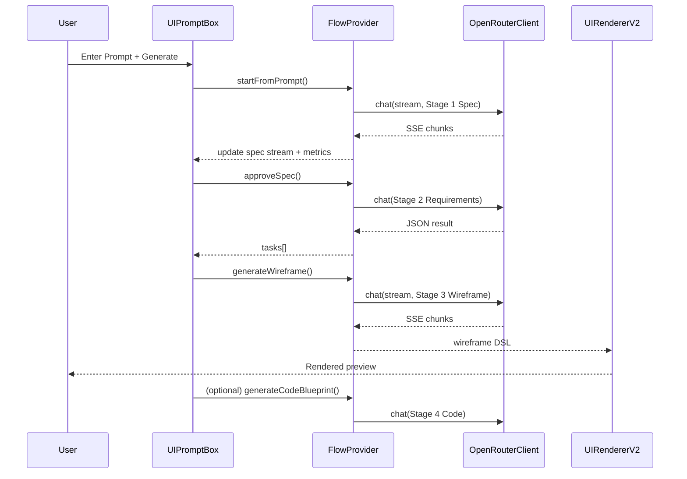
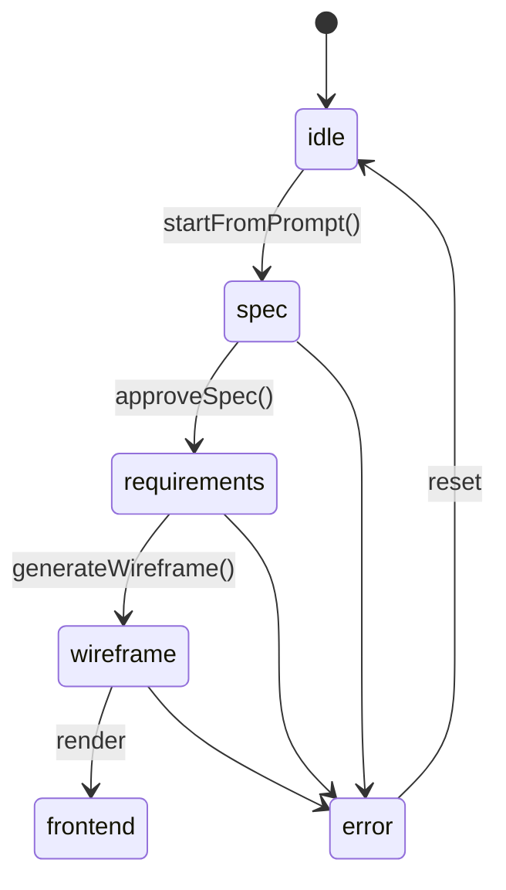

# Prompt → Design Spec → Requirements → Wireframe → Frontend

Date: 2025-08-08 12:25 (+08:00)

This document specifies an optimal, modular, and streaming-first implementation for multi‑stage UI generation that converts a natural language prompt into a production‑ready frontend preview within the MobileTab.

It preserves user preferences:
- API key management centralized in `ChatboxControls` and `useChatboxSettings()`.
- Model selection local to `UIPromptBox.tsx`, persisted in `localStorage`.

---

## 1) Objectives

- Convert user prompt into a structured Design Spec.
- Derive an 8–10 item Frontend Requirements checklist from the spec.
- Generate a Wireframe DSL consistent with the spec and requirements.
- Render a high‑fidelity mobile preview using a safe, declarative renderer.
- Provide streaming feedback, cancelation, metrics, caching, and error recovery.

### Non‑Goals
- Arbitrary runtime execution of generated code (security). Code is for export only.
- Full app navigation. Scope is single screen (with sub‑components/modals) per generation.

---

## 2) User Journey (UX)

```mermaid
flowchart LR
  A[Prompt Panel] --> B[Stage 1: Design Spec (stream)]
  B --> C[Stage 2: Requirements (8–10 tasks)]
  C --> D[Stage 3: Wireframe (stream)]
  D --> E[Stage 4: Frontend Output (render + optional code blueprint)]

  subgraph MobileTab Layout
    A -.compact, sticky.- B
    B -.review/edit.- C
    C -.checklist.- D
    D -.live preview.- E
  end
```

- Users can stop at any stage, edit, and continue.
- Streaming consoles show model output and metrics.
- Left: phone preview. Right: stepper with panels for each stage.

---

## 3) UI Layout & Files

- `src/app/businessidea/tabs/MobileTab.tsx`
  - Refactor into 2‑column responsive grid.
  - Left column: phone preview container.
  - Right column: vertical stepper with 4 panels: Prompt, Design Spec, Requirements, Frontend.

- `src/app/businessidea/tabs/ui-prompt/UIPromptBox.tsx`
  - Move into the right column as a compact prompt panel (top of stepper).
  - Keep local model selection and controls; show Start/Stop; persist model.

- New components:
  - `src/app/businessidea/tabs/ui-prompt/flow/FlowStepper.tsx` – collapsible panels + controls.
  - `src/app/businessidea/tabs/ui-prompt/preview/PhonePreview.tsx` – device frame with live render.
  - `src/app/businessidea/tabs/ui-prompt/renderer/UIRendererV2.tsx` – richer DSL renderer.

```mermaid
flowchart TB
  subgraph RightColumn[Right Column]
    PB[UIPromptBox (compact)]
    SP[Spec Panel]
    RP[Requirements Panel]
    FP[Frontend Panel]
  end
  subgraph LeftColumn[Left Column]
    PV[PhonePreview (UIRendererV2)]
  end

  PB --> SP --> RP --> FP
  FP --> PV
```

---

## 4) Architecture Overview

- Multi‑stage orchestration via a single provider and dedicated hooks per stage.
- Streaming with incremental JSON parsing; cancelation via AbortController.
- Strong validation (Zod) for all stage schemas.



---

## 5) State & Orchestration

### Provider: `UIGenerationFlowProvider`
File: `src/app/businessidea/tabs/ui-prompt/UIGenerationFlowProvider.tsx`

- State
  - `stage`: 'idle' | 'spec' | 'requirements' | 'wireframe' | 'frontend' | 'error'
  - `specDoc?: DesignSpecDoc`
  - `tasks?: RequirementTask[]`
  - `wireframe?: WireframeScreen`
  - `blueprint?: GeneratedCodeBlueprint`
  - `stream: { text: string; startedAt?: number; lastChunkAt?: number; chunks: number; bytes: number }`
  - `error?: string`
  - `controller?: AbortController`

- Actions
  - `startFromPrompt(prompt: string, opts)` → Stage 1
  - `approveSpec()` → Stage 2
  - `generateWireframe()` → Stage 3
  - `generateCode()` → Stage 4 (optional)
  - `cancel()` → abort current stage
  - `reset()`



---

## 6) Hooks (Stage Implementations)

- `useDesignSpec()` – Stage 1
  - Input: `prompt`, `model`, `signal`, `onChunk`.
  - Output: streamed `DesignSpecDoc` JSON (incrementally parsed), metrics, error.

- `useRequirements()` – Stage 2
  - Input: finalized `DesignSpecDoc`.
  - Output: `RequirementTask[]` (8–10 tasks with acceptance criteria).

- `useUIGeneration()` – Stage 3 (Already streaming-enabled; extend to stage‑aware triggers)
  - Input: `DesignSpecDoc` + `RequirementTask[]`.
  - Output: streamed `WireframeScreen` DSL + metrics.

- `useCodeBlueprint()` – Stage 4 (optional)
  - Input: `WireframeScreen`.
  - Output: `GeneratedCodeBlueprint` with TSX string for export.

All hooks rely on `OpenRouterClient.chat()` with `onChunk` streaming and `AbortSignal`.

---

## 7) Data Contracts (TypeScript)

```ts
// src/app/businessidea/tabs/ui-prompt/types.ts
export interface DesignSpecDoc {
  id: string;
  title: string;
  summary: string;
  targetAudience?: string;
  primaryGoals: string[];
  secondaryGoals?: string[];
  navigation?: { type: 'tabs' | 'bottom-bar' | 'none'; items?: string[] };
  layoutGuidelines?: { grid?: number; spacing?: 'sm'|'md'|'lg'; sections?: string[] };
  componentInventory?: Array<{ kind: string; purpose?: string; keyProps?: Record<string, any> }>;
  interactions?: Array<{ event: string; action: string; target?: string }>;
  dataBindings?: Array<{ entity: string; fields: string[] }>;
  styleTokens?: {
    colors?: Record<string,string>;
    typography?: { fontFamily?: string; scale?: 'sm'|'md'|'lg' };
    radii?: 'none'|'sm'|'md'|'lg';
    shadows?: 'none'|'sm'|'md'|'lg';
  };
  accessibility?: string[];
  performance?: string[];
}

export interface RequirementTask {
  id: string;
  title: string;
  description: string;
  acceptanceCriteria: string[];
  priority: 'P0'|'P1'|'P2';
  status: 'todo'|'in-progress'|'done';
  dependsOn?: string[];
  estimate?: number; // story points
}

export interface WireframeScreen {
  name: string;
  viewport?: { width: number; height: number; device: 'phone'|'tablet' };
  tokens?: { theme?: 'light'|'dark'; colors?: Record<string,string>; radii?: string; shadows?: string };
  nodes: WireframeNode[];
  viewStates?: Record<string, WireframeNode[]>;
  actions?: Array<{ id: string; event: string; intent: string; params?: any }>;
  bindings?: Array<{ nodeId: string; entity: string; field: string }>;
}

export interface WireframeNode {
  id: string;
  type: string; // List, Card, Header, Tabs, ChartPlaceholder, Form, TextField, Button, etc.
  props?: Record<string, any>;
  children?: WireframeNode[];
}

export interface GeneratedCodeBlueprint {
  componentName: string;
  tsx: string; // stringified TSX for export only
  assets?: Array<{ name: string; content: string }>;
}
```

> Validation: add Zod schemas mirroring the above for robust parsing at each stage.

---

## 8) Prompting Strategy

- Common system preamble: “Output JSON only. No markdown or code fences.” (sanitization still applied).
- Lower temperature (0.2–0.4) for determinism.

### Stage 1 (Design Spec)
- System: Senior product designer; produce `DesignSpecDoc` JSON.
- User: Original prompt + domain hints + strict schema instructions.

### Stage 2 (Requirements)
- System: Derive 8–10 tasks with acceptance criteria; produce `RequirementTask[]` JSON.
- User: Includes approved Spec JSON.

### Stage 3 (Wireframe)
- System: Produce `WireframeScreen` DSL aligned with Spec + Tasks; use supported component catalog.
- User: Includes Spec + Tasks JSON.

### Stage 4 (Code Blueprint, optional)
- System: Produce compact TSX string under `GeneratedCodeBlueprint.tsx`.
- User: Includes Wireframe JSON.

---

## 9) Rendering (`UIRendererV2`)

- Deterministic mapping from DSL → React components built with Tailwind.
- Supported components: `Screen`, `Navbar`, `Header`, `Card`, `List`, `ListItem`, `Tabs`, `Chip`, `Stat`, `ChartPlaceholder`, `Form`, `TextField`, `Button`, `SegmentedControl`, `Avatar`, `Icon`, `ModalSheet`.
- Token mapping: colors/typography/radii/shadows to utility classes.
- Simple interactivity: tab switching, modal toggle, button press visual feedback.
- Safe: no `eval`. Code blueprint is not executed at runtime.

---

## 10) Performance & Streaming

- Incremental parsing via brace‑balance; strip fences; tolerate partials.
- Throttle setState during streaming; batch UI updates.
- Abort immediately on cancel; close reader and clear controller.
- Cache artifacts by stable hashes of inputs (prompt/spec/tasks) in localStorage.

---

## 11) Error Handling

- For invalid or empty responses: retry once non‑streaming with tighter prompt.
- Schema validation errors: show concise, actionable messages with bad field hints.
- Allow user edits to Spec before regenerating Tasks/Wireframe.

---

## 12) Security

- Never execute generated TSX; only display as text for export.
- Sanitize text displays; no HTML injection.
- Keep API keys in `ChatboxControls`/`useChatboxSettings()`; support legacy key names.

---

## 13) Telemetry & Metrics

- Per stage: start time, end time, chunks, bytes, cancel events, retries.
- UI surface: small status chip + tooltip with details.

---

## 14) Testing Strategy

- Unit: Zod schemas, prompt builders, parsers, token mappers.
- Integration: Hook → Provider → Stepper → Renderer flow; cancel/resume; fallback path.
- Snapshot: Renderer for representative DSLs (cards/lists/forms/charts placeholders).
- UX: Keyboard navigation and screen reader roles for stepper, live regions for streams.

---

## 15) Rollout Plan

1. Scaffold provider + stepper layout; reposition `UIPromptBox`.
2. Implement Stage 1 hook + panel (streamed Spec + validation).
3. Implement Stage 2 hook + panel (Requirements list with checkboxes).
4. Extend `useUIGeneration` + `UIRendererV2` for Stage 3; render preview.
5. Optional Stage 4: code blueprint panel.
6. Persistence, telemetry, and polish.
7. QA with sample prompts; iterate on prompts and schemas.

---

## 16) Milestones & Estimates

- M1: Provider + Layout + Stepper (0.5–1 day)
- M2: Stage 1 Spec (stream + validation) (0.5–1 day)
- M3: Stage 2 Requirements (0.5 day)
- M4: Stage 3 Wireframe + Renderer V2 (1–2 days)
- M5: Optional Code Blueprint + Export (0.5 day)
- M6: Caching, Telemetry, QA Polish (0.5–1 day)

---

## 17) Acceptance Criteria

- Prompt produces a valid `DesignSpecDoc` with clear goals, components, tokens.
- Requirements list always has 8–10 tasks with acceptance criteria.
- Wireframe renders in preview and reflects Spec + Tasks.
- Streaming visible with metrics; cancel works instantly.
- No unsafe code execution; code blueprint is export‑only.
- API key remains managed by `ChatboxControls`; model selection remains local to `UIPromptBox`.
