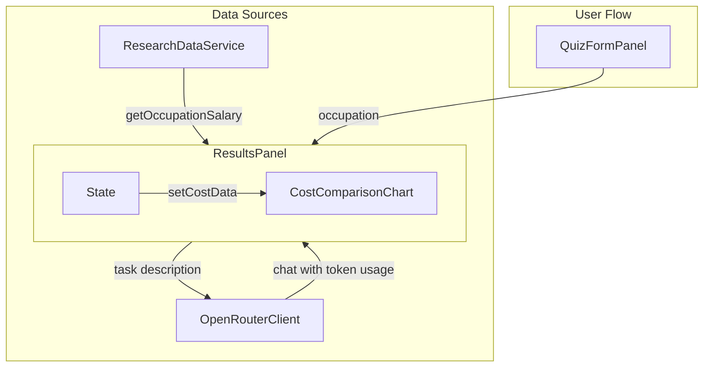

# Human vs AI Cost Analysis Implementation Plan

## Objective
Add a "Human vs AI Cost Comparison" section to the ResultsPanel component that compares the annual cost of a human worker versus an AI performing the same tasks. The implementation must use real data from the research service and OpenRouter API.

## Files to Create or Modify

### Modified Files
1. `src/lib/research/service/research-data-service.ts`
2. `src/lib/openrouter/client.ts`
3. `src/components/unified/ResultsPanel.tsx`
4. `src/types/index.ts`

### New Files
1. `src/components/unified/CostComparisonChart.tsx`
2. `src/lib/cost-analysis/utils.ts`
3. `src/__tests__/cost-analysis.test.ts`
4. `src/__tests__/ResultsPanel.test.tsx` (modify existing tests)

## Implementation Steps

### Step 1: Extend ResearchDataService
- Add method `getOccupationSalary(occupationIdentifier: string): Promise<number>` to fetch median salary for an occupation.
- Implement caching and error handling in the method.

### Step 2: Enhance OpenRouterClient
- Modify the `chat` method to return token counts and calculated cost.
- Add helper method `calculateCost(promptTokens: number, completionTokens: number, model: string): number` that uses model pricing data.

### Step 3: Create CostComparisonChart Component
- Implement a D3 bar chart component that takes `humanCost` and `aiCost` as props.
- The chart should show annual costs and include tooltips with breakdowns.

### Step 4: Integrate with ResultsPanel
- Add new state variables in ResultsPanel for cost data and loading state.
- Use `useEffect` to fetch human cost (salary) and calculate AI cost when occupation data is available.
- Render the CostComparisonChart in a new section at the bottom.

### Step 5: Data Processing Utilities
- Create utility functions in `src/lib/cost-analysis/utils.ts` for:
  - `calculateAnnualAICost(taskCost: number, frequency: number): number`
  - `formatCurrency(value: number): string`
  - `getModelPricing(model: string): { prompt: number, completion: number }`

### Step 6: Type Definitions
- Add new types in `src/types/index.ts`:
  - `CostData`: `{ humanCost: number; aiCost: number; breakdown: CostBreakdown }`
  - `CostBreakdown`: `{ promptTokens: number; completionTokens: number; cost: number; annualCost: number }`

### Step 7: Error Handling
- Display error messages if cost data cannot be loaded.
- Implement fallback to estimated data when API calls fail.

### Step 8: Testing
- Write unit tests for utility functions in `cost-analysis.test.ts`.
- Update ResultsPanel tests to include the new section.
- Test with various occupations and models.

## Mermaid Diagram: Data Flow

## Dependencies
- This feature depends on the ResearchDataService being initialized and having salary data.
- OpenRouterClient must be configured with a valid API key.

## Risk Mitigation
- Use cached data when live data is unavailable.
- Provide clear error messages.
- Use default values for missing data points.

## Estimated Timeline
1. ResearchDataService extension: 1 hour
2. OpenRouterClient enhancement: 2 hours
3. CostComparisonChart component: 4 hours
4. ResultsPanel integration: 2 hours
5. Utility functions and types: 1 hour
6. Testing: 2 hours

Total: 12 hours
