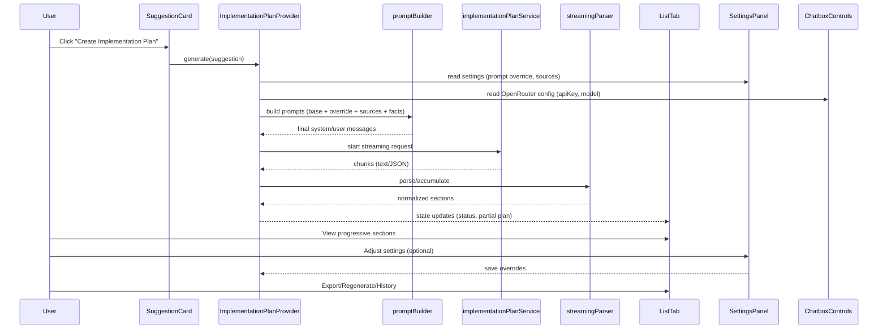

# Implementation Plan: Business Implementation Plan Generation & List View Integration

## Overview
A modular feature to generate a streamlined but complete Implementation Plan from an AI-generated Business Suggestion and render it in the `List` tab. It reuses the existing OpenRouter configuration from `ChatboxControls` and introduces a feature slice with clear boundaries for service, state, settings, UI, and persistence.

- Primary entry: user clicks "Create Implementation Plan" in `src/components/business/SuggestionCard.tsx`.
- Generation uses OpenRouter via Chatbox’s config, builds a structured prompt, streams results, and normalizes into a typed plan model.
- Output renders in `src/app/businessidea/tabs/ListTab.tsx` with sectioned components, progress, error states, history, and export.
- Settings live in `src/app/businessidea/tabs/settings-panel/SettingsPanel.tsx` and are future-expandable (system prompt override, sources list, advanced toggles scaffold).

## Goals
- Streamlined yet complete Implementation Plan with modular sections.
- Zero duplication of OpenRouter key/model UI; continue using `ChatboxControls`.
- Streaming-first UX, caching, and resumability.
- Clean separation of concerns with testable units.

## Non-Goals
- Changing `ChatboxControls` API key/model management.
- Altering business suggestion generation logic.

---

## High-Level Architecture
```mermaid
flowchart LR
  A[SuggestionCard "Create Implementation Plan"] -->|select suggestion| B[ImplementationPlanProvider]
  B -->|build prompts with overrides + sources| C[promptBuilder]
  C --> D[implementationPlanService]
  D -->|streamed chunks| E[streamingParser]
  E -->|normalized plan sections| B
  B -->|state updates| F[ListTab Plan Viewer]
  F -->|open settings| G[SettingsPanel]
  G -->|save overrides/sources| B

  subgraph Chatbox
    H[ChatboxControls]
  end

  H -->|config: apiKey, model, base prompt| D
```

## Event Sequence


---

## Files to Create

- `src/features/implementation-plan/`
  - `ImplementationPlanProvider.tsx`
    - React context + reducer store for selected suggestion, plan, status, errors, settings, and history.
    - Exposes actions: `selectSuggestion`, `generate`, `regenerate`, `cancel`, `setSettings`, `loadCached`, `clear`.
  - `useImplementationPlan.ts`
    - Hook that wraps provider context with ergonomic API.
    - Handles generation lifecycle, cancellation, and navigation cues.
  - `implementationPlanService.ts`
    - Consumes OpenRouter via Chatbox config (apiKey, model).
    - Streaming requests, retries (reuses existing hardened logic pattern), cancellation.
  - `promptBuilder.ts`
    - Merges base system prompt (from Chatbox) with Implementation Plan overrides and sources.
    - Injects business suggestion facts and constraints for structured output.
  - `types.ts`
    - Types for `ImplementationPlan`, `PlanSection`, `Task`, `Phase`, `Milestone`, `Resource`, `Risk`, `KPI`, `Status`.
  - `streamingParser.ts`
    - Robustly parses streamed JSON/Markdown to typed sections.
    - Tolerant to partial chunks; yields progressive updates.
  - `storage.ts`
    - LocalStorage keys for settings, cache, and history (versioned + hashed by ideaId + settings).
  - `components/`
    - `PlanHeader.tsx` (title, viability badge, actions: regenerate/export)
    - `PlanOverview.tsx` (goals, success criteria)
    - `PlanPhases.tsx`
    - `PlanTasks.tsx`
    - `PlanTimeline.tsx`
    - `PlanResources.tsx`
    - `PlanBudget.tsx`
    - `PlanRisks.tsx`
    - `PlanKPIs.tsx`
    - `PlanNext90Days.tsx`
    - `PlanProgress.tsx` (loading/streaming)
    - `PlanError.tsx`
    - `PlanEmpty.tsx`
    - `ExportMenu.tsx` (JSON/Markdown; CSV for tasks in future)

- Documentation (this file): `implemention-list.md`

## Files to Modify

- `src/components/business/SuggestionCard.tsx`
  - Add optional `onCreatePlan?: (suggestion: BusinessSuggestion) => void`.
  - On click: call `onCreatePlan?.(suggestion)` then `setActiveTab('list')`.

- `src/app/businessidea/tabs/BusinessPlanContent.tsx`
  - When rendering `SuggestionCard`, pass `onCreatePlan={(s) => implPlan.generate(s)}` using `useImplementationPlan()`.
  - No business logic in this file—just wiring.

- `src/app/businessidea/tabs/ListTab.tsx`
  - Replace placeholder with a plan viewer bound to `ImplementationPlanProvider` state.
  - Show `PlanEmpty`, `PlanProgress`, `PlanError`, and the modular sections when available.
  - Provide export/regenerate/history actions.

- `src/app/businessidea/tabs/settings-panel/SettingsPanel.tsx`
  - Add Implementation-Plan section with:
    - **System Prompt (override)** textarea.
    - **Sources** list/tags input (URL validation).
    - Expandable/accordion scaffold for future options (tone, depth, budget cap).
  - Wire to provider’s settings and persist via `storage.ts`.
  - Do not handle API key/model here.

- Tabs/Root provider wiring (as needed):
  - Ensure `ImplementationPlanProvider` wraps tabs containing `BusinessPlanContent` and `ListTab` so state survives navigation between tabs.

---

## Data Model (Streamlined but Complete)
```ts
interface ImplementationPlanMeta {
  ideaId: string;
  title: string;
  category?: string;
  version: string; // e.g. v1
  createdAt: string; // ISO
}

interface Phase { id: string; name: string; objectives: string[]; duration?: string; milestones: Milestone[]; }
interface Milestone { id: string; title: string; due?: string; successCriteria?: string[]; }
interface Task { id: string; phaseId?: string; title: string; description?: string; owner?: string; effort?: string; dependencies?: string[]; }
interface Resource { role: string; count?: number; skills?: string[]; tools?: string[]; }
interface Risk { item: string; likelihood: 'Low'|'Med'|'High'; impact: 'Low'|'Med'|'High'; mitigation?: string; }
interface KPI { metric: string; target: string; cadence?: string; }

interface ImplementationPlan {
  meta: ImplementationPlanMeta;
  overview: { goals: string[]; successCriteria?: string[]; assumptions?: string[] };
  phases: Phase[];
  tasks: Task[];
  timeline?: { start?: string; end?: string; milestones?: Milestone[] };
  resources?: { team?: Resource[]; vendors?: string[] };
  budget?: { items: { label: string; cost: string; notes?: string }[]; total?: string; assumptions?: string[] };
  risks?: Risk[];
  kpis?: KPI[];
  next90Days?: { days30: string[]; days60: string[]; days90: string[] };
}
```

---

## Prompt Strategy
- Base: `ChatboxControls`’ system prompt (already curated for your app).
- Overrides: `SettingsPanel` system prompt to emphasize what to include in the plan.
- Sources: URLs/refs included as constraints and citation guidance.
- Output contract: ask for strongly-typed JSON matching the model above; allow graceful fallbacks to Markdown with identifiable section headers.

---

## Generation Service
- Reads OpenRouter `apiKey`, `model`, and optional parameters from `useChatbox().config`.
- Streaming-first; yields chunks to the provider.
- Retries with exponential backoff (reuse the strategy established in OpenRouter client per your codebase fixes).
- Cancellation support.

---

## State Management
- Context holds: `selectedSuggestion`, `plan`, `status` (idle/generating/streaming/success/error), `error`, `settings` (prompt override, sources), `history`.
- Actions: `generate`, `regenerate`, `cancel`, `setSettings`, `loadCached`, `clear`.
- Derived selectors: `hasPlan`, `isLoading`, `canExport`, `getPlanByIdeaId`.

---

## Persistence & History
- `localStorage` with namespaced keys, e.g. `implPlan:settings:v1`, `implPlan:cache:v1:{ideaId}:{settingsHash}`.
- Cache last plan per idea + settings hash for instant load.
- History list with timestamps and quick-restore.

---

## ListTab UI Outline
- **PlanHeader**: title, viability badge (from suggestion if available), actions: Regenerate, Export (JSON/Markdown), History.
- **PlanOverview**: goals, assumptions, success criteria.
- **PlanPhases**: phases with objectives and milestones.
- **PlanTasks**: table or checklist; later CSV export.
- **PlanTimeline**: key milestones; optional Gantt-lite.
- **PlanResources**: team roles, tools, vendors.
- **PlanBudget**: line items, totals, assumptions.
- **PlanRisks**: risk matrix (likelihood/impact) with mitigations.
- **PlanKPIs**: metrics and targets.
- **PlanNext90Days**: 30/60/90 breakdown.
- **PlanProgress**: skeletons and determinate/indeterminate states during streaming.
- **PlanError**: friendly error with retry and diagnostics.
- **PlanEmpty**: guidance to pick a suggestion.

Design: compact spacing, neutral slate palette, subtle shadows, clean typography, responsive, expandable sections.

---

## Settings Panel (Expandable)
- Section: Implementation Plan
  - **System Prompt Override** (textarea)
  - **Sources** (tags/list with URL validation)
  - Advanced (collapsed): tone, depth, budget sensitivity, timeline strictness (placeholders)
- Persist on change. Provider consumes settings for generation.

---

## Error Handling & Observability
- Network/server/429 errors surfaced with retries and clear messaging.
- Partial output tolerated; parser yields best-effort.
- Logging via existing debug utilities (e.g., `chatboxDebug`).

---

## Exports
- JSON: full `ImplementationPlan` object.
- Markdown: sectioned narrative for sharing.
- Future: CSV for tasks/timeline.

---

## Security & Privacy
- Never store API keys here; reuse Chatbox config only.
- Validate source URLs; sanitize rendered Markdown.

---

## Rollout Plan
1) Add feature slice and provider. 2) Wire `SuggestionCard` and `BusinessPlanContent` callback. 3) Replace `ListTab` body with plan viewer. 4) Expand `SettingsPanel`. 5) Add basic tests. 6) Stabilize with logs.

## Testing Strategy
- Unit: promptBuilder, streamingParser, storage keys.
- Integration: `useImplementationPlan` state transitions.
- UI: ListTab render states (empty/loading/partial/complete/error), export triggers.

## Acceptance Criteria
- Clicking Create Implementation Plan navigates to List and starts generation.
- Plan streams progressively into ListTab, sections render without blocking.
- Settings override and sources affect generation and persist across reloads.
- Export JSON/Markdown works; cache auto-loads last plan for matching settings.
- No duplication of API key/model UI; ChatboxControls drives OpenRouter config.
