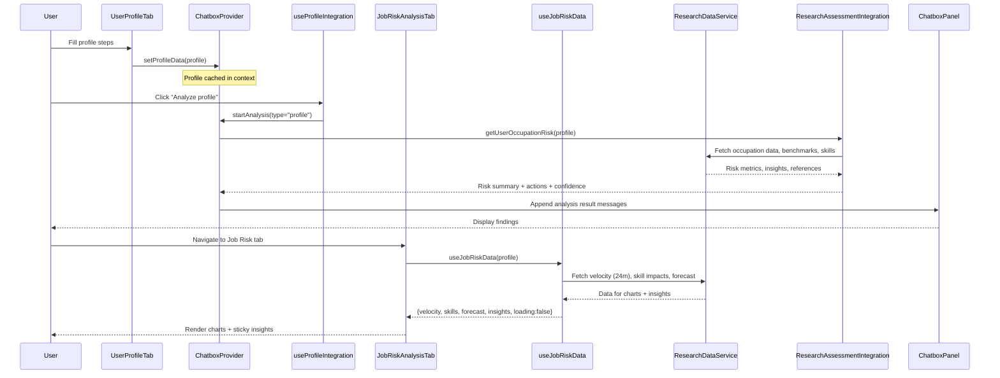

# Job Risk + Profile Analysis Integration — Minimal Implementation Task

## Objective
- Provide a minimal, robust integration between user profile, job-risk visualizations, and research-backed analysis via chatbox.
- Enforce defaults for the Job Risk tab per visualization spec and memory.
- Keep architecture open for future enhancements; avoid intrusive changes.

## Scope
- Wire profile context into job-risk data fetching.
- Enforce defaults in job-risk visualizations.
- Implement a thin chatbox executor for “profile” analysis using ResearchAssessmentIntegration.
- Improve readiness gating and statuses for ProfileAnalysisTrigger.
- Add minimal tests and structured logging for reliability.

## Non-goals
- Refactors of ChatboxControls API key/model selection (respect existing UX).
- Major redesign of visualizations or research services.
- Introducing new state management libraries.

---

## Files to Modify
- `src/app/businessidea/tabs/job-risk/JobRiskAnalysisTab.tsx`
  - Ensure layout supports sticky insights on desktop; pass through hook outputs cleanly.
- `src/app/businessidea/tabs/job-risk/hooks/useJobRiskData.ts`
  - Read profile context; call `ResearchDataService` with role/industry/location.
  - Enforce defaults: 24-month velocity history; initial skill clusters set to [Cognitive Routine, Analytical, Creative, Social, Manual Routine].
  - Return full typed shape and robust loading/error states.
- `src/app/businessidea/tabs/job-risk/components/InsightsPanel.tsx`
  - Make insights panel sticky on desktop (non-sticky on mobile).
- `src/components/chatbox/ChatboxProvider.tsx`
  - Add executor for `startAnalysis(type="profile")` that calls `ResearchAssessmentIntegration`.
  - Post structured messages (summary, risks, actions, confidence) and cache by profile signature.
- `src/components/chatbox/hooks/useProfileIntegration.ts`
  - Ensure `isReadyForAnalysis` reflects profile completeness; expose consistent statuses.
- `src/components/chatbox/ProfileAnalysisTrigger.tsx`
  - Align disabled/loading/success states across variants (button/card/inline) using readiness and chatbox status.

## Files to Create
- `src/app/businessidea/tabs/job-risk/__tests__/useJobRiskData.test.ts`
  - Tests: default windowing; mapping fallbacks; profile-gated calls; error resilience.
- `src/components/chatbox/__tests__/profileAnalysisExecutor.test.ts`
  - Tests: happy path + failure path for “profile” executor; caching by signature.
- `src/lib/research/service/__tests__/assessment-mapping.test.ts`
  - Tests: stable mapping from `ResearchAssessmentIntegration` outputs to chat messages.
- `job-risk-profile-integration-task.md`
  - This document.

---

## Implementation Units (Minimal, granular)

1) Enforce job-risk defaults
- Apply 24-month velocity window in `useJobRiskData`.
- Initialize skill clusters to the specified five categories.
- Make `InsightsPanel` sticky on desktop only.
- Acceptance:
  - Charts render with proper ranges/clusters.
  - Insights stick on desktop; behave normally on mobile.
  - No runtime errors with empty profile.

2) Wire profile → job-risk data
- Ensure profile is read from chatbox context/state.
- Parameterize `ResearchDataService` calls by role/industry/location.
- Guard against incomplete profile; return loading/safe defaults.
- Acceptance:
  - Changing role/industry/location updates charts after load.
  - No network calls when profile is incomplete.
  - Hook always returns typed shape with sensible defaults.

3) Chatbox profile analysis executor
- In `ChatboxProvider`, implement handler for `startAnalysis("profile")`.
- Use `ResearchAssessmentIntegration` to generate risk summary + actions.
- Cache results by profile signature; append structured messages to chat.
- Acceptance:
  - Trigger produces analysis reliably; cached on repeat.
  - Failures yield friendly message; session remains stable.
  - No changes to API key/model selection UX.

4) UX gating and statuses
- `ProfileAnalysisTrigger` variants reflect readiness/loading/success consistently.
- `useProfileIntegration` centralizes readiness logic and exposes status.
- Acceptance:
  - All variants correctly disable, show progress, and success.
  - No duplicate triggers; no ambiguous states.

5) Tests and logging
- Add minimal unit tests for transforms and executor paths.
- Add structured logs around analysis start/failure; keep noise low.
- Acceptance:
  - Tests pass reliably.
  - Logs aid debugging without clutter.

---

## Data Flow (Mermaid)

---

## Data Contracts and Mapping
- Input profile: `ProfileFormData` (role, roleDetails, industry, location, skills).
- Job-risk outputs (from `ResearchDataService` → `useJobRiskData` → charts):
  - `CutSeriesPoint[]` (velocity, 24 months default)
  - `SkillImpact[]` (initial clusters as specified)
  - `ForecastPoint[]`
  - `GlobalKPI`
  - `VizInsight[]`, `InsightsBundle`
- Chatbox analysis outputs (from `ResearchAssessmentIntegration` → messages):
  - Summary, benchmark deltas, top risks, recommended actions, confidence.

---

## Error Handling, Validation, Caching
- Readiness gating via `useProfileIntegration.isReadyForAnalysis`.
- Always return full typed shapes with safe defaults when data is partial.
- Friendly user messages on failure; no hard crashes.
- Cache by profile signature (role + industry + location [+ skills hash if used]).

---

## Acceptance Criteria (Overall)
- Job-risk tab respects defaults and loads contextual data from the profile.
- Chatbox “profile” analysis executes, posts structured results, and caches.
- UI triggers are deterministic across variants.
- Tests cover core mapping and executor paths.
- No regressions to API key/model selection UX.

---

## Future Enhancements (non-blocking)
- Expand forecast modeling and alternative baselines.
- Personalized skill-gap recommendations using profile skill levels.
- Persist visualization preferences per user.
- Add telemetry dashboards for analysis outcomes.
- Optional: background prefetch on profile change.
