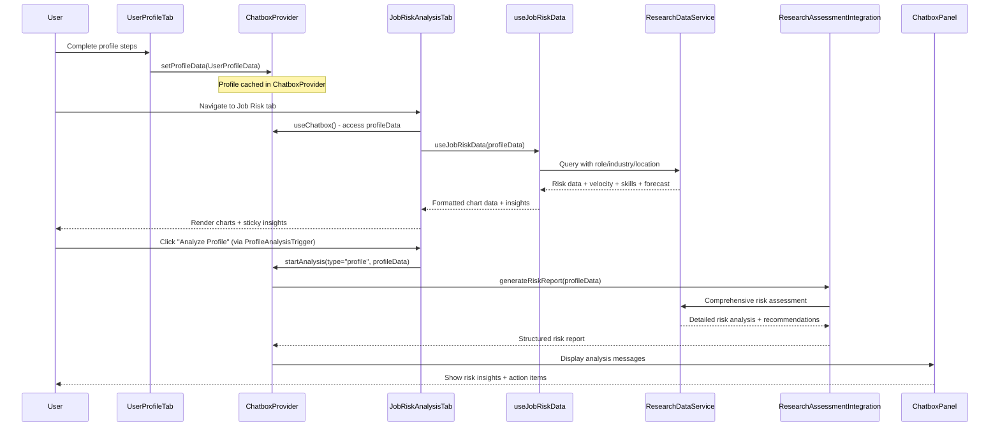

# Job Risk + Profile Analysis Integration — Updated Implementation Task

## Objective
- Integrate the existing profile analysis system with job-risk visualizations and research-backed analysis.
- Wire profile context into job-risk data fetching using the current `UserProfileData` structure.
- Implement profile-driven analysis executor in ChatboxProvider using existing `ResearchAssessmentIntegration`.
- Enforce visualization defaults and improve UX consistency.

## Scope
- Connect profile context to job-risk data fetching via `ResearchDataService`.
- Add profile analysis executor to ChatboxProvider using existing research integration.
- Make InsightsPanel sticky on desktop for better UX.
- Ensure consistent readiness states across profile analysis components.
- Add comprehensive tests for the integration points.

## Non-goals
- Refactors of existing profile analysis adapter facade (already implemented).
- Changes to ChatboxControls API key/model selection UX.
- Major redesign of visualization components or research services.
- Breaking changes to existing ProfileAnalysisTrigger functionality.

---

## Current Architecture Status
- ✅ Profile analysis adapter facade implemented (`src/lib/profile-analysis/index.ts`)
- ✅ ProfileAnalysisTrigger with readiness gating implemented
- ✅ useProfileIntegration hook with adapter integration
- ✅ ResearchAssessmentIntegration service available
- ✅ ChatboxProvider with sophisticated analysis capabilities
- ✅ UserProfileTab syncs data to ChatboxProvider via `setProfileData()`
- ❌ Job risk data not connected to profile context
- ❌ Profile analysis executor missing from ChatboxProvider
- ❌ InsightsPanel not sticky on desktop

## Profile Context Architecture
The current system has two profile contexts:
1. **Legacy ProfileContext** (`src/app/businessidea/context/ProfileContext.tsx`) - Uses `ProfileFormData` structure
2. **UserProfile System** (`src/app/businessidea/tabs/user-profile/`) - Uses `UserProfileData` structure and syncs to ChatboxProvider

The job risk integration should use the **UserProfileData** from ChatboxProvider since:
- UserProfileTab already syncs profile data to ChatboxProvider
- ProfileAnalysisTrigger already works with UserProfileData
- The adapter facade handles UserProfileData → analysis data transformation

## Files to Modify
- `src/app/businessidea/tabs/job-risk/JobRiskAnalysisTab.tsx`
  - Access profile data from ChatboxProvider (via useChatbox hook).
  - Pass profile data to useJobRiskData hook.
  - Ensure layout supports sticky insights on desktop.
- `src/app/businessidea/tabs/job-risk/hooks/useJobRiskData.ts`
  - Accept UserProfileData parameter and integrate with ResearchDataService.
  - Map UserProfileData (role, industry, location, skills) to research service parameters.
  - Enforce defaults: 24-month velocity history; skill clusters [Cognitive Routine, Analytical, Creative, Social, Manual Routine].
  - Return profile-driven data with robust loading/error states.
- `src/app/businessidea/tabs/job-risk/components/InsightsPanel.tsx`
  - Add sticky positioning for desktop (responsive behavior).
- `src/components/chatbox/ChatboxProvider.tsx`
  - Add profile analysis executor using ResearchAssessmentIntegration.
  - Handle `startAnalysis(type="profile")` with structured message output.
  - Cache results by profile signature using existing cache manager.

## Files to Create
- `src/app/businessidea/tabs/job-risk/__tests__/useJobRiskData.test.ts`
  - Tests: profile-driven data fetching; default enforcement; error handling.
- `src/components/chatbox/__tests__/profileAnalysisExecutor.test.ts`
  - Tests: profile analysis execution; ResearchAssessmentIntegration integration; caching.
- `src/lib/research/service/__tests__/profile-integration.test.ts`
  - Tests: UserProfileData to research service parameter mapping.

---

## Updated Data Contracts

### Current Profile Data Structure (UserProfileData)
```typescript
type UserProfileData = {
  role?: Role; // Student | Professional | BusinessOwner | CareerShifter
  roleDetails?: RoleDetails; // Role-specific details
  industry?: string;
  location?: string;
  workPreference?: WorkPreference;
  skills: string[];
  hobbies?: string[];
  interests?: string[];
  values?: string[];
  goals?: string[];
};
```

### Profile Context Access Pattern
```typescript
// In JobRiskAnalysisTab.tsx
import { useChatbox } from '@/components/chatbox/ChatboxProvider';

const { profileData } = useChatbox(); // Gets UserProfileData synced from UserProfileTab
const { velocity, skills, forecast, insights, loading } = useJobRiskData(profileData);
```

### Profile to Research Service Mapping
- **Input**: `UserProfileData` from ChatboxProvider
- **Mapping**: 
  - `role` + `roleDetails` → occupation identifier for ResearchDataService
  - `industry` → industry filter for risk analysis
  - `location` → geographic context for employment data
  - `skills` → skill-based risk assessment parameters
- **Output**: Risk metrics, velocity data, skill impacts, forecasts

### Job Risk Data Flow (Updated)


## Implementation Units (Updated)

### 1) Profile Context Integration in Job Risk
- **Files**: `JobRiskAnalysisTab.tsx`, `useJobRiskData.ts`
- **Changes**:
  - Access profile data from ChatboxProvider via `useChatbox()` hook
  - Pass UserProfileData to useJobRiskData hook
  - Map UserProfileData fields to ResearchDataService parameters
  - Maintain 24-month velocity window and default skill clusters
- **Acceptance**:
  - Job risk charts update when profile changes
  - No network calls when profile incomplete
  - Graceful fallback to placeholder data when needed

### 2) Profile Analysis Executor in ChatboxProvider
- **Files**: `ChatboxProvider.tsx`
- **Changes**:
  - Add handler for `startAnalysis(type="profile")` 
  - Integrate with existing ResearchAssessmentIntegration
  - Format analysis results as structured chat messages
  - Use existing cache manager with profile signature
- **Acceptance**:
  - Profile analysis produces comprehensive risk report
  - Results cached and reused for identical profiles
  - Structured output includes summary, risks, actions, confidence

### 3) Desktop Sticky Insights Panel
- **Files**: `InsightsPanel.tsx`, `JobRiskAnalysisTab.tsx`
- **Changes**:
  - Add responsive sticky positioning (desktop only)
  - Ensure mobile behavior remains unchanged
  - Maintain current styling and content structure
- **Acceptance**:
  - Insights panel sticks on desktop screens (>768px)
  - Normal scroll behavior on mobile
  - No layout shifts or visual regressions

### 4) Enhanced Testing Coverage
- **Files**: New test files as listed above
- **Changes**:
  - Unit tests for profile data mapping
  - Integration tests for analysis executor
  - Error handling and fallback scenarios
- **Acceptance**:
  - All tests pass reliably
  - Coverage includes happy path and error cases
  - Mock data used appropriately for testing

## Updated Error Handling & Validation

### Profile Data Validation
- Use existing `getReadiness()` from profile analysis adapter
- Graceful degradation when profile incomplete
- Clear user feedback via existing ProfileAnalysisTrigger states

### Research Service Integration
- Leverage existing ResearchDataService error handling
- Fallback to placeholder data when research service unavailable
- Structured logging for debugging integration issues

### Caching Strategy
- Use existing ChatboxProvider cache manager
- Cache key based on profile signature (role + industry + location + skills hash)
- Respect existing cache TTL and invalidation logic

## Acceptance Criteria (Updated)

### Core Integration
- ✅ Job risk tab displays profile-driven data when profile complete
- ✅ Profile analysis via ChatboxProvider produces structured risk assessment
- ✅ InsightsPanel sticky behavior works on desktop, normal on mobile
- ✅ Existing ProfileAnalysisTrigger functionality preserved

### Data Flow
- ✅ UserProfileData correctly mapped to ResearchDataService parameters
- ✅ Analysis results cached by profile signature
- ✅ Profile changes trigger job risk data refresh
- ✅ Graceful handling of incomplete or invalid profile data

### User Experience
- ✅ No breaking changes to existing profile analysis workflow
- ✅ Consistent loading/error states across components
- ✅ Clear feedback when profile insufficient for analysis
- ✅ Responsive behavior maintained across device sizes

### Testing & Reliability
- ✅ Comprehensive test coverage for new integration points
- ✅ Error scenarios handled gracefully with user feedback
- ✅ Performance impact minimal (leverage existing caching)
- ✅ No regressions in existing functionality

## Future Enhancements (Non-blocking)

### Advanced Profile-Risk Correlation
- Personalized risk scoring based on specific role details
- Skill gap analysis using profile skills vs. occupation requirements
- Career transition risk assessment for CareerShifter role

### Enhanced Visualization Integration
- Profile-specific chart customization
- Dynamic skill cluster selection based on user skills
- Comparative analysis against similar profiles

### Intelligent Caching & Prefetching
- Background data refresh on profile changes
- Predictive caching for likely analysis requests
- Smart cache invalidation based on profile change significance

---

## Technical Notes

### Profile Context Access
The job risk components will access profile data via:
1. **ChatboxProvider** (recommended) - `const { profileData } = useChatbox()`
   - UserProfileTab already syncs data here via `setProfileData()`
   - Consistent with existing ProfileAnalysisTrigger usage
   - No additional context providers needed
2. Alternative: useProfileIntegration hook (wraps ChatboxProvider access)

### ResearchAssessmentIntegration Usage
The existing service provides:
- `generateRiskReport(userResponses)` - comprehensive analysis
- `getUserOccupationRisk(userResponses)` - basic risk assessment
- `getRecommendations(occupationRisk)` - actionable advice

### Backward Compatibility
All changes must maintain compatibility with:
- Existing ProfileAnalysisTrigger component
- Current ChatboxProvider API
- Existing profile analysis adapter facade
- Current job risk visualization components