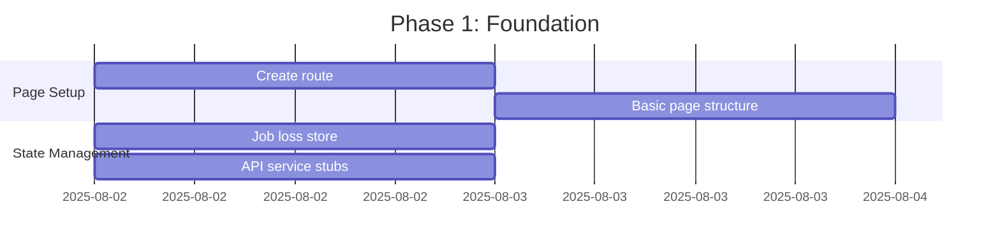
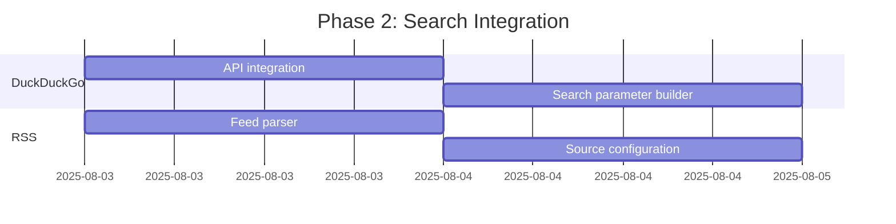
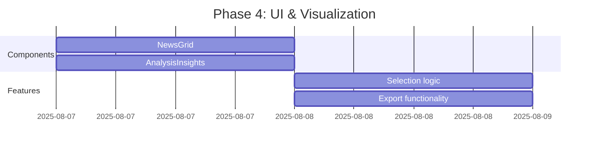

# Job Loss Impact Tracker Implementation Plan

## Overview
Implement a new `/joblosstracker` page that:
1. Fetches news about AI-related job losses and business closures
2. Allows users to analyze selected articles via OpenRouter
3. Visualizes insights and trends

## Files to Create
1. **Page Components**
   - `src/pages/joblosstracker.tsx` - Main page container
   - `src/components/jobloss/SearchControls.tsx` - Search input and filters
   - `src/components/jobloss/NewsGrid.tsx` - News results display
   - `src/components/jobloss/AnalysisInsights.tsx` - Visualization of OpenRouter analysis

2. **Services**
   - `src/lib/websearch/websearch.service.ts` - Core search service
   - `src/lib/websearch/duckduckgo.ts` - DuckDuckGo API integration
   - `src/lib/websearch/rss-parser.ts` - RSS feed processor
   - `src/lib/openrouter/analysis/news-analyzer.ts` - News analysis service

3. **Supporting Files**
   - `src/lib/websearch/types.ts` - Type definitions
   - `src/lib/openrouter/analysis/prompts/jobloss.md` - Analysis prompt templates
   - `public/news-sources.json` - Predefined news sources (RSS feeds)

## Files to Modify
1. **Routing**
   - `src/pages/_app.tsx` - Add new route
   - `src/components/Navbar.tsx` - Add navigation link

2. **OpenRouter Extension**
   - `src/lib/openrouter/index.ts` - Export new analysis module
   - `src/lib/openrouter/client.ts` - Add batch processing support

3. **State Management**
   - `src/store/jobloss-store.ts` - New Zustand store for job loss data
   - `src/store/index.ts` - Export new store

## Implementation Phases

### Phase 1: Foundation (1 day)

### Phase 2: Search Integration (2 days)

### Phase 3: Analysis Engine (2 days)

### Phase 4: UI & Visualization (2 days)

## Optimization Strategies
1. **Caching**: Implement Redis caching for search results
2. **Batch Processing**: Analyze multiple articles in single OpenRouter request
3. **Lazy Loading**: Paginate search results
4. **Debounced Search**: 300ms delay on search input
5. **SSR for News**: Pre-render top stories at build time

## Dependencies
1. **New Packages**:
   - `rss-parser` - For RSS feed processing
   - `redis` - For caching
   - `recharts` - For data visualization

2. **Environment Variables**:
   - `DUCKDUCKGO_API_KEY`
   - `REDIS_URL`
   - `OPENROUTER_API_KEY` (existing)

## Risk Mitigation
1. **API Failure**: Fallback to multiple RSS sources
2. **Analysis Errors**: Implement retry logic with exponential backoff
3. **Content Parsing**: Use Readability.js for article extraction
4. **Rate Limiting**: Queue system for OpenRouter requests

## Test Plan
1. Unit tests for search service
2. Integration tests for analysis pipeline
3. E2E tests for user workflows
4. Performance testing with 100+ articles

This plan provides a clear roadmap for implementation with optimal file structure and efficient workflow. Let me know if you'd like me to proceed with creating any of these files.
