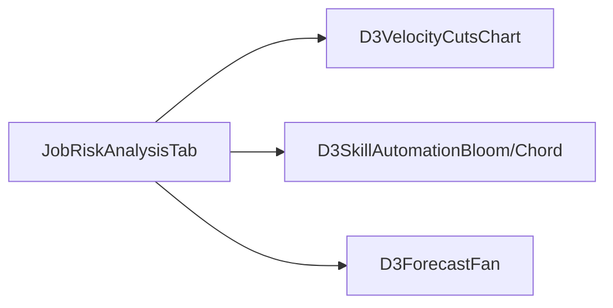
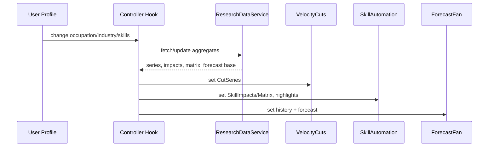

# Job Risk Analysis — D3 Visualization Spec

This document specifies three minimal, modern, data‑driven D3 visualizations for `JobRiskAnalysisTab.tsx`. Visuals include concise, contextual text and insights while remaining clean and professional. Everything must be ready for future data integration from:

- `src/app/businessidea/tabs/user-profile/`
- `src/components/research/`
- `src/lib/research/service/`

---

## 0) Global Rules

- Minimalist UI with premium tech vibe: compact spacing (8px grid), neutral slate backgrounds, subtle shadows/rings, clean typography.
- D3 only: `d3-selection`, `d3-scale`, `d3-shape`, `d3-transition`, `d3-chord/ribbon` (no Chart.js or other libs).
- Text policy: allow minimal, contextual text to improve comprehension (short title, tiny axis labels, micro annotations, caption with a key insight). No verbose paragraphs within charts.
- Accessibility: add offscreen descriptions, keyboard focus rings on SVG wrappers, `prefers-reduced-motion` support (disable non-essential animation).
- Integration-ready: components accept data via props and can be wired to:
  - `ResearchDataService` (e.g., `getIndustryData()`, `getTaskAutomationData()`, `getRiskMatrixData()`, `getSkillGapData()`)
  - User profile selections (occupation, industry, skills) for highlights and filtering
  - Existing research UI components without coupling to their internal rendering
- Performance: SVG first, efficient updates, debounce on resize, consider Canvas fallback for very dense datasets later.
- Palette (urgent tone): slate-900/950 bg; oranges/ambers for risk: `#f59e0b`, `#fb923c`, `#ef4444`; slate-300 for hairlines; white alpha glows.

Design tokens (CSS vars):

```css
:root {
  --viz-bg: #0b1220;        /* slate-950 */
  --viz-surface: #0f172a;   /* slate-900 */
  --viz-grid: rgba(148,163,184,0.18); /* slate-400 @ ~18% */
  --viz-amber-1: #f59e0b;
  --viz-amber-2: #fb923c;
  --viz-red-1: #ef4444;
  --viz-glow: rgba(251,146,60,0.35);
}
```

---

## 1) Overview and Intent

- Core message: AI is already replacing roles across industries; the pace is accelerating and increasingly inevitable.
- Narrative:
  1) Show velocity of cuts/replacements to establish momentum (Viz 1).
  2) Reveal which skills are most implicated (Viz 2).
  3) Project the next 12–18 months to emphasize trajectory and inevitability (Viz 3).
- Light text: Each chart gets a short title, a micro caption, and tiny axis labels (where applicable). Annotations highlight noteworthy local changes without clutter.

Mermaid — data flow and composition:

```mermaid
graph TD
  A[user-profile selections\n(industry, occupation, skills)] --> C[JobRisk Controller Hook\n(data shaping)]
  B[ResearchDataService\n(getTaskAutomationData, getRiskMatrixData, getIndustryData)] --> C
  C --> D1[D3VelocityCutsChart]
  C --> D2[D3SkillAutomationBloom/Chord]
  C --> D3[D3ForecastFan]
```

---

## 2) Visualization Specs

### 2.1 Velocity Cuts Line — "Already Replaced / Cuts Over Time"

- Purpose: Convey increasing pace of roles cut/replaced.
- Form: Smooth monotone line with gradient (amber→red), subtle filled area, sparse grid hairlines. Animated draw that accelerates toward recent months. Optional faint "now" hairline.
- Allowed text:
  - Short title (e.g., "Cuts Over Time")
  - Tiny x/y axis labels (months, count)
  - Micro annotation: last N months delta (e.g., "+42%") near the end segment
  - Caption: one line insight (e.g., "Acceleration in the last 3 months")
- Encodings:
  - X: time (months)
  - Y: number of roles cut/replaced
  - Color/Glow: higher slope → slightly stronger glow to imply acceleration
- Interactions: hover amplifies glow; no tooltips by default; keyboard focus outlines the SVG wrapper.
- Animation: draw line using `stroke-dasharray`, easing that accelerates near the end; reduced-motion disables animation.
- Accessibility: `aria-label` with short description; `.sr-only` caption text.

Data contract (placeholder now, real later):

```ts
export type CutSeriesPoint = { t: string | Date; cuts: number };
export type CutSeries = CutSeriesPoint[]; // monthly points, sorted asc by t
```

Component API:

```ts
export interface D3VelocityCutsChartProps {
  data: CutSeries;
  width?: number;
  height?: number;
  highlightWindowMonths?: number; // e.g., amplify last 3 months
  showCaption?: boolean;          // default true
  className?: string;
}
```

Integration mapping:
- Start with a deterministic placeholder generator.
- Later, aggregate monthly signals using `ResearchDataService.getIndustryData()` or table-based series.
- Filter/weight by user selection (industry/occupation) from `user-profile`.

---

### 2.2 Skill Automation Flow — "Skills Implicated in Replaced Roles"

Two modes (auto-select based on provided props):

- Radial Skill Risk Bloom (default): radial bars for skill clusters; length encodes risk/impact; inner→outer amber/red gradient; high-impact segments emit subtle outward particles.
- Role↔Skill Chord (when link matrix available): ribbons show volume of impact from role clusters to skill clusters; thickness encodes magnitude.

Allowed text:
- Short title (e.g., "Skills at Risk")
- Micro legend swatches (3–4 max) with labels like "low/med/high" or "volume"; keep tiny and aligned low-right.
- Optional caption: one line insight (e.g., "Cognitive routine skills most exposed")

Encodings:
- Radial: angle = skill cluster, radius = risk/impact, color intensity = risk level; optional halo on user-relevant skills.
- Chord: arc sizes indicate cluster magnitude; ribbon thickness = impact volume; warm oranges dominate risk flows.

Data contracts:

```ts
export type SkillImpact = { skillGroupId: string; impact: number; volume?: number };
export type SkillImpacts = SkillImpact[]; // impact normalized [0,1]

// Optional for chord when links exist (rows: role clusters, cols: skill clusters)
export type RoleSkillMatrix = number[][];
```

Component API:

```ts
export interface D3SkillAutomationProps {
  impacts: SkillImpacts;        // required for radial mode
  matrix?: RoleSkillMatrix;     // if present, chord mode activates
  width?: number;
  height?: number;
  mode?: 'auto' | 'radial' | 'chord'; // default 'auto'
  highlightSkills?: string[];   // from user-profile
  showLegend?: boolean;         // default minimal
  showCaption?: boolean;        // default true
  className?: string;
}
```

Integration mapping:
- Use `ResearchDataService.getTaskAutomationData()` and `getSkillGapData(occupation)` to compute cluster impacts.
- Map user skills from `user-profile` to `highlightSkills` for subtle halo.

---

### 2.3 Forecast Fan — "Next 12–18 Months"

Two coupled elements:

1) Fan Forecast Line: continuation of Viz 1 into the future with expected line and p10–p90 band; history solid, forecast dashed; band filled with low-opacity amber and diagonal hatching to imply inevitability.
2) Thermal Month Strip: horizontal ribbon of 12–18 month cells; color intensity encodes projected monthly cuts speed.

Allowed text:
- Short title (e.g., "12–18 Month Outlook")
- Tiny axis labels for time/value (line sub-chart)
- Caption: one-line insight (e.g., "High probability of continued acceleration")

Data contracts:

```ts
export type ForecastPoint = { t: string | Date; expected: number; p10?: number; p90?: number };
export type ForecastSeries = ForecastPoint[];
```

Component API:

```ts
export interface D3ForecastFanProps {
  history: CutSeries;          // reuse from Viz 1
  forecast: ForecastSeries;    // next 12–18 points
  width?: number;
  height?: number;
  showBand?: boolean;          // p10/p90 area
  showThermalStrip?: boolean;  // heat ribbon below/aside
  showCaption?: boolean;       // default true
  className?: string;
}
```

Integration mapping:
- Initially derive simple forecasts (SMA/EMA or deterministic) for placeholders.
- Later hydrate with research series or model-based forecasts exposed by `ResearchDataService.getVisualizationConfig('line')` (or a dedicated future endpoint).
- User profile filters modulate the historical base used for the forecast.

---

## 3) Layout in `JobRiskAnalysisTab.tsx`

- Grid: 3 cards in a responsive grid (1 col on mobile, 2 on tablet, 3 on desktop), equal heights.
- Each card: dark slate surface, subtle rounded corners (12px), hairline border with `--viz-grid`, inner ring on focus.
- Padding: 24px (3 × 8px). Titles/captions are minimal; charts dominate.
- Optional top-right control cluster (icon-only) for mode toggles (e.g., radial/chord) — hidden until hover/focus.

Mermaid — component composition in tab:



---

## 4) Data Wiring and Contracts

Data providers and mapping:

- From `user-profile/`:
  - Current occupation, industry, and skills
  - Use to filter data, adjust weights, and set `highlightSkills`
- From `lib/research/service/research-data-service.ts`:
  - `getIndustryData()` → aggregations for Viz 1 (monthly cuts by industry → overall/filtered series)
  - `getTaskAutomationData()` → base for Viz 2 skill impacts
  - `getRiskMatrixData()` → candidate for chord matrix when available
  - `getSkillGapData(occupation)` → refine Viz 2 highlighting
  - `getVisualizationConfig('line')` → future pre-shaped series/forecast config
- From `components/research/`:
  - Align visual language; avoid coupling to Chart.js fallback components

Mermaid — sequence for data refresh:



---

## 5) Accessibility & Interaction

- Each SVG wrapper has `role="img"`, `aria-label` summarizing the chart.
- Provide `.sr-only` captions below each chart with one-line insight.
- Keyboard focusable wrappers with visible focus rings.
- Respect `prefers-reduced-motion: reduce`:
  - Disable line draw animations, particle effects, and shimmering.
- No tooltips by default; if added later, ensure they’re keyboard-accessible.

---

## 6) Implementation Plan

1) Create three D3 components with the specified props and deterministic placeholder data generators.
2) Integrate into `JobRiskAnalysisTab.tsx` with minimal titles/captions and responsive grid layout.
3) Add a small controller hook for shaping data and future integration wiring.
4) Add theming via CSS vars and ensure Tailwind classes match premium minimalist aesthetic.
5) QA: reduced motion, resize behavior, a11y review, performance under 60fps.

---

## 7) Acceptance Criteria

- Three charts render with minimal contextual text (title, tiny labels, micro caption) and convey urgency/inevitability.
- Components accept props exactly as defined and can be wired to research services and user profile.
- Responsive layout with premium minimalist styling and smooth animations (unless reduced motion).
- No dependency on non-D3 chart libraries.
- A11y support and clean integration boundaries.

---

## 8) Risks & Mitigations

- Dense datasets → consider Canvas fallback later; start with SVG and prune points.
- Text clutter risk → enforce strict text character limits and opacity.
- Forecast uncertainty → clearly distinguish forecast styling (dashed line, band hatch) but keep minimal.

---

## 9) Appendix — Token and Spacing

- Spacing: 8px grid; card padding 24px; inner chart margins 16–24px.
- Corner radius: 12px cards; 6px small badges.
- Shadows/rings: subtle, never heavy; use `--viz-glow` sparingly.
