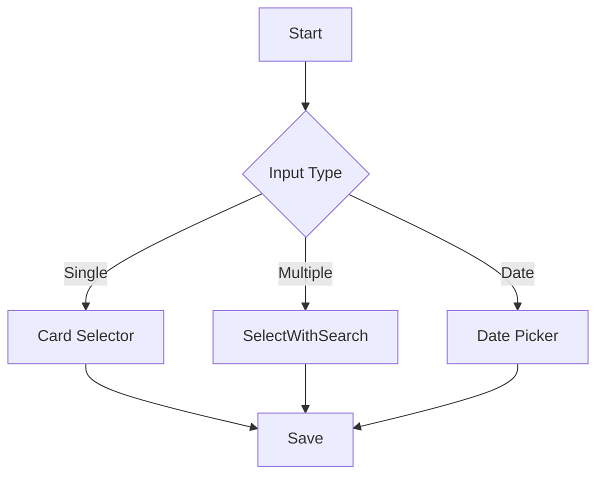
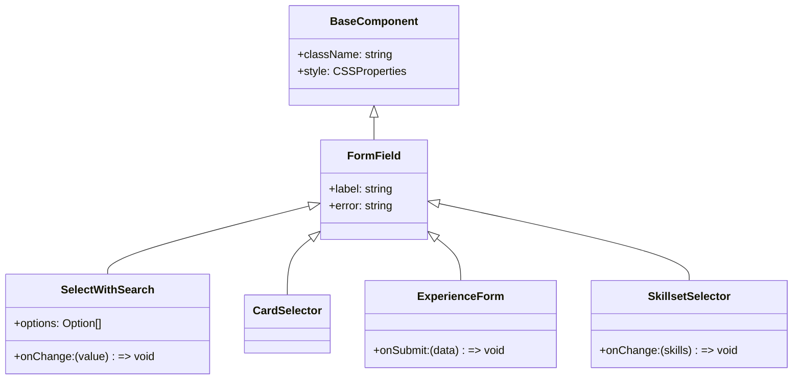

# Profile Panel Enhancement - Development Plan

## Design System

### 1. Design Tokens
**Files:**
- `src/design-tokens/colors.ts`
- `src/design-tokens/typography.ts`
- `src/design-tokens/spacing.ts`
- `src/design-tokens/animations.ts`

**Implementation:**
- Color: Blue/purple primary, neutral grays
- Typography: Clear hierarchy
- Spacing: 8px grid system
- Shadows: Subtle elevation
- Border Radius: 4px, 8px, 12px, full
- Transitions: 200-300ms

## Component Structure

### 1. Atomic Design
```
src/
  components/
    atoms/           # Basic UI elements
      Button/
      Input/
      Select/
      Card/
      Badge/
    molecules/       # Combined atoms with functionality
      FormField/
      SelectWithSearch/
      CardSelector/
      DateRangePicker/
    organisms/       # Complex components
      SkillsetSelector/
      ExperienceForm/
      ProfileTypeSelector/
```

### 2. Core Components

#### SelectWithSearch
**Files:**
- `src/components/molecules/SelectWithSearch/SelectWithSearch.tsx`
- `src/components/molecules/SelectWithSearch/types.ts`

**Features:**
- Typeahead search
- Multi-select with chips
- Keyboard navigation
- Virtualized list

## Interaction Flow



## Component Implementation

### 1. CardSelector
**Files:**
- `src/components/molecules/CardSelector/CardSelector.tsx`
- `src/components/molecules/CardSelector/types.ts`

**Features:**
- Responsive grid (1-4 columns)
- Hover/focus states
- Icon + text support
- Selected state
- Mobile-optimized

### 2. ExperienceForm
**Files:**
- `src/components/organisms/ExperienceForm/ExperienceForm.tsx`
- `src/components/organisms/ExperienceForm/types.ts`

**Features:**
- Company autocomplete
- Position suggestions
- Date range picker
- Form validation

### 3. SkillsetSelector
**Files:**
- `src/components/organisms/SkillsetSelector/SkillsetSelector.tsx`
- `src/components/organisms/SkillsetSelector/types.ts`

**Features:**
- Categorized skills
- Visual proficiency
- Search/filter
- Selected management

## State Management

### 1. Profile Context
**Files:**
- `src/context/ProfileContext/ProfileContext.tsx`
- `src/context/ProfileContext/types.ts`

**Features:**
- Centralized state
- Form management
- Validation
- Auto-save

### 2. Custom Hooks
**Files:**
- `src/hooks/useFormState/useFormState.ts`
- `src/hooks/useDebouncedSearch/useDebouncedSearch.ts`
- `src/hooks/useVirtualList/useVirtualList.ts`

**Features:**
- Form state
- Debounced search
- Virtualized lists

## Component Relationships



## Development Notes

### Dependencies
```json
{
  "dependencies": {
    "@headlessui/react": "^1.7.0",
    "react-datepicker": "^4.8.0",
    "react-window": "^1.8.7",
    "framer-motion": "^6.5.1"
  }
}
```

## Rollout Plan

1. **Beta Testing**
   - Internal QA
   - Limited user group
   - Feedback collection

2. **Staged Rollout**
   - Percentage-based release
   - Feature flags
   - A/B testing

3. **Full Release**
   - Documentation updates
   - User training materials
   - Support team briefing

## Maintenance

1. **Monitoring**
   - Error tracking
   - Performance metrics
   - Usage analytics

2. **Iteration**
   - Regular design reviews
   - User feedback incorporation
   - Continuous improvement cycle
