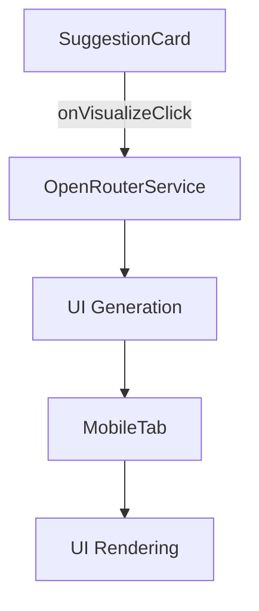
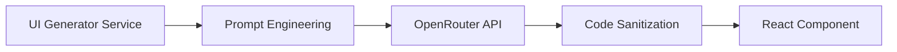
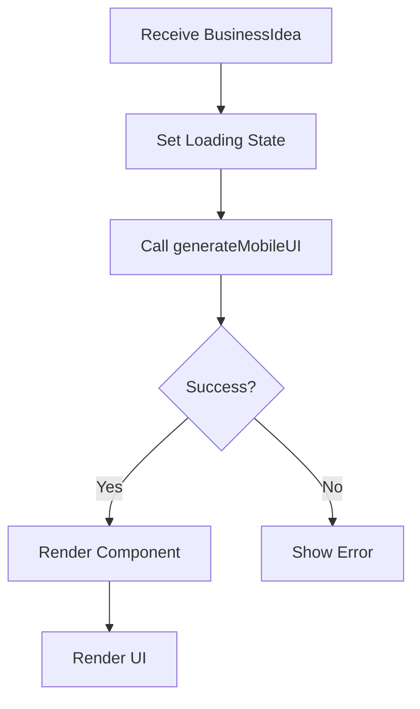
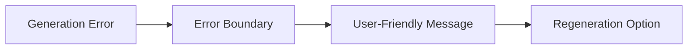

### `visualize-frontend.md` Implementation Plan

#### 1. Component Architecture Updates


#### 2. SuggestionCard Modifications
- **New Props**:
  - `onVisualize: (businessIdea: BusinessIdea) => void`
- **Visualize Button**:
  ```tsx
  <Button onClick={() => onVisualize(businessIdea)}>
    Visualize App
  </Button>
  ```

#### 3. OpenRouter Integration Layer


**Service Functions**:
```typescript
// src/lib/openrouter/uiGenerator.ts
interface UIGenerationRequest {
  businessIdea: BusinessIdea;
  framework: 'react';
  styling: 'tailwind';
}

export async function generateMobileUI(
  request: UIGenerationRequest
): Promise<{ componentCode: string }> {
  // Implementation details
}
```

#### 4. MobileTab Component Enhancement
**New State**:
```typescript
const [generatedUI, setGeneratedUI] = useState<{
  componentCode: string | null;
  loading: boolean;
  error: string | null;
}> ({
  componentCode: null,
  loading: false,
  error: null
});
```

**Render Workflow**:


#### 5. UI Rendering Mechanism
```tsx
// MobileTab.tsx
const renderGeneratedUI = () => {
  if (generatedUI.loading) return <LoadingSpinner />;
  if (generatedUI.error) return <ErrorDisplay />;
  
  return (
    <DynamicComponentRenderer 
      code={generatedUI.componentCode} 
    />
  );
};
```

#### 6. DynamicComponentRenderer Implementation
```tsx
// src/components/common/DynamicComponentRenderer.tsx
import { useMemo } from 'react';

export default function DynamicComponentRenderer({ code }) {
  const Component = useMemo(() => {
    try {
      // Security sanitization
      const sanitizedCode = sanitizeCode(code);
      return new Function('React', `return ${sanitizedCode}`)(React);
    } catch (error) {
      return () => <ErrorFallback error={error} />;
    }
  }, [code]);

  return <Component />;
}
```

#### 7. Prompt Engineering Strategy
**Template**:
```
Generate a mobile app UI wireframe for a business idea about: 
"{businessIdea.description}"

Requirements:
- Use React functional components with TypeScript
- Style with Tailwind CSS classes
- Mobile-first responsive design
- Include core screens: dashboard, detail view, profile
- Use placeholder data where needed
- Export as default component

Constraints:
- Maximum 3 screens
- No backend integration
- Use simple navigation pattern
- Avoid complex state management
```

#### 8. Error Handling System


**Error Types**:
1. API request failures
2. Code generation errors
3. Component rendering errors
4. Timeout errors

#### 9. Performance Optimization
- **Debounce Requests**: 300ms delay on rapid clicks
- **Component Caching**: Session storage caching
- **Lazy Loading**: Dynamic import of heavy components
- **Virtualization**: For long lists in generated UIs

#### 10. Security Measures
1. Code sanitization (remove eval, fetch, etc.)
2. Sandboxed iframe rendering
3. Content Security Policy (CSP) headers
4. Output validation against schema

#### 11. Testing Strategy
1. **Unit Tests**:
   - UI generation service
   - Code sanitization
   - Error handling

2. **Integration Tests**:
   - SuggestionCard → OpenRouter → MobileTab flow
   - Component rendering lifecycle

3. **E2E Tests**:
   - Full user journey visualization
   - Error scenario simulations

#### 12. Implementation Sequence
1. Create UI generation service
2. Implement DynamicComponentRenderer
3. Add visualization handler to SuggestionCard
4. Modify MobileTab to handle generated UI
5. Implement error boundaries
6. Add loading states
7. Set up caching layer
8. Implement security sanitization
9. Add analytics tracking
10. Create documentation
