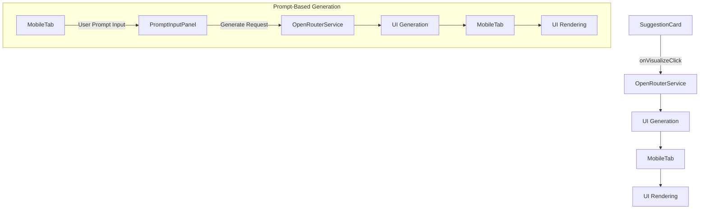
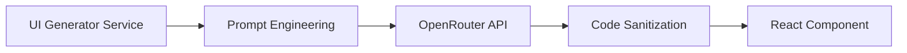
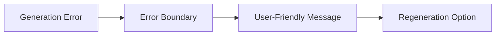

### `visualize-frontend.md` Implementation Plan

This document outlines the implementation plan for the frontend visualization feature, including both the existing `SuggestionCard`-triggered flow and the new prompt-based UI generation within `MobileTab`.

#### 1. Component Architecture Updates


#### 2. SuggestionCard Modifications
- **New Props**:
  - `onVisualize: (businessIdea: BusinessIdea) => void`
- **Visualize Button**:
  ```tsx
  <Button onClick={() => onVisualize(businessIdea)}>
    Visualize App
  </Button>
  ```
*(No changes required for this component for the new task, but included for completeness of the overall architecture.)*

#### 3. OpenRouter Integration Layer

**Service Functions**:
- `generateMobileUI(request: UIGenerationRequest)`: Existing function for `BusinessIdea`-based generation.
- `generateFromPrompt(prompt: string, options: { framework: 'react'; styling: 'tailwind'; screens: number })`: **New function** for prompt-based UI generation. This function will internally use the existing `generateMobileUI` logic with an adapted `BusinessIdea` structure or a new prompt template.

**Modified File**:
- `src/lib/openrouter/uiGenerator.ts`: Add `generateFromPrompt` function.
- `src/lib/openrouter/analysis/types.ts`: Update types if necessary to accommodate new request structures.

#### 4. MobileTab Component Enhancement
This section details the integration of the new prompt-based UI generation.
- **New State**:
  ```typescript
  const [generatedUI, setGeneratedUI] = useState<{
    componentCode: string | null;
    loading: boolean;
    error: string | null;
  }> ({
    componentCode: null,
    loading: false,
    error: null
  });

  // New state for prompt-based generation
  const [promptUI, setPromptUI] = useState<{
    isActive: boolean; // Controls visibility of the prompt panel
    input: string;     // The user's input prompt
    loading: boolean;
    result: {
      componentCode: string | null;
      error: string | null;
    };
    history: Array<{ // Optional: for storing past prompt generations
      prompt: string;
      timestamp: Date;
      componentCode: string;
    }>;
  }>({ 
      isActive: false,
      input: '',
      loading: false,
      result: { componentCode: null, error: null },
      history: []
  });
  ```
- **Render Workflow**:
  ```mermaid
  graph TD
      A[Receive BusinessIdea] --> B[Set Loading State]
      B --> C[Call generateMobileUI]
      C --> D{Success?}
      D -->|Yes| E[Render Component]
      D -->|No| F[Show Error]
      E --> G[Render UI]

      subgraph Prompt-Based Flow
          H[Toggle Prompt Panel] --> I{Prompt Panel Active?}
          I -->|Yes| J[PromptInputPanel]
          J -->|User Input| K[Update promptUI.input]
          J -->|Generate Click| L[Call generateFromPrompt]
          L --> M[Set promptUI.loading]
          M --> N{Success?}
          N -->|Yes| O[Update promptUI.result]
          N -->|No| P[Set promptUI.error]
          O --> Q[Render promptUI.result]
          P --> Q
      end
  ```
**Modified File**:
- `src/app/businessidea/tabs/MobileTab.tsx`: Major modifications for state, UI, and integration of the new prompt panel.

#### 5. UI Rendering Mechanism
```tsx
// MobileTab.tsx
const renderGeneratedUI = () => {
  if (generatedUI.loading) return <LoadingSpinner />;
  if (generatedUI.error) return <ErrorDisplay />;
  
  return (
    <DynamicComponentRenderer 
      code={generatedUI.componentCode} 
    />
  );
};

// New rendering for prompt-based UI
const renderPromptGeneratedUI = () => {
  if (promptUI.loading) return <LoadingSpinner />;
  if (promptUI.result.error) return <ErrorDisplay error={promptUI.result.error} />;
  
  return (
    <DynamicComponentRenderer 
      code={promptUI.result.componentCode} 
    />
  );
};
```
*(No direct changes to `DynamicComponentRenderer.tsx` as it's generic.)*

#### 6. DynamicComponentRenderer Implementation
```tsx
// src/components/common/DynamicComponentRenderer.tsx
import { useMemo } from 'react';

export default function DynamicComponentRenderer({ code }) {
  const Component = useMemo(() => {
    try {
      // Security sanitization
      const sanitizedCode = sanitizeCode(code);
      return new Function('React', `return ${sanitizedCode}`)(React);
    } catch (error) {
      return () => <ErrorFallback error={error} />;
    }
  }, [code]);

  return <Component />;
}
```
*(This component remains unchanged and will be reused for both generation methods.)*

#### 7. Prompt Engineering Strategy
- **Business Idea Template**: (Existing)
  ```
  Generate a mobile app UI wireframe for a business idea about: 
  "{businessIdea.description}"
  ...
  ```
- **Prompt-Based Generation Template**: **New**
  ```
  Generate a mobile app UI wireframe based on the following user prompt: 
  "{userPrompt}"

  Requirements:
  - Use React functional components with TypeScript
  - Style with Tailwind CSS classes
  - Mobile-first responsive design
  - Include core screens: dashboard, detail view, profile
  - Use placeholder data where needed
  - Export as default component

  Constraints:
  - Maximum 3 screens
  - No backend integration
  - Use simple navigation pattern
  - Avoid complex state management
  ```

#### 8. Error Handling System

**Error Types**:
1. API request failures
2. Code generation errors
3. Component rendering errors
4. Timeout errors
5. **New**: Invalid prompt submissions (e.g., empty, too long, harmful content)

#### 9. Performance Optimization
- **Debounce Requests**: 300ms delay on rapid clicks.
- **Component Caching**: Session storage caching.
- **Lazy Loading**: Dynamic import of heavy components.
- **Virtualization**: For long lists in generated UIs.
- **New**: Cached prompt results (LRU cache) for frequently generated prompts.

#### 10. Security Measures
1. Code sanitization (remove eval, fetch, etc.)
2. Sandboxed iframe rendering
3. Content Security Policy (CSP) headers
4. Output validation against schema
5. **New**: Prompt validation (blocklisted keywords, length limits, AI-based toxicity screening).

#### 11. Testing Strategy
1. **Unit Tests**:
   - UI generation service
   - Code sanitization
   - Error handling
   - **New**: Prompt validation logic.
   - **New**: Prompt panel state transitions.

2. **Integration Tests**:
   - SuggestionCard → OpenRouter → MobileTab flow
   - Component rendering lifecycle
   - **New**: MobileTab → PromptInputPanel → OpenRouter flow.
   - **New**: Concurrent usage with SuggestionCard visualization.

3. **E2E Tests**:
   - Full user journey visualization
   - Error scenario simulations
   - **New**: Prompt-based generation user journey.

#### 12. Implementation Sequence
1. Create `src/lib/openrouter/uiGenerator.ts` (if not exists) and add `generateFromPrompt` function.
2. Create `src/components/mobiletab/PromptInputPanel.tsx` for the prompt input UI.
3. Create `src/components/mobiletab/PromptGeneratedView.tsx` for displaying prompt-generated UI.
4. Modify `src/app/businessidea/tabs/MobileTab.tsx` to:
    - Add new state for prompt UI.
    - Integrate `PromptInputPanel` and `PromptGeneratedView`.
    - Add toggle button for prompt panel.
    - Implement logic to call `generateFromPrompt` and update state.
5. Implement error boundaries and loading states for the new flow.
6. Add security sanitization and prompt validation.
7. Set up caching layer for prompt results.
8. Add analytics tracking for the new feature.
9. Create documentation.

**Files to be Created**:
- `src/components/mobiletab/PromptInputPanel.tsx`
- `src/components/mobiletab/PromptGeneratedView.tsx`

**Files to be Modified**:
- `src/app/businessidea/tabs/MobileTab.tsx`
- `src/lib/openrouter/uiGenerator.ts`
- `src/lib/openrouter/analysis/types.ts` (if necessary)
- `src/components/common/DynamicComponentRenderer.tsx` (no code change, but its usage is extended)
