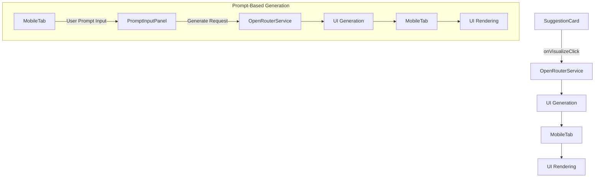
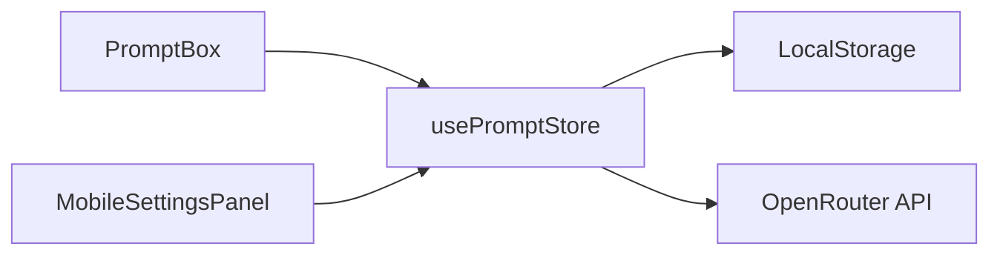
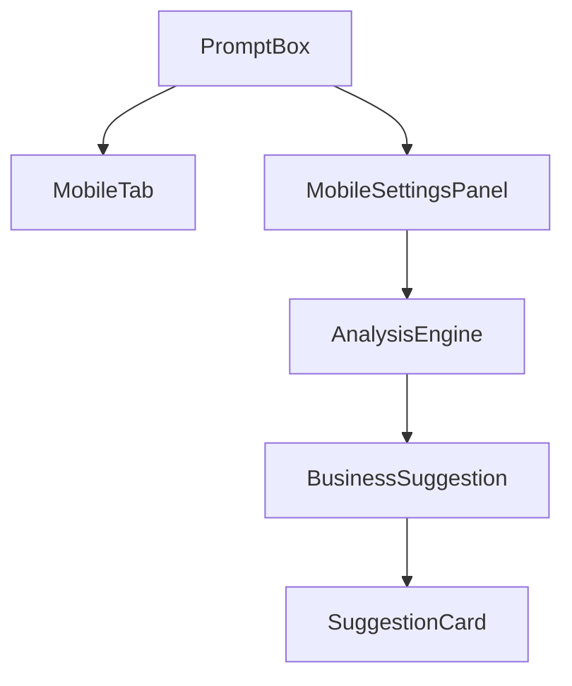
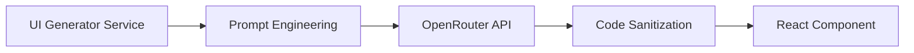

### `visualize-frontend.md` Implementation Plan

This document outlines the implementation plan for the frontend visualization feature, including both the existing `SuggestionCard`-triggered flow and the new prompt-based UI generation within `MobileTab`.

## Streamlined UI Generation Plan (3-Step)

This section supersedes the prior multi-stage approach. We now use a lean pipeline that preserves output quality and the sample UI aesthetics while minimizing moving parts.

### 1) Prompt → Design Spec → Code Blueprint
- **Prompt**: User describes the app goal and tone. We stream a compact Design Spec JSON.
- **Design Spec**: Validated (Zod). User can quickly review/edit key fields. We render a safe preview from the spec (no TSX execution).
- **Code Blueprint**: Single completion generates an export-only React+Tailwind file list. Download as zip; do not eval at runtime.

### Deliverables
- **Design Spec** (JSON): theme, screens, components, constraints, accessibility, target_platform.
- **Preview**: Render from spec via a safe DSL using the existing `UIWireframeRenderer` (extend incrementally as needed).
- **Code Blueprint**: List of {path, contents_text} for React + Tailwind.

### Non-Goals
- No runtime execution of generated TSX in the app.
- No complex stepper/providers; a single controls panel is enough.
- No backend—client-only with OpenRouter.

### Architecture (lightweight)
- UI: `MobileTab` becomes two-column (Left: PhonePreview; Right: controls/spec/code actions).
- Controls: reuse `UIPromptBox.tsx` for prompt + model + “Generate Spec”. Add a minimal spec viewer and a “Generate Code” button gated by validation.
- Hooks: reuse `useUIGeneration` for streaming; add thin `useDesignSpec` and `useCodeBlueprint` wrappers around the same OpenRouter client.
- Types: add Zod schemas for `DesignSpec` and `CodeBlueprint` only (keep current wireframe types and extend as needed).

### Minimal Component Set (MVP)
- Header/NavBar, TabBar
- Button (primary/secondary)
- Card, Stat/Metric row
- ListItem (title/subtitle/avatar/badge)
- FormField (text/password/email)
- ChartPlaceholder, Avatar, Icon
- NumberPad/Keyboard placeholder

### Validation & Safety
- Strict Zod on Spec and Code Blueprint; strip/normalize unknown fields.
- Safe renderer only; never eval TSX.
- API key via `ChatboxControls` and `useChatboxSettings()` remains unchanged.

### Performance & Reliability
- Stream only the Design Spec for fast feedback; Code Blueprint can be non-stream.
- Throttle UI updates during streaming; keep cancel support.
- Cache by hash(prompt) for spec and hash(spec) for blueprint.

### Error Handling
- Spec invalid → show validation diff + one-click refine (retry with tighter constraints).
- Codegen failure → single retry with reduced component set and shorter limits.

### Acceptance Criteria
- Spec generation p50 < 5s, JSON validates.
- Preview matches Spec using only allowed primitives.
- Code Blueprint builds in a stock React+Tailwind starter without edits.
- Cancel works; errors are actionable; artifacts cached.

### Milestones
- M1: Spec generation + Zod validation + viewer + caching.
- M2: Preview renderer updates for MVP primitives.
- M3: Code blueprint generation + download + QA.

---

### Archived Previous Plan (for reference)
#### 1. Component Architecture Updates


#### 2. Prompt Management System
- **Purpose**: Centralized system prompt configuration for AI behavior customization
- **Components**:
  - `PromptBox.tsx`: Modular input component with validation
  - `usePromptStore.ts`: Zustand store for state management
- **Key Features**:
  - Real-time synchronization between UI components
  - LocalStorage persistence
  - Character limit enforcement
  - Reset to default functionality
- **Integration Points**:
  - MobileTab (primary user-facing input)
  - MobileSettingsPanel (advanced configuration)
  - SuggestionCard (via Zustand store)

#### 3. State Management Updates


#### 4. Component Relationships


#### 5. SuggestionCard Integration Notes
- **Prompt Context Access**:
  ```tsx
  const { systemPrompt } = usePromptStore();
  // Use prompt to influence suggestion generation
  ```
- **Implementation Guidelines**:
  1. Import usePromptStore hook
  2. Access systemPrompt value
  3. Incorporate into suggestion generation logic
  4. Maintain component independence

#### 6. SuggestionCard Modifications
- **New Props**:
  - `onVisualize: (businessIdea: BusinessIdea) => void`
- **Visualize Button**:
  ```tsx
  <Button onClick={() => onVisualize(businessIdea)}>
    Visualize App
  </Button>
  ```
*(No changes required for this component for the new task, but included for completeness of the overall architecture.)*

#### 7. OpenRouter Integration Layer

**Service Functions**:
- `generateMobileUI(request: UIGenerationRequest)`: Existing function for `BusinessIdea`-based generation.
- `generateFromPrompt(prompt: string, options: { framework: 'react'; styling: 'tailwind'; screens: number })`: **New function** for prompt-based UI generation. This function will internally use the existing `generateMobileUI` logic with an adapted `BusinessIdea` structure or a new prompt template.

**Modified File**:
- `src/lib/openrouter/uiGenerator.ts`: Add `generateFromPrompt` function.
- `src/lib/openrouter/analysis/types.ts`: Update types if necessary to accommodate new request structures.

#### 8. MobileTab Component Enhancement
This section details the integration of the new prompt-based UI generation.
- **New State**:
  ```typescript
  const [generatedUI, setGeneratedUI] = useState<{
    componentCode: string | null;
    loading: boolean;
    error: string | null;
  }> ({
    componentCode: null,
    loading: false,
    error: null
  });

  // New state for prompt-based generation
  const [promptUI, setPromptUI] = useState<{
    isActive: boolean; // Controls visibility of the prompt panel
    input: string;     // The user's input prompt
    loading: boolean;
    result: {
      componentCode: string | null;
      error: string | null;
    };
    history: Array<{ // Optional: for storing past prompt generations
      prompt: string;
      timestamp: Date;
      componentCode: string;
    }>;
  }>({ 
      isActive: false,
      input: '',
      loading: false,
      result: { componentCode: null, error: null },
      history: []
  });
  ```
- **Render Workflow**:
  ```mermaid
  graph TD
      A[Receive BusinessIdea] --> B[Set Loading State]
      B --> C[Call generateMobileUI]
      C --> D{Success?}
      D -->|Yes| E[Render Component]
      D -->|No| F[Show Error]
      E --> G[Render UI]

      subgraph Prompt-Based Flow
          H[Toggle Prompt Panel] --> I{Prompt Panel Active?}
          I -->|Yes| J[PromptInputPanel]
          J -->|User Input| K[Update promptUI.input]
          J -->|Generate Click| L[Call generateFromPrompt]
          L --> M[Set promptUI.loading]
          M --> N{Success?}
          N -->|Yes| O[Update promptUI.result]
          N -->|No| P[Set promptUI.error]
          O --> Q[Render promptUI.result]
          P --> Q
      end
  ```
**Modified File**:
- `src/app/businessidea/tabs/MobileTab.tsx`: Major modifications for state, UI, and integration of the new prompt panel.

#### 9. UI Rendering Mechanism
```tsx
// MobileTab.tsx
const renderGeneratedUI = () => {
  if (generatedUI.loading) return <LoadingSpinner />;
  if (generatedUI.error) return <ErrorDisplay />;
  
  return (
    <DynamicComponentRenderer 
      code={generatedUI.componentCode} 
    />
  );
};

// New rendering for prompt-based UI
const renderPromptGeneratedUI = () => {
  if (promptUI.loading) return <LoadingSpinner />;
  if (promptUI.result.error) return <ErrorDisplay error={promptUI.result.error} />;
  
  return (
    <DynamicComponentRenderer 
      code={promptUI.result.componentCode} 
    />
  );
};
```
*(No direct changes to `DynamicComponentRenderer.tsx` as it's generic.)*

#### 10. Security Enhancements
- **Prompt Validation**:
  - Character length limits
  - Restricted keyword filtering
  - Input sanitization
- **Data Flow**:
  - Client-side only persistence
  - No server transmission of prompts
  - Secure API key handling

#### 11. Testing Strategy
1. **Unit Tests**:
   - UI generation service
   - Code sanitization
   - Error handling
   - **New**: Prompt validation logic.
   - **New**: Prompt panel state transitions.

2. **Integration Tests**:
   - SuggestionCard → OpenRouter → MobileTab flow
   - Component rendering lifecycle
   - **New**: MobileTab → PromptInputPanel → OpenRouter flow.
   - **New**: Concurrent usage with SuggestionCard visualization.

3. **E2E Tests**:
   - Full user journey visualization
   - Error scenario simulations
   - **New**: Prompt-based generation user journey.

#### 12. Implementation Sequence
1. Create `src/lib/openrouter/uiGenerator.ts` (if not exists) and add `generateFromPrompt` function.
2. Create `src/components/mobiletab/PromptInputPanel.tsx` for the prompt input UI.
3. Create `src/components/mobiletab/PromptGeneratedView.tsx` for displaying prompt-generated UI.
4. Modify `src/app/businessidea/tabs/MobileTab.tsx` to:
    - Add new state for prompt UI.
    - Integrate `PromptInputPanel` and `PromptGeneratedView`.
    - Add toggle button for prompt panel.
    - Implement logic to call `generateFromPrompt` and update state.
5. Implement error boundaries and loading states for the new flow.
6. Add security sanitization and prompt validation.
7. Set up caching layer for prompt results.
8. Add analytics tracking for the new feature.
9. Create documentation.

**Files to be Created**:
- `src/components/mobiletab/PromptInputPanel.tsx`
- `src/components/mobiletab/PromptGeneratedView.tsx`

**Files to be Modified**:
- `src/app/businessidea/tabs/MobileTab.tsx`
- `src/lib/openrouter/uiGenerator.ts`
- `src/lib/openrouter/analysis/types.ts` (if necessary)
- `src/components/common/DynamicComponentRenderer.tsx` (no code change, but its usage is extended)
